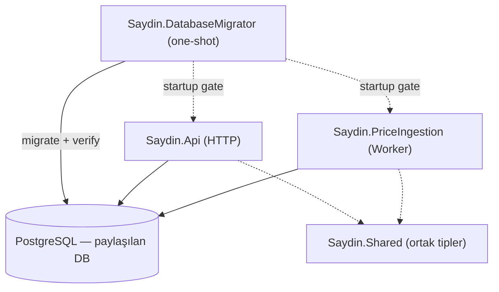

# Saydin.Services

.NET 10 backend servisleri — finansal "ya alsaydım?" hesaplama motoru.

## Servisler

| Servis | Açıklama | Port |
|---|---|---|
| `Saydin.Api` | Flutter uygulamasına Minimal API sunar | 5080 |
| `Saydin.PriceIngestion` | Dış finansal API'lerden fiyat verisi çeker | — |
| `Saydin.DatabaseRoleBootstrap` | Cluster-global least-privilege rol grafiğini kurar/doğrular (one-shot) | — |
| `Saydin.DatabaseMigrator` | Şemayı servis başlangıcından önce doğrular/günceller (one-shot) | — |
| `Saydin.DatabaseSecurity` | Role contract ve hardened secret-file ortak çekirdeği | — |
| `Saydin.Shared` | Ortak entity, exception, diagnostics | — |

## Hızlı Başlangıç

### Ön koşullar

- Docker + Docker Compose (backend servisleri için)
- .NET 10 SDK (yerel geliştirme için, opsiyonel)

### Altyapıyı Başlat

```bash
# Repo kökünden — yalnız ilk kurulumda secret/identity kontratını hazırla
./infrastructure/secrets/bootstrap-dev-database.sh

# Üretilen dosya yalnız nonsecret topology/role metadata içerir
docker compose --env-file .env --env-file .env.database-runtime up --build -d

# İsteğe bağlı yerel yönetim/gözlem arayüzleri
docker compose --env-file .env --env-file .env.database-runtime --profile devtools \
  up --build -d pgadmin redis-insight aspire-dashboard prometheus

# İsteğe bağlı: en az bir worker açıkken ingestion profilini ayrıca başlat
docker compose --env-file .env --env-file .env.database-runtime --profile ingestion \
  up --build -d saydin-price-ingestion
```

Bootstrap komutu DB parolalarını `.env`/argv/runtime environment'a yazmaz: root-only one-shot
materializer source secret'ı per-purpose named volume'lara 0700/0400 olarak kopyalar. API,
ingestion, calendar, audit, exporter ve migrator yalnız kendi dosyasını görür. Doğrudan
`docker compose up` nonsecret role metadata yoksa fail-closed olur.
Ingestion default stack'e dahil değildir; dış provider'a istemsiz çağrı yapılmaması için yalnız
`ingestion` profiliyle ve `.env` içinde en az bir `WORKER_*_ENABLED=true` seçiliyken başlatılır.

022-ready development Compose sözleşmesi PostgreSQL bağlantı health'ini, pre-bootstrap,
one-shot `database-migrator`, exact HBA ve post-migration bootstrap kapılarını bekler;
API/ingestion/DB monitoring yalnız doğrulanmış şema ve rol grafiğiyle başlar.
Fresh DB'de ilk role-bootstrap migrator graph'ını kurar, managed migrator 27 migration'ı uygular;
post-migration role-bootstrap ise 022 sonrası backup graph'ını tamamlayıp fiziksel bağlantıyı
doğrulamadan runtime servislerini başlatmaz. Development HBA one-shot'ı yalnız türetilmiş backup
v1/v2 rolleri ve yalnız project subnet'i için SCRAM replication izni kurar; aynı rolleri bütün SQL
veritabanlarından reddeder.
Complete-014/managed-through-018 legacy DB yalnız açık privilege-cutover yoluyla alınır;
checksum/rol/ACL/şema drift'i fail-closed'dur. İşletim, mevcut root-Compose sınırı ve recovery akışı
için bkz. [development-guide.md](docs/development-guide.md).

### Uygulamayı Çalıştır (Yerel .NET)

DB runtime sınırı raw connection string/user-secret kabul etmez. Yerel process çalıştıracaksan
Compose'un ürettiği explicit PG topology/role metadata'yı ve yalnız o consumer'a ait absolute
owner-only password file'ı sağlamalısın. Standart ve taşınabilir geliştirme yolu yukarıdaki Compose
akışıdır; ayrıntılar [development-guide.md](docs/development-guide.md) içindedir.

### API Test

```bash
# Process liveness (public listener)
curl -fsS http://localhost:5080/health/live

# Server-issued installation credential üret (çıktıyı güvenli tut; loglama/commit etme)
INSTALLATION_TOKEN="$(curl -fsS -X POST http://localhost:5080/v1/installations | jq -er .credential)"

# Asset listesi
curl -H "Authorization: Installation $INSTALLATION_TOKEN" http://localhost:5080/v1/assets

# "Ya alsaydım" hesaplama
curl -X POST http://localhost:5080/v1/what-if/calculate \
  -H "Content-Type: application/json" \
  -H "Authorization: Installation $INSTALLATION_TOKEN" \
  -d '{
    "assetSymbol": "USDTRY",
    "buyDate": "2020-01-01",
    "sellDate": "2024-01-01",
    "amount": 10000,
    "amountType": "TRY"
  }'
```

> Tüm endpoint örnekleri (DCA, Compare, Reverse What-If, Scenarios) için:
> [development-guide.md](docs/development-guide.md) → "API Test Örnekleri".

## Mimari



**Temel kural:** `Saydin.Api` hiçbir dış finansal API'ye istek atmaz. `Saydin.PriceIngestion` hiçbir HTTP endpoint expose etmez. Servisler sadece veritabanı üzerinden haberleşir.

Detaylı mimari: [docs/architecture.md](docs/architecture.md)

Mimari karar kayıtları (ADR): [docs/decisions/](docs/decisions/README.md) ·
Değişiklik geçmişi: [CHANGELOG.md](CHANGELOG.md) ·
Review/remediation kanıtı: [docs/analysis/](docs/analysis/README.md)

## Geliştirme

Yerel geliştirme kurulumu, user-secrets ve Docker iş akışı için: [docs/development-guide.md](docs/development-guide.md)

## Observability

`devtools` profili ayağa kalktıktan sonra (bütün host portları yalnız loopback'e bağlıdır):

| Araç | URL | Kullanım |
|---|---|---|
| Aspire Dashboard | http://localhost:18888 | Traces, logs, metrics |
| pgAdmin | http://localhost:5050 | PostgreSQL yönetimi |
| Redis Insight | http://localhost:5540 | Redis izleme |
| Prometheus | http://localhost:9090 | Metrik sorgulama |
| Scalar | http://localhost:5080/scalar/v1 | API dökümantasyonu (ham OpenAPI JSON: /openapi/v1) |

## Mimari Kurallar

Agent dosyası: [CLAUDE.md](CLAUDE.md)
