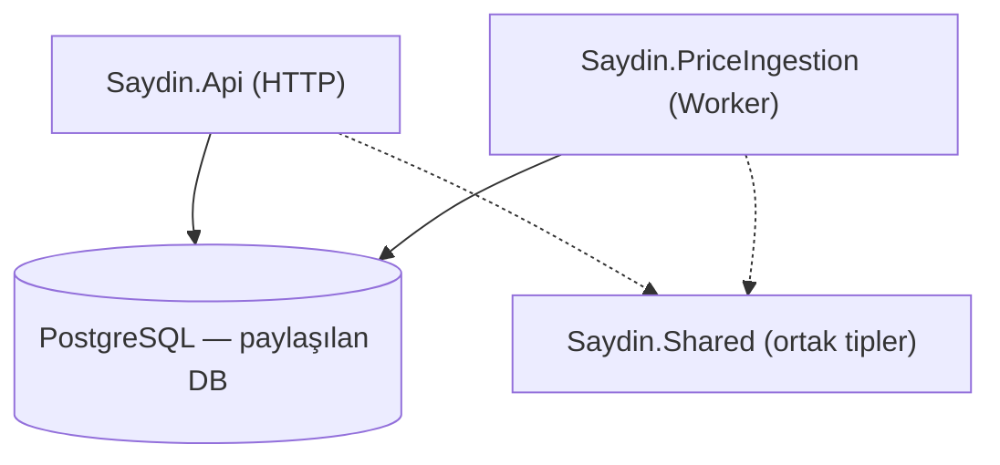

# Saydin.Services

.NET 10 backend servisleri — finansal "ya alsaydım?" hesaplama motoru.

## Servisler

| Servis | Açıklama | Port |
|---|---|---|
| `Saydin.Api` | Flutter uygulamasına Minimal API sunar | 5080 |
| `Saydin.PriceIngestion` | Dış finansal API'lerden fiyat verisi çeker | — |
| `Saydin.Shared` | Ortak entity, exception, diagnostics | — |

## Hızlı Başlangıç

### Ön koşullar

- Docker + Docker Compose (backend servisleri için)
- .NET 10 SDK (yerel geliştirme için, opsiyonel)

### Altyapıyı Başlat

```bash
# Repo kökünden — kod değişikliğinden sonra image'ı yeniden derle ve servisleri başlat
docker compose build && docker compose up -d
```

Migration'lar fresh (boş volume) başlatmada `docker-entrypoint-initdb.d` üzerinden otomatik
uygulanır (`infrastructure/postgres/migrations` klasörü mount edilir). Var olan / dolu bir
DB'ye yeni migration uygulama akışı için bkz. [development-guide.md](docs/development-guide.md).

### Uygulamayı Çalıştır (Yerel .NET)

> **Uyarı:** Bu repo Docker Compose tabanlıdır; lokal makinede .NET 10 SDK kurulu **olmayabilir**. SDK kurulu değilse aşağıdaki `dotnet` komutları çalışmaz — bunun yerine yukarıdaki **Altyapıyı Başlat** akışını kullan. Ayrıntılar: [CLAUDE.md](CLAUDE.md).

```bash
# User secrets ile bağlantı dizelerini ayarla
dotnet user-secrets set "ConnectionStrings:Postgres" "Host=localhost;Database=saydin;Username=saydin;Password=<YOUR_PASSWORD>" \
  --project src/Saydin.Api

dotnet run --project src/Saydin.Api
```

### API Test

```bash
# Sağlık kontrolü
curl http://localhost:5080/health

# Asset listesi
curl http://localhost:5080/v1/assets

# "Ya alsaydım" hesaplama
curl -X POST http://localhost:5080/v1/what-if/calculate \
  -H "Content-Type: application/json" \
  -H "X-Device-ID: test-device-123" \
  -d '{
    "assetSymbol": "USDTRY",
    "buyDate": "2020-01-01",
    "sellDate": "2024-01-01",
    "amount": 10000,
    "amountType": "TRY"
  }'
```

> Tüm endpoint örnekleri (DCA, Compare, Reverse What-If, Scenarios) için:
> [development-guide.md](docs/development-guide.md) → "API Test Örnekleri".

## Mimari



**Temel kural:** `Saydin.Api` hiçbir dış finansal API'ye istek atmaz. `Saydin.PriceIngestion` hiçbir HTTP endpoint expose etmez. Servisler sadece veritabanı üzerinden haberleşir.

Detaylı mimari: [docs/architecture.md](docs/architecture.md)

Mimari karar kayıtları (ADR): [docs/decisions/](docs/decisions/README.md) ·
Değişiklik geçmişi: [CHANGELOG.md](CHANGELOG.md)

## Geliştirme

Yerel geliştirme kurulumu, user-secrets ve Docker iş akışı için: [docs/development-guide.md](docs/development-guide.md)

## Observability

Altyapı ayağa kalktıktan sonra:

| Araç | URL | Kullanım |
|---|---|---|
| Aspire Dashboard | http://localhost:18888 | Traces, logs, metrics |
| pgAdmin | http://localhost:5050 | PostgreSQL yönetimi |
| Redis Insight | http://localhost:5540 | Redis izleme |
| Prometheus | http://localhost:9090 | Metrik sorgulama |
| Scalar | http://localhost:5080/scalar/v1 | API dökümantasyonu (ham OpenAPI JSON: /openapi/v1) |

## Mimari Kurallar

Agent dosyası: [CLAUDE.md](CLAUDE.md)
