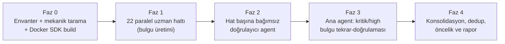

# PR Review Planı — `development` @ `f9f608d`

> **Review tarihi:** 2026-08-20
> **Hedef commit:** `f9f608d` ("Add unit tests for calendar data sources and project configuration")
> **Taban:** `a274c62` (`main` ile merge edilmiş entegrasyon commit'i)
> **Kapsam:** `git diff a274c62..f9f608d` — 554 dosya (snapshot HTML/PDF arşivi hariç), ~92,5 bin eklenen / ~3,9 bin silinen satır
> **Amaç:** `docs/analysis/05-remediation-action-plan.md` kapsamında yapılan remediation'ın gerçekten
> doğru, güvenli ve iddia edildiği gibi tamamlanmış olup olmadığını bağımsız olarak doğrulamak

## Kapsam dışı bırakılanlar

| Yol | Neden |
|---|---|
| `tools/calendar-data/data/snapshots/**` (~800 dosya, ~14 bin satır HTML/PDF) | Resmî kaynakların ham arşiv kopyası; üretilen/indirilen veri, kaynak review konusu değil. Yalnız store/replay mekanizması (`SourceSnapshotStore`, manifest doğrulaması) incelenir. |
| `tools/calendar-data/data/normalized/*.csv` (8,6 bin satır) | Türetilmiş veri; format/sınır/örnek satır düzeyinde spot-check yapılır, satır satır okunmaz. |
| `bin/`, `obj/`, `TestResults/` | Build çıktısı, tracked değil. |

## Review ilkeleri

1. Her bulgu **dosya:satır kanıtı**, **tetiklenme senaryosu**, **etki** ve **uygulanabilir öneri** içerir.
2. Bulgu, üreten agent'tan **bağımsız ikinci bir agent** tarafından kodun kendisi okunarak doğrulanır;
   `CONFIRMED` / `PLAUSIBLE` / `REJECTED` olarak işaretlenir. Reddedilen bulgular rapora girmez.
3. Teorik olasılık kesin bulgu gibi yazılmaz; ortam bağımlılığı açıkça belirtilir.
4. Yeşil build davranışsal doğruluk kanıtı sayılmaz — kritik akışlar ayrıca elle okunur.
5. Yalnız hata değil; `CLAUDE.md` mimari sözleşmesine uyum, işletilebilirlik ve doküman-kod tutarlılığı da denetlenir.
6. Güçlü kararlar da kayda geçer.

## Önem derecesi ölçütü

Mevcut `docs/analysis/00-review-plan-and-coverage.md` ölçütü korunur:

| Seviye | Ölçüt |
|---|---|
| **Critical** | Yaygın veri kaybı/bozulması, secret ifşası, kolay uzaktan istismar, temel servisin çalışamaması |
| **High** | Gerçekçi üretim koşulunda yanlış finansal sonuç, önemli güvenlik/izolasyon açığı, sürekli veri güncelliği kaybı, CI'ın kritik regresyonu kaçırması |
| **Medium** | Sınırlı koşullarda işlev/operasyon bozulması, önemli gözlemlenebilirlik/test/bakım açığı |
| **Low** | Düşük etkili tutarsızlık, doküman/ergonomi sorunu, savunma derinliği iyileştirmesi |

## Review hatları (22 paralel hat)

| Hat | Kapsam | Dosya | Diff satırı | Model |
|---|---|---:|---:|---|
| L01 | API kimlik ve güvenlik yüzeyi (installation principal, credential keyring, dağıtık limiter, port boundary) | 18 | 1.488 | opus |
| L02 | Scenario payload/pagination/body sınırları (cursor codec, extra-data validator, hard cap) | 14 | 953 | opus |
| L03 | Finansal hesaplama, cache, kota ve authority tüketimi (WhatIf/DCA, quota lease, Redis, final observation) | 38 | 2.425 | opus |
| L04 | API runtime, activity logging, exception zinciri, `Program.cs`, telemetri | 19 | 1.528 | opus |
| L05 | `Saydin.Shared` entity/EF configuration ↔ SQL şema paritesi | 22 | 780 | opus |
| L06 | SQL migration 015–022 doğruluğu, privilege separation, online migration protokolü | 12 | 3.634 | opus |
| L07 | `Saydin.DatabaseMigrator` (runner, manifest, impact preflight, trust root, normalizer) | 13 | 6.010 | opus |
| L08 | `Saydin.DatabaseRoleBootstrap` + `Saydin.DatabaseSecurity` (rol sözleşmesi, secret dosyaları) | 17 | 3.803 | opus |
| L09 | Ingestion window ledger, write fence, worker supervision, freshness telemetry | 20 | 3.806 | opus |
| L10 | Provider adapter/mapper, observation authority/evidence, resilience, startup validator | 21 | 1.429 | opus |
| L11 | `Saydin.DataQualityAudit` (kanonik JSON, imza, evidence bundle, ledger continuity, audit SQL) | 19 | 4.583 | opus |
| L12 | `Saydin.DataRepair` (imzalı plan, receipt, trust lease, executor) | 17 | 3.130 | opus |
| L13 | `tools/calendar-data` + `infrastructure/calendar` (acquisition, parser, snapshot store, release) | 32 | 14.648 | opus |
| L14 | CI/CD workflow'ları ve `.github/scripts` kapıları | 28 | 3.617 | opus |
| L15 | Production deployment, Caddy, OTEL/Loki/Tempo, Prometheus kuralları, Alertmanager | 30 | 3.027 | opus |
| L16 | Backup/restore drill + release supply chain (imzalama, manifest, rollback) | 25 | 2.473 | opus |
| L17 | Build/compose/paketleme konfigürasyonu (compose, Directory.*.props, sln, lock dosyaları) | 7 | 511 | sonnet |
| L18a | `Saydin.Api.Tests` + `Saydin.Api.IntegrationTests` test kalitesi | 59 | 10.786 | opus |
| L18b | `Saydin.PriceIngestion` testleri + `calendar-data` testleri | 41 | 7.942 | opus |
| L18c | `DatabaseMigrator` + `DatabaseRoleBootstrap` testleri | 23 | 7.090 | opus |
| L18e | `DataQualityAudit` + `DataRepair` testleri | 30 | 6.932 | opus |
| L19 | Dokümantasyon, ADR, runbook, `CLAUDE.md` tutarlılığı | 53 | 5.886 | sonnet |

## Akış

Faz 2 bir bariyer değildir: her hat kendi bulgularını üretir üretmez doğrulama aşamasına geçer.

## Mekanik kapılar (Faz 0)

| Kapı | Sonuç |
|---|---|
| `dotnet build Saydin.Services.sln -c Debug` (SDK 10.0 container) | **PASS** — 0 warning, 0 error, 17 proje |
| `CLAUDE.md` yasak listesi taraması | Faz 0'da çalıştırıldı, sonuç `04-mechanical-gates.md` |
| Diff kapsama doğrulaması | 554 dosyanın tamamı en az bir hatta atandı, kapsam dışı bırakılan yollar tabloda |

## Çıktılar

| Rapor | İçerik |
|---|---|
| [`README.md`](README.md) | Yönetici özeti, yayın kararı ve P0 öncelik sırası |
| `00-review-plan.md` | Bu doküman |
| [`01-findings-critical-high.md`](01-findings-critical-high.md) | 2 Critical + 14 High, tam kanıt/etki/öneri |
| [`02-findings-medium.md`](02-findings-medium.md) | 56 Medium |
| [`03-findings-low.md`](03-findings-low.md) | 149 Low (tablo) |
| [`04-mechanical-gates.md`](04-mechanical-gates.md) | Build, test, yasak-liste ve kritik bulgu yeniden üretimleri |
| [`05-lane-summaries.md`](05-lane-summaries.md) | Hat bazlı kapsam, reddedilen iddialar, güçlü kararlar, açık sorular |

## Gerçekleşen sonuç

| Ölçüt | Değer |
|---|---|
| Çalıştırılan agent | 44 (22 finder + 22 doğrulayıcı), 0 hata |
| Tool çağrısı | 2.369 |
| Ham bulgu | 200 |
| Doğrulayıcı kararı | 189 CONFIRMED · 5 PLAUSIBLE · 6 REJECTED |
| Doğrulayıcıların eklediği yeni bulgu | 28 |
| Nihai envanter | **221** bulgu — 2 Critical · 14 High · 56 Medium · 149 Low |
