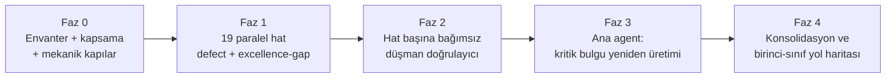

# PR Review 2 — Planı ve Kapsam Matrisi

> **Review tarihi:** 2026-08-24
> **Hedef:** `development` çalışma ağacındaki **commit'lenmemiş** değişiklik seti
> (`git diff` + untracked), taban `f9f608d`
> **Kapsam:** 361 dosya — 304 tracked (+13.584 / −3.397) ve 57 untracked (~6,4 bin satır);
> toplam ~23,4 bin satır değişiklik
> **Amaç:** Yalnız hata aramak değil — bu değişiklik setinin **birinci sınıf bir ürün ve
> mühendislik deneyimi** hedefine ne kadar yaklaştığını çok boyutlu olarak ölçmek

## Bu review'i öncekinden ayıran şey

Bu değişiklik seti, [`docs/analysis/pr-review/`](../pr-review/) altındaki review'in remediation'ıdır.
[`07-remediation-progress.md`](../pr-review/07-remediation-progress.md) çok güçlü bir iddia taşıyor:

> "`docs/analysis/pr-review/` envanterindeki doğrulanmış Critical, High, Medium ve Low repo
> bulguları düzeltildi veya daha üst bir davranışsal kabul maddesi altında açıkça supersede edildi.
> Repo kapsamında açık kod, test, CI, doküman veya statik-konfigürasyon kusuru kalmadı."

Bu iddia **kabul edilmez, denetlenir**. `R17` hattı yalnız bu iş için ayrılmıştır: önceki 2 Critical
ve 14 High bulgunun her biri kodda tek tek aranır ve "düzeltildi / kısmen düzeltildi / semptom
örtüldü / düzeltilmedi / haklı olarak supersede edildi" olarak karara bağlanır.

## Kapsam dışı

| Yol | Neden |
|---|---|
| `tools/calendar-data/data/snapshots/**` | Resmî kaynakların ham arşiv kopyası; üretilen veri |
| `docs/analysis/pr-review/**` | Bu review'in **girdisi**; kendi çıktımızı review etmiyoruz (ancak `R17` iddialarını denetler) |
| `bin/`, `obj/`, `TestResults/` | Build çıktısı |

## Review boyutları (her hat hepsini uygular)

Bu review tek boyutlu bir defect avı değildir. Her hat şu eksenlerin tamamından geçer:

| Eksen | Soru |
|---|---|
| **Doğruluk** | Kod iddia ettiği şeyi yapıyor mu? Uç durumlar, yarış koşulları, hata yolları? |
| **Güvenlik ve izolasyon** | Yetki, kimlik, secret, enjeksiyon, atlatma yüzeyi |
| **Veri bütünlüğü** | Kalıcı bozulma/kayıp, idempotentlik, transaction sınırı, fence'ler |
| **Finansal doğruluk** | `decimal` disiplini, yuvarlama, kültür, tarih/timezone semantiği |
| **Performans ve ölçek** | N+1, index kullanımı, bellek, gereksiz I/O, sıcak yol maliyeti |
| **İşletilebilirlik** | Arıza modu, gözlemlenebilirlik, alarm, runbook uygulanabilirliği, kurtarma |
| **Ürün deneyimi** | API sözleşmesi tutarlılığı, hata mesajı kalitesi, lokalizasyon, istemci ergonomisi |
| **Geliştirici deneyimi** | Kurulum, komut, hata çıktısı, isimlendirme, keşfedilebilirlik |
| **Test kalitesi** | Test iddia ettiğini gerçekten doğruluyor mu? Negatif senaryolar? Tautoloji? |
| **Dokümantasyon** | Kod ↔ doküman uyumu, çalışan komutlar, ADR tutarlılığı |
| **Sadelik** | Gereksiz karmaşıklık, tekrar, birleştirilebilir soyutlama |

Bulgular iki tipte kaydedilir:

- **`defect`** — yanlış, kırık veya riskli bir şey.
- **`excellence-gap`** — yanlış değil ama **birinci sınıf değil**: eksik cila, tutarsız ergonomi,
  kaçırılmış sadeleştirme, zayıf hata deneyimi. Bu review'in asıl katma değeri burada.

## Review hatları (19 paralel hat)

| Hat | Kapsam | Dosya | Satır |
|---|---|---:|---:|
| R01 | API güvenlik/admission yüzeyi (limiter, port boundary, endpoint surface, runtime) | 10 | 720 |
| R02 | Installation kimlik yaşam döngüsü + migration 023/024 (rehash, lifecycle admission) | 6 | 660 |
| R03 | Activity logging, pseudonymization, kanal yaşam döngüsü | 10 | 399 |
| R04 | Kalan API servis/repository/model/DTO katmanı + `Saydin.Shared` | 35 | 1.094 |
| R05 | PriceIngestion worker/repository (silinen repo'lar, provider deadline, sanitizer) | 16 | 749 |
| R06 | PriceIngestion adapter/mapper (`ProviderValueParser`, resilience/timeout) | 12 | 344 |
| R07 | DatabaseMigrator + RoleBootstrap + DatabaseSecurity (SCRAM verifier, SensitivePassword) | 19 | 1.198 |
| R08 | DataQualityAudit + DataRepair (canonical parity, repair policy, Dockerfile) | 25 | 939 |
| R09 | calendar-data (plan materializer, coverage evidence, verify-candidate) | 17 | 1.981 |
| R10 | `infrastructure/backup` (WAL highwater, recovery evidence, base-backup, restore init) | 13 | 2.641 |
| R11 | `infrastructure/deployment` + prometheus + alertmanager + otel | 27 | 1.838 |
| R12 | `infrastructure/release` + `.github/workflows` + `.github/scripts` | 33 | 1.623 |
| R13 | `Saydin.Api` unit + integration test kalitesi | 33 | 2.077 |
| R14a | PriceIngestion + calendar-data test kalitesi | 30 | 1.553 |
| R14b | Migrator/RoleBootstrap/DQA/DataRepair test kalitesi | 43 | 4.120 |
| R15 | Dokümantasyon, ADR, runbook, `CLAUDE.md` | 30 | 1.314 |
| R16 | Compose, solution, merkezi paket ve build konfigürasyonu | 3 | 169 |
| **R17** | **Remediation doğrulama** — önceki 2 Critical + 14 High gerçekten düzeldi mi | — | — |
| **R18** | **Ürün/DX mükemmellik** — çapraz tutarlılık, ergonomi, sadeleştirme, cila | — | — |

Kapsama doğrulaması: 361 dosyanın **tamamı** en az bir hatta atanmıştır (kapsanmayan: 0).

## Akış

## Çıktılar

| Rapor | İçerik |
|---|---|
| `README.md` | Yönetici özeti, yayın kararı, birinci-sınıf yol haritası |
| `00-review-plan.md` | Bu doküman |
| `01-findings-critical-high.md` | Doğrulanmış Critical + High |
| `02-findings-medium.md` | Doğrulanmış Medium |
| `03-findings-low.md` | Doğrulanmış Low |
| `04-mechanical-gates.md` | Build, test, tarama ve yeniden üretim kanıtları |
| `05-lane-summaries.md` | Hat kapsamları, reddedilen iddialar, güçlü kararlar |
| `06-remediation-audit.md` | Önceki review bulgularının gerçek kapanma denetimi |
| `07-excellence-roadmap.md` | `excellence-gap` kayıtları — birinci sınıfa giden fark |
