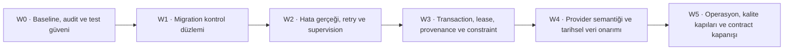

# Ingestion ve Veri Katmanı Remediation Planı

**Kaynak rapor:** `docs/analysis/02-ingestion-data-review.md`  
**Baseline:** `development`, inceleme anında `main` ile hizalı  
**Kapsam:** Rapordaki 25 bulgunun tamamının uygulama, migration, veri onarımı, test ve operasyon work item'larına dönüştürülmesi  
**Bu dokümanın etkisi:** Yalnız planlama. Production kodu, mevcut migration veya veri değiştirilmemiştir.

## 1. Plan ilkeleri ve değişmezler

1. **Mevcut migration dosyaları değiştirilmez.** `001`–`014` tarihsel kanıttır. Yeni şema değişiklikleri, merge anındaki sıradaki boş numarayla yeni ve ileri-yönlü migration olarak eklenir.
2. **Expand → dual-read/write → backfill → validate → contract** sırası kullanılır. Bu planın dalgalarında destructive contract migration yoktur; kolon/tablo kaldırma en az bir sonraki bağımsız release'e bırakılır.
3. **Veri düzeltme migration ile körlemesine yapılmaz.** Önce salt-okunur audit, sonra geri alınabilir snapshot/staging, sonra batch kimlikli ve kota kontrollü repair çalışır.
4. **“Boş veri” bir başarı türü değildir.** Yalnız provider sözleşmesi ve takvim tarafından açıkça doğrulanmış `expected_no_data` terminal sonucu kabul edilir.
5. **Crash sonrası yeniden çalıştırma güvenlidir.** Commit sonucu belirsiz olsa bile aynı logical window tekrarlandığında veri çoğalmamalı, daha yeni pencere başarısız pencerenin üstünden atlamamalıdır.
6. **Rollback, down-migration değildir.** Application rollback eski image'a dönüş + feature flag kapatma + additive şemayı yerinde bırakma şeklindedir. Veri repair rollback'i, pre-repair snapshot/staging ve `repair_batch_id` üzerinden yapılır.
7. **Release kapısı audit'i kapatmaz.** Davranış testleri için kullanılan `NuGetAudit=false` yalnız baseline ölçümüdür; normal audit-açık build ayrıca geçmelidir.
8. **Bir bulgunun 03/04 raporunda eşinin olması ikinci bir implementasyon işi üretmez.** Aşağıdaki “Çakışma” sütunu ortak owner/backlog kaydını gösterir.

### Karmaşıklık ölçeği

| Seviye | Beklenen kapsam |
|---|---|
| S | Tek bileşen, sınırlı test yüzeyi; yaklaşık 1–2 mühendis-günü |
| M | Birden fazla dosya veya DI/config/test değişimi; yaklaşık 3–5 mühendis-günü |
| L | Şema/entegrasyon/rollout içeren iş; yaklaşık 1–2 mühendis-haftası |
| XL | Veri modeli + runtime + fault test + staged rollout; iki haftadan büyük, parçalı teslim edilmeli |

Bu değerler takvim taahhüdü değil, sıralama ve review kapasitesi göstergesidir.

## 2. Dalga ve bağımlılık modeli

| Wave | Amaç | Giriş koşulu | Çıkış kapısı |
|---|---|---|---|
| W0 | Mevcut gerçeği dondurmak, güvenli test/audit zemini | 380/380 baseline ve fresh 16 migration kanıtı | Test komutları gerçek test sayısını doğrular; pre-change veri audit'i ve geri dönüş snapshot'ı hazır; migration sıra sahibi atanmış |
| W1 | Her startup/deploy'da şema bütünlüğünü fail-closed yapmak | W0 | Blank, complete-014, pre-014, partial-init, concurrent-runner ve kill/restart matrisi geçer; uygulama partial şemaya başlamaz |
| W2 | Fetch/job/worker hatalarını görünür ve yeniden denenebilir yapmak | W1 additive migration yolu hazır | Fault matrisi geçer; başarısız window atlanmaz; ölen worker health'i yeşil bırakamaz; fatal process non-zero çıkar |
| W3 | Atomiklik, distributed ownership, provenance ve DB invariant'ları | W2 outcome/state machine stabil | İki replica testi, commit-ack-loss testi, EF/schema contract ve `NOT VALID → VALIDATE` data gate'leri geçer |
| W4 | Kaynakların doğru tarih/fiyat semantiğine geçirilmesi ve kontrollü backfill | W3 provenance + snapshot + constraint pre-audit | Provider contract fixture'ları ve canary geçer; audit edilen gap'ler batch kimlikli repair ile kapanır; final fiyat semantiği belgelenir |
| W5 | Alert/readiness, coverage, docs ve kalıcı release gate | W4 | Audit-açık image build, 0-skip gerçek-infra, migration fault suite, per-source freshness alert testi ve risk-bazlı coverage gate required olur |

## 3. 25 bulgunun work item haritası

| Work item | Bulgu | Teslimat özeti | Karmaşıklık | Önkoşul | Wave | 03/04 çakışması |
|---|---|---|---:|---|---|---|
| ING-001 | C-01 | Durable ingestion-window ledger, typed outcome ve stop/retry semantics | XL | TST-001 temeli, DBM-001/002/003 | W2 | Benzersiz; PLT-H07 ile operability ilişkili |
| DBM-001 | C-02 | Her başlangıçta çalışan schema gate + partial fresh-init recovery | XL | W0 backup/audit; DBM-002/003/005 | W1 | Benzersiz; XVR-H02 fresh-migration CI desteği sağlar |
| OXR-001 | H-01 | OXR auth/transport/parse/no-data ayrımı ve strict-empty | M | ING-001 outcome contract | W2 | Test boşluğu PLT-M12/XVR-M01 ile ortak; davranış bulgusu benzersiz |
| DAT-001 | H-02 | `price_kind/as_of/finality` sözleşmesi, doğru schedule ve rebaseline | XL | DAT-003, DAT-002, ING-001 | W4 | PLT-M19 schedule/doc kısmıyla kısmi duplicate |
| EVDS-001 | H-03 | Sabit 2003-01-01 ay-başı başlangıç ve month-boundary invariant | S | ING-001 | W4 | Yok |
| EVDS-002 | H-04 | EVDS enabled→key startup validation ve docs/config düzeltmesi | S | RUN-001 startup gate | W4 | **PLT-M15 ile doğrudan duplicate** |
| RES-001 | H-05 | Gerçek retry/break-duration semantiği ve DI pipeline testi | M | TST-001 | W2 | Test yüzeyi PLT-M12/XVR-M01 ile ilişkili |
| SUP-001 | H-06 | Per-worker supervisor veya host fail-fast + progress-aware health | L | OBS-001, RUN-001 | W2 | **PLT-H08 ile doğrudan duplicate**; PLT-H07 ilişkili |
| CON-001 | H-07 | DB lease/advisory ownership ve unique logical window | L | ING-001 ledger, DBM-002 | W3 | PLT-M04 scaling ile ilişkili, aynı bulgu değil |
| DBM-002 | H-08 | Persistent-session migration lock ve body/tracking recovery | L | TST-001 migration fixture | W1 | PLT-H06 deployment migration job ile ortak teslimat |
| DBM-003 | H-09 | Checksum/fingerprint, güvenli baseline ve conditional-step state | L | DBM-002 | W1 | Benzersiz |
| DAT-002 | H-10 | Finansal validation policy + DB CHECK rollout'u | L | W0 data audit, DBM-001 | W3 | 04'teki decimal olumlu güvencesi bunu kapatmaz |
| MAP-001 | H-11 | Rejected-row/completeness sonucu ve schema-drift failure | L | ING-001 typed outcome | W2 | Benzersiz |
| DAT-003 | H-12 | Fiyat provenance/raw hash/as-of ve GoldAPI/OXR ayırımı | XL | DBM-001, W0 provenance audit | W3 | Benzersiz |
| TST-001 | H-13 | OXR/worker/repository/resilience/migration fault test paketi + gate | L | Yok | W0; kapanış W5 | **PLT-M11, PLT-M12 ve XVR-M01 ile doğrudan duplicate** |
| TXN-001 | M-01 | Data + job/window terminal state tek transaction | L | ING-001 ledger | W3 | Yok |
| JOB-001 | M-02 | Cancellation/abandoned semantics ve stale-lease reaper | M | ING-001, CON-001 tasarımı | W2 | PLT-M06 yalnız shutdown temasıyla ilişkili |
| ORM-001 | M-03 | Explicit EF delete behavior ve schema-model fingerprint | M | DBM-001 | W3 | Yok |
| SEC-001 | M-04 | OXR header auth + argv'siz psql secret aktarımı | M | DBM-005, OXR-001 | W4 | PLT-M08 secret governance ile ilişkili |
| OBS-001 | M-05 | Per-source attempt/outcome/lag/progress metric, trace ve readiness | L | ING-001 state modeli | W2 | **PLT-H07 ile doğrudan duplicate**; PLT-M05/M19 ilişkili |
| DOC-001 | M-06 | Kanonik `.csproj` test komutu + minimum test-count docs smoke | S | Yok | W0 | PLT-M15 ve PLT-L01 ile ortak docs-command işi |
| DBM-004 | M-07 | Lock/disk preflight, resumable Timescale migration ve recovery runbook | L | DBM-001/002 | W1 | PLT-H06 rollback/delivery ile ilişkili |
| RUN-001 | M-08 | Fatal exception için non-zero process exit | S | TST-001 process harness | W2 | **XVR-M05 ile doğrudan duplicate** |
| DBM-005 | M-09 | SQL ve shell migration için tek doğrulanmış DB hedefi | S | DBM-002 tasarımı | W1 | Yok |
| PERF-001 | L-01 | OXR cache-aware delay, restart dedupe ve gerçek affected-count | S | ING-001/TXN-001 API'leri | W4 | Yok |

## 4. W0 — Baseline, audit ve test güveni

### TST-001 — Risk bazlı ingestion test zemini

- **Değişecek alanlar:** `tests/Saydin.PriceIngestion.Tests`, yeni gerçek-PostgreSQL ingestion integration projesi veya mevcut integration harness, `.github/workflows/ci.yml`, coverage merge/gate config.
- **Teslimat:** OXR adapter/mapper; bütün concrete worker'lar; orchestrator/heartbeat; gerçek DI resilience pipeline; üç repository; fresh/existing migration ve process-exit testleri. HTTP stub cancellation-aware ve gerçek async olmalı; saat bağımlılıkları `TimeProvider` üzerinden kontrol edilmelidir.
- **Acceptance gate:** Required CI'da 86 mevcut ingestion testi korunur; yeni suite'de skip=0; `TestResults` artifact yokluğu failure; OXR/worker/orchestrator/repository sınıflarında doğrudan test bulunur. Başlangıç coverage değeri bir release'te yapay hedefe sıçratılmamalı; önce changed-lines ≥%80 ve kritik sınıflar için line/branch tabanı, sonra genel eşik kademeli artırılmalıdır.
- **Rollout/rollback:** Test-only ilk PR production davranışını değiştirmez. Flaky test karantinaya alınıp required gate bypass edilmez; root cause düzeltilir.

### DOC-001 — Test komutu ve test-count doğrulaması

- **Değişecek alanlar:** `docs/development-guide.md`, `.github/pull_request_template.md` ile ortak kanonik test script/Make target'ı, CI docs-smoke.
- **Teslimat:** Dizin yerine tam `tests/Saydin.PriceIngestion.Tests/Saydin.PriceIngestion.Tests.csproj` kullanımı; TRX/XML'den minimum test count ve `skipped=0` kontrolü.
- **Acceptance gate:** Dokümandaki komut temiz SDK container'ında en az 86 ingestion testini raporlar. “Exit 0 fakat 0 test” fixture'ı gate tarafından failure sayılır.
- **Çakışma yönetimi:** PLT-L01/M15 owner'ı aynı kanonik komutu tüketir; iki ayrı script yazılmaz.

### W0 veri audit ve geri-dönüş paketi

Bu iş ayrı bir review bulgusu değil, C-01/C-02/H-02/H-10/H-12 kapanışının zorunlu önkoşuludur.

- Salt-okunur audit çıktısı: asset/source başına ilk-son tarih; takvime göre eksik gün/ay kümeleri; duplicate logical job; `running` yaşı; failed/success-0 pencereler; negatif/sıfır fiyat-endeks; OHLC sırasızlığı; ayın 1'i olmayan TÜFE; seed/tuik kapsamı; XAU/XAG için provenance bilinmeyen dönem.
- Audit, piyasa takvimini kaynak bazında ayırır: CoinGecko 7/24, TCMB iş günü + resmi yayın yokluğu, BIST işlem takvimi, OXR tamamlanmış UTC gün, EVDS aylık yayın.
- Pre-change PostgreSQL backup + restore drill yapılır; fiyat ve inflation tabloları için satır sayısı/hash örneklemesi kaydedilir. Production verisi rapoya dökülmez; erişim kontrollü incident/change kaydında tutulur.
- Provider key, plan/tier, geçmiş erişim limiti ve kota bütçesi doğrulanır. Kota yetersizse backfill “başladı” sayılmaz.
- **Gate:** Audit sonucu owner, tarih ve query sürümüyle imzalanmadan W3 constraint veya W4 repair çalışmaz.

## 5. W1 — Migration kontrol düzlemi

### DBM-002 — Eşzamanlı ve crash-safe migration runner

- **Tasarım:** Bütün run boyunca tek persistent DB session veya eşdeğer bir migrator kullan; session-level advisory lock aynı session'da tutulur. SQL migration body ile version/checksum kaydı mümkünse tek transaction'da commit edilir. Transaction dışı/`.sh` adımları `pending/running/succeeded/skipped_optional/failed` state ve idempotent postcondition taşır.
- **Acceptance gate:** İki migrator barrier ile aynı anda başladığında body bir kez çalışır. Body commit sonrası tracking öncesi kill, tracking sonrası ACK kaybı ve lock-holder ölümü testlerinde rerun deterministik biçimde converge eder. `ON CONFLICT` tek başına acceptance değildir.
- **Rollback:** Yeni runner önce `verify-only`, sonra staging, sonra tek production deploy job'ında etkinleşir. Sorunda uygulama deploy'u durdurulur; eski runner'a körlemesine dönülmez, çünkü hangi body'nin commit ettiği önce state/postcondition ile belirlenmelidir.

### DBM-003 — Checksum, schema fingerprint ve legacy baseline

- **Tasarım:** Her tracked migration için SHA-256 manifest; yeni kayıtlar checksum zorunlu. `014` back-register'ına güvenmek yerine legacy baseline, kritik tablo/kolon/constraint/FK/Timescale policy fingerprint'i doğrulanınca operatör onayıyla yazılır. `012b` gibi opsiyonel cluster rolü “succeeded” yerine gerçek durumuyla tutulur.
- **Acceptance gate:** Tek byte değişmiş uygulanmış migration mismatch ile non-zero; 008 seviyesindeki DB 014-complete sayılamaz; complete-014 DB veri/DDL değiştirmeden doğrulanır; exporter secret yoksa `skipped_optional` görünür.
- **Backward compatibility:** Mevcut `checksum IS NULL` satırları otomatik olarak güvenilir sayılmaz. İlk baseline yalnız doğrulanan commit/fingerprint eşleşmesi için, audit kaydıyla doldurulur.

### DBM-005 — Tek migration bağlantı hedefi

- **Tasarım:** `DATABASE_URL`/PG* girdileri tek kez normalize edilir; SQL ve shell adımları aynı bağlantı nesnesi/secret file üzerinden yürür. Body öncesi ve sonrası server address, database, user ve cluster identifier doğrulanır.
- **Acceptance gate:** Yalnız `DATABASE_URL` verilen iki-DB fixture'ında rol ve schema kaydı aynı hedefte oluşur, diğer DB değişmez. Parola process argv/log/trace içinde görünmez.
- **Rollback:** Eski shell path, yeni runner doğrulanmadan kaldırılmaz; ancak iki path aynı deploy'da aktif olmaz.

### DBM-004 — Büyük/Timescale migration operasyon güvenliği

- **Tasarım:** Preflight satır/chunk boyutu, compression durumu, disk headroom, blocking session ve beklenen lock süresi ölçülür. `lock_timeout`/`statement_timeout`; chunk-batch decompression; resumable checkpoint; postcondition ve compression re-enable recovery adımı tanımlanır. Non-concurrent büyük index işlemleri transaction dışı `CONCURRENTLY` akışına bölünür.
- **Acceptance gate:** Production-benzeri hacimde rehearsal; belirlenen lock SLO'su aşılırsa otomatik abort; 008b eşdeğeri sonrası fault'ta resume edip 013 postcondition'ına ulaşma; disk headroom alarmı.
- **Rollback:** DDL down yerine forward-recovery. Compression kapalı kalırsa yazma trafiğini sürdürme kararı kapasite gate'ine bağlıdır; otomatik olarak bir sonraki migration'a geçilmez.

### DBM-001 — C-02 fresh-init ve schema readiness tasarımı

#### Hedef mimari

- Docker image'in yalnız boş volume'da çalışan `/docker-entrypoint-initdb.d` davranışı şema doğruluğunun tek sahibi olmaktan çıkarılır.
- Ayrı migration service/job **her startup/deploy'da** çalışır; migrations read-only başka path'ten okunur. API/ingestion bu job'ın `service_completed_successfully`/deployment gate sonucu olmadan başlamaz.
- PostgreSQL `pg_isready` yalnız process liveness'tır. Ayrı schema readiness; beklenen son version, checksum/fingerprint ve kritik postcondition'ları doğrular.
- Tarihsel `001`–`014` değiştirilmez. Fresh bootstrap, bu dosyaları mevcut sırayla uygular; partial fresh DB'yi tekrar çalıştırmak yerine güvenli sınıflandırır.

#### Crash/fault semantiği

| Crash noktası | Beklenen durum | Restart davranışı |
|---|---|---|
| Cluster init öncesi | Uygulama erişimi yok | Normal init tekrar denenir |
| Tarihsel migration ortası | `bootstrap_incomplete`; schema readiness kırmızı | Target yalnız bu bootstrap tarafından yaratılmış ve hiç app write almamışsa kontrollü DB recreate; aksi halde quarantine/manual recovery |
| Migration body commit, tracking ACK yok | Postcondition + checksum ile “commit olmuş” belirlenir | Body körlemesine rerun edilmez; tracking reconcile edilir |
| Shell/role adımı ortası | Adım `running/failed`, şema version'ından ayrı | İdempotent postcondition sonrası retry; optional ise açık `skipped_optional` |
| Son version sonrası readiness öncesi | Şema tamam | Restart validate edip app gate'i açar |
| İki migrator | Biri lock owner | Diğeri bounded wait/exit; body çalıştırmaz |

#### Backward compatibility matrisi

| Mevcut DB durumu | Davranış |
|---|---|
| Tamamen blank | Yeni migrator bootstrap sahibi; başarıya kadar app kapalı |
| Complete `014` + doğrulanan fingerprint | Veri/DDL değişmeden baseline kabulü; yalnız yeni sürümler uygulanır |
| Gerçek pre-014 production DB | Otomatik back-register yok; read-only fingerprint + operator-attested baseline veya kontrollü ara upgrade |
| `schema_migrations` yok, kısmi nesneler var | Fresh ownership kanıtı yoksa **fail closed/quarantine**; drop/recreate yok |
| Yeni sistemin `bootstrap_incomplete` marker'ı ve hiç app write yok | Kontrollü target DB recreate + tam bootstrap retry |
| Şema binary'den daha yeni | App compatibility range karşılanmıyorsa startup reddi; migration geri alınmaz |

#### Dosya ve rollout sırası

1. DBM-002/003/005 runner + state/checksum gelir; mevcut Compose mount hâlâ aktif, yeni job `verify-only`.
2. Complete-014 dev/staging DB'lerde no-op/fingerprint kanıtlanır; pre-014 ve partial fixture'lar fail-closed test edilir.
3. Downstream services schema-job completion'a bağlanır; mevcut DB'lerde migration job no-op olur.
4. Yalnız yeni blank-volume path doğrulandıktan sonra migrations klasörünün doğrudan `initdb.d` mount'u kaldırılır ve tek bootstrap sahibi migrator olur.
5. Production canary'de app write açılmadan migration/readiness doğrulanır.

#### Exact acceptance gate

- Blank volume: `001`–`014` + yeni migration'lar bir kez uygulanır, fingerprint eşleşir.
- Her migration boundary'sinde ve seçili statement/commit noktasında process kill: aynı volume restart'ta app hiçbir zaman partial DB'ye başlamaz; fresh-owned DB sonunda converge eder.
- Complete-014 kopyası: tablo veri count/hash değişmez ve migrator no-op.
- 008-only, 008b-only, 011-only ve checksum-mismatch fixture: non-zero/fail-closed, yanlış back-register yok.
- İki parallel migrator: tek body execution.
- Migration success fakat readiness mismatch: app kapalı.
- Backup restore drill + eski application image smoke: additive şemada geçer.

#### Rollback

- Migration uygulanmadan önce job/image rollback serbesttir.
- Additive migration uygulandıktan sonra eski application image schema compatibility smoke'u geçtiyse image geri alınır, yeni kolon/tablo yerinde bırakılır.
- Partial/başarısız upgrade'de eski runner çalıştırılmaz; DBM-002 state'ine göre forward-recovery veya pre-change backup restore seçilir.
- Fresh-owned ve hiç app write almamış incomplete DB dışında otomatik drop/recreate **yasaktır**.

## 6. W2 — Hata gerçeği, retry ve supervision

### ING-001 — C-01 durable window ve fault semantics

#### Runtime sözleşmesi

Adapter sonucu en az şu ayrımı taşır: `data`, `expected_no_data(reason)`, `retryable_failure`, `permanent_failure`, `partial/rejected`. Cancellation ayrı control-flow'dur. Auth/config, 4xx contract ve schema drift kalıcı; network/429/5xx/timeout retryable sınıflandırılır. Provider-specific istisnalar review edilmeden genel `catch → []/null` yoktur.

Logical range için additive bir `ingestion_windows` ledger önerilir:

- kimlik: source + nullable asset + job type + range start/end + contract version;
- state: pending/running/succeeded/expected_no_data/retryable_failed/permanent_failed/cancelled/abandoned;
- lease owner/until, attempt count, next attempt, accepted/rejected count ve hata kodu;
- `ingestion_jobs` attempt/audit kaydı olarak kalır; mevcut okuyucular bozulmaz, nullable `window_id/outcome_code` ile genişletilir.

HTTP resilience yalnız HTTP attempt'lerini; worker logical retry yalnız bütün window'u yönetir. Nested ve birbirinden habersiz retry bütçesi olmaz. In-memory `chunkFrom` yalnız ledger state atomik olarak terminal-success olduğunda ilerler. `MAX(price_date)` tek checkpoint olmaktan çıkar; failed/pending window önce işlenir.

#### Crash matrisi

| Fault noktası | Beklenti |
|---|---|
| Job/window create öncesi | Provider çağrısı yok; aynı window yeniden planlanır |
| Window running sonrası, fetch öncesi kill | Lease expiry sonrası `abandoned` ve reclaim |
| HTTP retries exhausted | `retryable_failed`, backoff; sonraki chunk çalışmaz |
| Auth/schema/mapper permanent failure | `permanent_failed`, source readiness kırmızı; checkpoint ilerlemez |
| Kısmi payload | Completeness policy'ye göre whole-window fail veya açık partial state; tam başarı değil |
| Data transaction ortası | Rollback; window retry edilir |
| Commit ACK kaybı | Data + terminal window aynı transaction'daysa DB state okunur; idempotency key ile duplicate oluşmaz |
| SIGTERM | Kısa shutdown finalize veya lease expiry; süresiz running yok |
| Success sonrası process kill | Terminal ledger tekrar fetch'i engeller; data/window tutarlı |

#### Exact acceptance gate

- Üç chunk fixture'ında ikinci chunk'ın adapter, mapper, job-start ve repository fault varyantlarının her birinde üçüncü chunk çağrılmaz.
- Restart aynı DB ile ikinci chunk'ı yeniden hedefler; daha yeni `MAX` değeri eksik window'u saklamaz.
- EVDS dört-chunk testinde ikinci chunk fail olduğunda üçüncü/dördüncü ilerlemez veya açık pending kalır; başarı sayılmaz.
- Commit-before-ACK testinde retry sonrası bir logical window, bir price key ve tutarlı terminal state vardır.
- `success/0` yalnız `expected_no_data` reason + provider calendar kanıtıyla yazılabilir.
- Old/new binary rolling testinde enforcement, eski instance drain edilmeden açılmaz.

#### Rollout ve rollback

1. Additive ledger migration.
2. Yeni binary `shadow` modda ledger yazar fakat legacy scheduling kararını değiştirmez; sonuç farkları ölçülür.
3. Bütün instance'lar yeni binary olduktan sonra source bazlı enforcement: CoinGecko → EVDS → TCMB/TwelveData → OXR.
4. Failed-window audit ve W4 repair bundan sonra başlar.
5. Sorunda ilgili source flag'i legacy moda döner; additive ledger korunur. Başlamış data repair otomatik geri çevrilmez, batch snapshot prosedürü kullanılır.

### OXR-001 — OpenExchangeRates strict outcome

- **Teslimat:** Missing key startup/config error; 401/403 permanent auth; 429 retryable rate-limit; 5xx/network retryable; malformed/missing rates permanent contract; yalnız doğrulanmış 404/no-publication `expected_no_data`. Mapper geçersiz metal/TRY rate'i rejected/schema error olarak bildirir.
- **Acceptance gate:** Missing key, 401, 403, 429, 500, malformed JSON, missing `rates`, missing XAU/TRY ve çok-gün kısmi response tablosunun her satırı expected state/job/metric üretir. Hiçbiri `success/0` olamaz; tanımlı no-data fixture olabilir.
- **Rollout:** Önce shadow outcome metric, sonra OXR strict-empty flag. Kota limitine ulaşmış canary, breaker/worker'ı sonsuz retry'ya sokmamalıdır.

### MAP-001 — Rejected-row ve completeness

- **Teslimat:** Mapper sonucu `accepted`, `rejected(reason,index/date)`, top-level contract status ve expected count taşır. TwelveData/EVDS zorunlu collection yokluğu exception; TCMB malformed-200 ile 404 tatil ayrılır. PII/secret veya full payload loglanmaz.
- **Acceptance gate:** 10/10 valid success; 9/10 ve 0/10 malformed senaryolarında policy'e uygun partial/failure, rejected metric ve checkpoint davranışı. Provider alan rename contract testi fail-closed.
- **Rollout:** Rejection önce yalnız metric/log; threshold gerçek provider örnekleriyle kalibre edildikten sonra enforcement açılır.

### RES-001 — Retry/circuit breaker sahipliği

- **Teslimat:** `BreakDuration`, sampling, minimum throughput ve pipeline order açıkça ayarlanır; yorum/doküman aynı gerçek semantiği söyler. Worker logical retry bütçesi HTTP retry ile birlikte toplam süre/attempt limitine bağlanır.
- **Acceptance gate:** Fake time + gerçek DI handler ile 500/429/timeout dizilerinde exact attempt sayısı, delay, breaker open süresi ve half-open sonucu assert edilir. Shutdown cancellation retryable hata sayılmaz.
- **Rollback:** Config flag ile önce bir provider; eski policy değerleri config'te bir release tutulur.

### SUP-001 — Worker supervision ve health

- **Karar:** Tercih edilen minimum-risk politikası, herhangi bir enabled worker fatal olduğunda host'u non-zero fail ettirip container orchestrator'a yeniden başlatmaktır. In-process restart seçilecekse max restart/bütçe sonrası host yine fail olmalı; sonsuz self-heal yoktur.
- **Acceptance gate:** İki worker fixture'ında biri fatal olduğunda container ya restart olur ya bounded supervisor ile geri gelir; hiçbir durumda bağımsız heartbeat healthy kalmaz. Normal cancellation clean exit; hung/no-progress worker freshness threshold sonrası readiness false.
- **Çakışma:** PLT-H08'in tek uygulama kaydı budur. Platform planı yalnız container/deploy/alert tarafını sahiplenir.

### JOB-001 — Cancellation ve stale job

- **Teslimat:** Ledger `cancelled/abandoned`; bounded shutdown finalize; lease expiry reaper. `CancellationToken.None` sınırsız kullanılmaz, ayrı kısa shutdown budget kullanılır.
- **Acceptance gate:** HTTP, transaction ve delay sırasında SIGTERM varyantlarında terminal/lease state belirlenen süre içinde oluşur; startup reaper stale window'u tek kez reclaim eder.

### RUN-001 — Fatal exit code

- **Teslimat:** Fatal log flush korunarak rethrow veya açık non-zero exit. Normal SIGTERM exit semantiği ayrı.
- **Acceptance gate:** Missing connection, no-enabled-worker ve supervisor fatal fixture'larında process exit `!=0`; normal stop'ta beklenen clean code. XVR-M05 ile API ve ingestion aynı helper/policy'yi paylaşır.

### OBS-001 — Provider progress telemetry

- **Teslimat:** Attempt/outcome/duration, accepted/rejected, retry, last-success observation, lag, failed/running-window age, lease contention ve breaker state. Source/asset-category gibi bounded-cardinality tag; job/window correlation span. Liveness process'i, readiness veri tazeliğini ölçer.
- **Acceptance gate:** Success, expected-empty, partial, auth, retries-exhausted, fatal worker ve stale-window fixture'larında metric/span/health snapshot'ı. En az bir alert rule testinde stale source sayacı alarm üretir ve recovery'de kapanır.
- **Çakışma:** PLT-H07 alarm routing/SLO'yu, bu item runtime sinyal üretimini sahiplenir.

## 7. W3 — Atomiklik, concurrency, provenance ve constraint

### CON-001 — Distributed lease ve logical uniqueness

- **Teslimat:** Ledger üzerinde atomic claim (`SELECT ... FOR UPDATE SKIP LOCKED`, compare-and-swap veya transaction advisory lock), owner/lease expiry ve unique logical key. Rolling deploy sırasında eski binary'ler drain edilmeden enforcement açılmaz.
- **Acceptance gate:** Aynı DB'ye iki replica/barrier: bir provider call, bir active owner, bir terminal window. Owner kill sonrası yalnız bir successor reclaim eder. Clock skew testi DB server time kullanıldığını doğrular.
- **Rollback:** Lease enforcement flag kapatılabilir; unique/additive tablo yerinde kalır. İki farklı scheduler aynı anda legacy moda bırakılmaz.

### TXN-001 — Data ve audit state atomikliği

- **Teslimat:** Repository application service tek DbContext/transaction içinde price/inflation UPSERT + job/window terminal update yapar. Affected row sayısı `==1`; gerçek distinct inserted/updated count döner.
- **Acceptance gate:** Data write, job update ve commit'in her sınırında fault injection. Gözlenebilir DB durumu yalnız “ikisi de yok/pending” veya “data + terminal success”; “data committed/job failed-running” yok.
- **Rollback:** Eski ayrı repository metotları bir release adapter olarak kalabilir; enforcement flag sonrası kaldırma contract wave'e ertelenir.

### DAT-003 — Provenance ve repair reversibility

- **Expand şema:** Nullable `source`, `observed_at/as_of_at`, `price_kind`, `is_final`, `payload_hash`, `repair_batch_id`; raw body yerine boyut/redaction kontrollü archive reference. Eski satırlar `source='unknown_legacy'` olarak yalnız audit sonucuyla sınıflandırılır; uydurma GoldAPI/OXR etiketi verilmez.
- **Acceptance gate:** Yeni write'ların %100'ünde provenance; raw secret taraması temiz; provider overwrite provenance'ı transaction ile günceller. GoldAPI/OXR bilinmeyen satırlar sorgulanabilir ve repair batch rollback edilebilir.
- **Backward compatibility:** Kolonlar önce nullable/defaultsız; eski app insert'i çalışır. Yeni app dual-write eder. `NOT NULL` ancak historical classification/backfill tamamlandıktan sonraki contract release'de değerlendirilir.

### DAT-002 — Finansal constraint rollout'u

- **Policy:** `close > 0`, `volume IS NULL OR >=0`, `index_value >0`, `period_date = date_trunc('month',...)`; OHLC high/low/open/close kuralları price kind'a göre tanımlanır. TCMB referans fiyatında olmayan OHLC null kalabilir.
- **Sıra:** read-only violation audit → mapper validation → yeni CHECK `NOT VALID` → yeni yazı canary → historical repair/quarantine → `VALIDATE CONSTRAINT`. Existing migration edit yoktur.
- **Acceptance gate:** Her invalid boundary mapper ve gerçek PostgreSQL tarafından reddedilir; valid provider fixtures geçer; `VALIDATE` öncesi violation count 0. Lock rehearsal DBM-004 limitleri içinde.
- **Rollback:** `NOT VALID` constraint yeni write'ı yine kontrol ettiği için acil durumda yalnız yeni migration ile drop edilebilir; bunun yerine önce mapper flag ve canary ile false-positive riski giderilir. Validation rollout'u durdurulabilir.

### ORM-001 — EF/schema contract

- **Teslimat:** PricePoint/IngestionJob ilişkilerinde explicit `DeleteBehavior.Restrict`; DB kolonlarının property/shadow mapping'i veya deliberate exclusion metadata'sı; model-schema fingerprint test.
- **Acceptance gate:** Loaded ve unloaded dependent ile Asset delete aynı restrict sonucu; generated migration diff beklenmedik drop/cascade içermez; fresh DB EF model contract geçer.

## 8. W4 — Provider doğruluğu ve veri onarımı

### DAT-001 — Final/reference fiyat modeli ve schedule

- **Karar kaydı:** Ürün tüketicisinin “close” ile ne kastettiği ADR'de belirlenir. OXR completed UTC day; CoinGecko UTC gün sonu; TwelveData BIST official final candle; TCMB official reference/bid olarak ayrı `price_kind` alır. Provider revision/finality destekliyorsa provisional → final transition tanımlanır.
- **Acceptance gate:** Fixture'da gün başı/gün sonu farklıyken doğru timestamp seçilir; BIST clock testi resmi kapanış + yayın tamponu sonrasıdır; OXR yalnız tamamlanmış günü yazar; TCMB reference fiyatı daily-close gibi etiketlenmez. API tüketicisi mixed price kind'ı ya doğru sunar ya açıkça reddeder.
- **Rollout:** Yeni kolon dual-write → API/read path compatibility → source-by-source schedule → staging diff → backfill/rebaseline. Schedule tek başına değiştirilip eski `close` semantiğiyle yeni data karıştırılmaz.
- **Rollback:** Schedule/config ve read-selection flag geri alınır; eski kayıtlar silinmez. Repair batch snapshot ile geri alınabilir.

### EVDS-001 — Month boundary ve tarih ufku

- **Teslimat:** `new DateOnly(2003,1,1)` veya doğrulanmış config; her chunk sınırı ayın 1'i. Clock statik property'den çıkarılıp test edilebilir.
- **Acceptance gate:** Ayın 2/18/31'inde startup testleri aynı 2003-01-01 başlangıcı ve kesintisiz month-first chunk üretir; latest tuik anchor geçmiş failed window'u saklamaz.

### EVDS-002 — Key/config fail-fast

- **Teslimat:** EVDS enabled ise API key startup validation; `.env.example` güvenli default; development/architecture docs resmi sözleşmeyle hizalı.
- **Acceptance gate:** Enabled+blank key non-zero; disabled+blank key clean; valid secret log/config dump'ta görünmez. Docs smoke doğru akışı çalıştırır.

### SEC-001 — Secret taşıma

- **Teslimat:** OXR token header; psql `PGPASSFILE`/secret file veya güvenli credential provider; argv/query/log redaction. OXR header desteği plan/tier fixture ile doğrulanır.
- **Acceptance gate:** Capturing handler/span/log ve process list testlerinde secret substring yok; auth request başarılı. SSRF regression'da dynamic source id absolute URI'ye dönüşemez.

### PERF-001 — Kota ve sayım doğruluğu

- **Teslimat:** OXR delay yalnız cache miss/HTTP call sonrası; schedule sonrası persisted target/window kontrolü; repository gerçek distinct/affected count.
- **Acceptance gate:** İki metal ×365 gün testinde HTTP call yaklaşık 365 ve ikinci cache turu ek 73 saniye üretmez; target mevcut restart sıfır fetch; duplicate input reported count distinct ile eşit.

## 9. Veri audit, backfill ve doğrulama bağımlılıkları

Backfill, “kod deploy oldu” diye otomatik başlamaz. Aşağıdaki sıralama zorunludur:

1. **Freeze ve snapshot:** Kaynak bazlı repair window'ları belirlenir; pre-repair fiyat/enflasyon satırları staging/backup'a alınır. Her batch benzersiz `repair_batch_id`, provider contract version ve query manifest taşır.
2. **Semantik hazır olma:** ING-001 strict outcome, DAT-003 provenance, DAT-001 price kind ve DAT-002 mapper validation canlı olmadan historical overwrite yoktur.
3. **Dry run:** Provider sonucu staging'e yazılır; mevcut satırla delta, missing/extra dates, non-positive/precision ve daily move outlier raporu çıkar. İnsan onayı olmadan merge yoktur.
4. **Kaynak sırası:** CoinGecko 7/24 gap reconciliation → EVDS gerçek aylık seri → TCMB iş günü/tatil → TwelveData BIST → OXR metal. OXR son sıradadır; düşük free-tier kota ve legacy provenance belirsizliği önce çözülmelidir.
5. **Batch apply:** Küçük tarih aralıkları, transaction başına bounded rows; provider quota ve DB lock metriği izlenir. Her batch data + provenance + window success'i TXN-001 transaction'ında yazar.
6. **Post-audit:** Beklenen takvime göre gap=0 veya açık `expected_no_data`; invalid financial row=0; terminal/pending ledger tutarlı; API örnek hesapları eski/yeni karşılaştırmalı onaylı.
7. **Constraint validate:** Yalnız post-audit temizse DAT-002 `VALIDATE` çalışır.
8. **Rollback:** Yanlış batch'te aynı `repair_batch_id` satırları pre-repair staging değerine geri alınır. Arada kullanıcı write'ı olamayacağı fiyat master datası için bile current hash eşleşmeden overwrite yapılmaz.

Backfill sırasında provider geçmiş erişimi/kotası yetersizse bulgu kapalı sayılmaz; “external dependency blocked” olarak kaydedilir ve API'nin veri freshness/coverage contract'ı bunu görünür kılar.

## 10. Dosya çakışmaları ve merge sahipliği

| Conflict lane | Sıralı work item'lar | Ortak dosyalar | Merge kuralı |
|---|---|---|---|
| Migration runner/bootstrap | DBM-005 → DBM-002 → DBM-003 → DBM-004 → DBM-001 | `infrastructure/postgres/apply-migrations.sh`, yeni bootstrap/migrator, Compose, ADR-001 | Tek owner; paralel PR yok. Önce connection contract, sonra lock/state/checksum, en son orchestration switch |
| Yeni migration numaraları | ING-001/CON-001/JOB-001 → DAT-003 → DAT-002 → ORM-001 gerekirse | `infrastructure/postgres/migrations/<next>_*.sql`, schema docs | Merge sırasında migration sequence rebase edilir; tarihsel dosya edit edilmez. Constraint validation ayrı migration olabilir |
| Worker engine | ING-001 → JOB-001 → SUP-001 → PERF-001 | `BaseAssetWorker.cs`, `EvdsInflationWorker.cs`, worker interfaces/orchestrator | ING-001 state contract merge olmadan diğerleri başlamaz; behavior flags ayrı commit |
| Adapter/outcome | ING-001 → OXR-001/MAP-001 → EVDS-001/002 → DAT-001/SEC-001 | Adapter interface, OXR/EVDS/Twelve/TCMB/CoinGecko adapter-mapper'ları | Interface PR küçük ve önce; provider PR'ları sonra paralel olabilir, aynı adapter içinde tek owner |
| Repository/EF | ING-001 → TXN-001/CON-001 → DAT-003 → ORM-001/DAT-002 | repository interfaces, implementations, entities/configurations | Transaction API önce; model ve schema aynı PR/gate'te hizalanır |
| Program/DI/health | RES-001 → RUN-001 → OBS-001 → SUP-001 | `Program.cs`, resilience extension, metrics, heartbeat/orchestrator | Tek integration owner; her adım process/container testinden geçer |
| Tests/CI/docs | TST-001/DOC-001, sonra bütün feature testleri | test csproj/harness, workflow, docs | Harness değişiklikleri önce; production PR kendi testini taşır. PLT/XVR planları aynı CI/docs işini tekrar açmaz |

## 11. Release, rollout ve rollback sırası

### Release R0 — Kanıt ve kontrol

- TST-001/DOC-001, W0 audit, backup/restore drill.
- Production davranışı değişmez.
- **Go/no-go:** Gerçek test count ve veri baseline yoksa dur.

### Release R1 — Migration control plane

- DBM-005/002/003/004/001; önce verify-only, sonra application schema gate.
- Hiçbir yeni finansal schema zorunluluğu yok.
- **Rollback:** Migration uygulanmadıysa image/job rollback; uygulandıysa state'e göre forward-recovery. Partial DB'ye application açılmaz.

### Release R2 — Additive ledger + shadow outcome

- ING-001 ledger migration, outcome types, OXR/MAP shadow classification, OBS sinyalleri, RUN/SUP temel davranışı.
- Tüm instance'lar yeni binary; enforcement kapalı.
- **Rollback:** Feature flags kapalı/old image; additive tablo kalır.

### Release R3 — Enforced failure semantics ve atomiklik

- Source bazlı strict outcome, logical retry, cancellation, transaction ve distributed lease.
- CoinGecko ile canary, sonra diğer kaynaklar; eski instance tamamen drain.
- **Rollback:** Source flag kapatılır; ledger ve job kanıtı korunur. Veri transaction'ları idempotent olduğundan tekrar güvenlidir.

### Release R4 — Provenance ve financial expand

- Nullable provenance/price-kind kolonları, dual-write; mapper validation; CHECK'ler `NOT VALID`; explicit EF behavior.
- **Rollback:** Eski image additive schema üzerinde smoke edilmiş olmalı; validation/contract ertelenir.

### Release R5 — Provider correction ve repair

- Schedule/semantic düzeltmeleri, EVDS key/boundary, secret transfer, perf; source-by-source repair batch.
- **Rollback:** Config/read flag geri; batch snapshot restore. Tarihsel migration down yok.

### Release R6 — Validate ve kalıcı gate

- Data post-audit sonrası constraints validate; alert/readiness, merged coverage, fault suites ve docs drift required.
- Eski write path kaldırımı ayrı contract proposal olmadan yapılmaz.

## 12. Work item bazlı Definition of Done özeti

| Work item | Kapanış için zorunlu kanıt |
|---|---|
| ING-001 | Chunk fault/restart/commit-ACK/cancellation matrisi; failed window atlanmıyor |
| DBM-001 | Blank + partial + complete-014 + pre-014 + newer-schema restart/readiness matrisi |
| OXR-001 | 9 durumlu auth/rate/5xx/parse/missing/partial/no-data table test; false-success yok |
| DAT-001 | Provider timestamp/finality contract + canary diff + batch-repair post-audit |
| EVDS-001 | Clock bağımsız 2003-01-01 ve tüm chunk'larda month-first |
| EVDS-002 | Enabled/blank non-zero; disabled/blank clean; docs smoke |
| RES-001 | Gerçek DI pipeline exact attempts, delays ve break duration |
| SUP-001 | Fatal worker sonrası restart/fail ve health red; normal shutdown clean |
| CON-001 | İki replica tek claim/call; lease owner kill/reclaim |
| DBM-002 | Parallel runner + body/tracking kill recovery |
| DBM-003 | Checksum tamper ve incomplete baseline fail-closed |
| DAT-002 | Invalid mapper/DB fixtures red; historical violation 0; constraint validated |
| MAP-001 | Partial/top-level schema drift failure ve rejected metric |
| DAT-003 | Yeni writes provenance %100; unknown legacy açık; repair rollback kanıtı |
| TST-001 | Required 0-skip suite, artifact zorunlu, kritik sınıf gates |
| TXN-001 | Data ve job/window terminal state atomic fault test |
| JOB-001 | SIGTERM terminal/lease expiry ve stale reaper tek-claim |
| ORM-001 | Loaded/unloaded delete aynı Restrict; model fingerprint temiz |
| SEC-001 | URI/argv/log/span secret taraması temiz; auth smoke |
| OBS-001 | Outcome/lag/readiness snapshot + alarm firing/recovery testi |
| DOC-001 | Kanonik komut gerçekten ≥86 test; 0-test exit-0 reddediliyor |
| DBM-004 | Hacimli Timescale rehearsal; lock/disk SLO ve resume kanıtı |
| RUN-001 | Fatal non-zero, SIGTERM clean exit process testi |
| DBM-005 | İki DB target isolation ve secret-free argv |
| PERF-001 | HTTP/delay/restart/affected-count deterministic test |

## 13. Nihai kabul kapısı ve residual risk

25 bulgu “kod merge edildi” ile değil, aşağıdaki birleşik kanıtla kapatılır:

- Audit-açık normal API ve ingestion image build'i başarılı; High/Critical dependency audit temiz.
- Full suite gerçek PostgreSQL/Redis ile 0 failed/0 skipped; ingestion unit mevcut 86 baseline'ın altına düşmez; yeni migration/fault/concurrency suite required'dır.
- Fresh ve existing-DB migration matrix'i, aynı-volume kill/restart dahil geçer; uygulama partial/mismatch şemaya başlamaz.
- Kaynak başına son başarılı observation ve lag görünür; fatal/dead/stale source alert testi geçer.
- Pre/post data audit imzalıdır; açıklanamayan gap, invalid finansal satır ve provenance'sız yeni write yoktur.
- Repair batch'lerinin rollback kanıtı ve provider kota/credential bağımlılıkları kayıtlıdır.
- Old application image additive schema üzerinde smoke edilmiştir; contract/destructive migration bu planda yapılmamıştır.

Residual risk olarak canlı provider plan/tier davranışı, production veri hacmi/lock süresi ve geçmiş GoldAPI satırlarının kesin kökeni staging/rehearsal olmadan tamamen çözülemez. Bu alanlarda kanıt yoksa work item “done” değil, açık bağımlılık olarak kalmalıdır.
