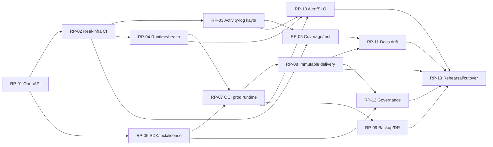

# Saydin.Services — Platform Remediation Planı

> Tarih: 2026-08-18  
> Plan tabanı: `development` / `a274c62`; `main` / `9067dd2` bu commit'in atasıdır  
> Kaynaklar: [`03-platform-docs-quality-review.md`](../03-platform-docs-quality-review.md) ve
> [`04-validation-and-cross-cutting-review.md`](../04-validation-and-cross-cutting-review.md)  
> Kapsam: yalnız planlama; bu çalışma production kodu, CI, Compose veya config değiştirmez

## 1. Sonuç ve kapanış kuralı

İki review'deki platform ve çapraz-kesit bulguları, tekrarları birleştirilerek **13 remediation
work item** altında toplandı. Önerilen sıra beş wave'dir: önce güvenli build ve güvenilir CI sinyali,
sonra runtime/kalite ve deterministik supply-chain, ardından gerçek OCI production paketi ve teslimat
zinciri, daha sonra DR/alert/doküman/yönetişim ve son olarak production provası.

Yeni OCI belgeleri hosting kararını, hedef topolojiyi ve geçiş sırasını açıklıyor; bu önemli bir
**tasarım/dokümantasyon kapanışı**dır. Ancak `docs/deployment/README.md:34-37` provisioning ile
cutover'ın henüz beklediğini açıkça söylüyor. `git diff main...development` da iki dal arasındaki
değişikliklerin yalnız altı dokümantasyon dosyası olduğunu gösteriyor; uygulama, CI ve runtime
artefaktları `main` ile aynı. Bu nedenle production-readiness bulgularının hiçbiri yalnız yeni
belgeler sayesinde teknik olarak kapanmış sayılmaz.

Bir bulgu ancak aşağıdaki dört koşul birlikte sağlandığında **kapalı** işaretlenir:

1. Değişiklik kanonik kaynakta uygulanmış ve required review almıştır.
2. Aşağıdaki work item'da tanımlı kabul kanıtı, immutable CI run/release/artefakt bağlantısıyla
   saklanmıştır; checkbox veya ekran görüntüsü tek başına yeterli değildir.
3. Rollback uygulanabilir ve en az bir non-production provada ölçülmüştür.
4. İlgili runbook/ADR ile gerçek config aynı PR'da hizalanmış, kalan risk ve sahibi kaydedilmiştir.

`NuGetAudit=false` yalnız geçmiş davranış doğrulamasının supply-chain engelinden ayrılması için
kullanılmıştır. Hiçbir acceptance veya release adımında audit suppression kabul edilmez.

## 2. Yeni OCI belgeleri bulguları kapatıyor mu?

| Alan | OCI belgesindeki yeni kanıt | Kapanış durumu | Kalan iş |
|---|---|---|---|
| OpenAPI release engeli | ADR/runbook paket grafiğini değiştirmiyor | **Açık** | RP-01 |
| Gerçek-infra CI | Runbook migration doğrulamasını tarif ediyor (`oci-migration-plan.md:163-180`), CI'ı değiştirmiyor | **Açık** | RP-02 |
| Coverage/test kalite kapısı | Yeni belgelerde coverage veya threshold yok | **Açık** | RP-05 |
| Production topolojisi | Dört çekirdek servis + Caddy, private DB/Redis, `Production` ve admin UI'ların dışlanması tasarlanmış (`oci-migration-plan.md:16-35`, `317-429`) | **Kısmi — tasarım var, artefakt yok** | RP-07 |
| Production güvenlik varsayılanları | Inline örnek API'yi doğrudan hosta publish etmiyor; ancak rate-limit override'ı yok, sabit `container_name`, mutable image tag'leri, geniş proxy trust ve eksik hardening/resource sınırları sürüyor (`oci-migration-plan.md:324-422`) | **Kısmi** | RP-07 |
| Teslimat/promotion/rollback | Runbook cutover ve metinsel rollback sunuyor (`oci-migration-plan.md:258-309`); buna karşın `git pull` + hostta rebuild kullanıyor, gerçek image tag/digest/registry/workflow yok | **Kısmi — prosedür taslağı** | RP-08, RP-13 |
| Backup/DR | İki katmanlı snapshot + `pg_dump` ve ilk restore tatbikatı tarif edilmiş (`oci-migration-plan.md:236-254`, `507-534`) | **Kısmi — RPO/RTO, PITR, şifreleme, alarm ve çalışma kanıtı yok** | RP-09 |
| Alert/SLO/on-call | Dış uptime kontrolü opsiyonel; ops tablosu çoğunlukla manuel (`oci-migration-plan.md:274-299`) | **Açık** | RP-10 |
| SDK/lock/lisans | Lock file ve FluentAssertions kararı yok; ARM varyantı özellikle mutable `:10.0` tag öneriyor (`oci-migration-plan.md:431-451`) | **Açık** | RP-06 |
| Runtime correctness | Aynı bağımsız heartbeat probe'u korunuyor; worker supervision, fatal exit ve live/ready ayrımı yok (`oci-migration-plan.md:375-407`) | **Açık** | RP-03, RP-04 |
| Doküman drift'i | ADR-007 ve deployment haritası hosting karar boşluğunu kapatıyor; fakat gerçek olmayan prod dosya adları çalıştırılabilir komutlarda kullanılıyor, rollback “versioned image” varsayıyor ve inline örnek gerçek config'den kopabilir | **Kısmi** | RP-11 |
| Governance | Kabul edilmiş ADR ve karar matrisi hosting karar izini güçlendiriyor | **Kısmi — security/contribution/license/release ownership eksikleri sürüyor** | RP-12 |

Özellikle `oci-migration-plan.md:357-381` içindeki API environment'ı `Production` yapıyor fakat
`appsettings.json`daki kapalı rate-limiter baseline'ını açan bir ayar içermiyor. Ayrıca
`oci-migration-plan.md:297,302-304` host üzerinde yeniden build ve önceki tag'e dönüş anlatırken
örnekte versiyonlanmış application image'ı bulunmuyor. Bu iki nokta, runbook uygulanmadan önce RP-07
ve RP-08'in tamamlanmasını zorunlu kılar.

## 3. Bağımlılık sırası ve wave kapıları

| Wave | Work item'lar | Wave çıkış kapısı |
|---|---|---|
| **0 — Release gerçeği** | RP-01, RP-02 | Audit açık API image build geçiyor; gerçek PostgreSQL/Redis job'ı 0 skip ile required |
| **1 — Runtime ve kalite tabanı** | RP-03, RP-04, RP-05, RP-06 | Kayıp/fatal durumları görünür; coverage ratchet ve deterministik restore/security/license politikası aktif |
| **2 — Deploy edilebilir production** | RP-07, RP-08 | ARM64 doğrulanmış, sertleştirilmiş prod manifesti ve aynı imajı promote eden imzalı delivery zinciri hazır |
| **3 — İşletilebilirlik ve yönetişim** | RP-09, RP-10, RP-11, RP-12 | Restore ve alarm provaları geçti; dokümanlar smoke edildi; sahiplik/politika kayıtlı |
| **4 — Go/no-go** | RP-13 | OCI benzeri ortamda deploy, failure, restore ve rollback kanıt paketi onaylandı |

Complexity ölçeği solo ekip için göreli planlama büyüklüğüdür: **S** ≤2 gün, **M** 3–5 gün,
**L** 1–2 hafta, **XL** çoklu iterasyon/iki haftadan büyük. Takvim taahhüdü değildir.

## 4. Remediation work item'ları

### RP-01 — OpenAPI vulnerability ve API image unblock

- **Kaynak/severity:** PLT-H01 + XVR-H01 (**High**, duplicate).
- **Wave / dependency / complexity:** Wave 0 / bağımlılık yok / **S**.
- **Uygulama planı:** `Microsoft.OpenApi` güvenli 2.x sürümünü merkezi ve açık biçimde en az
  `2.7.5`e pinle; uyumlu `Microsoft.AspNetCore.OpenApi` patch'ini ayrı doğrula. Yalnız üst paketi
  `10.0.11`e yükseltmek yeterli kabul edilmez, çünkü alt sınır hâlâ `>=2.0.0` olabilir. Suppression,
  `NuGetAudit=false` veya advisory ignore ile release açılmaz.
- **Kabul kanıtı:** Audit açık clean restore ve normal API Docker build exit 0; transitive listede
  resolved `Microsoft.OpenApi >=2.7.5`; High/Critical advisory 0; `/openapi/v1.json` ile Scalar
  smoke/contract testi geçer; üretilen image digest'i CI artefaktında kayıtlıdır.
- **Rollback:** Uyumsuz aday pin branch'te geri alınabilir, fakat eski zafiyetli sürüm production'a
  çıkarılmaz. Release bloklu kalır; gerekirse OpenAPI yüzeyi kontrollü biçimde devre dışı bırakılan
  ayrı güvenli çözüm değerlendirilir. Audit kapatılmaz.

### RP-02 — Fail-closed gerçek PostgreSQL/Redis CI ve test izolasyonu

- **Kaynak/severity:** PLT-H02 + XVR-H02 (**High**, duplicate); PLT-M13; PLT-M04 + XVR-M02'nin
  paralel test kısmı.
- **Wave / dependency / complexity:** Wave 0 / RP-01 acceptance / **M**.
- **Uygulama planı:** Required integration job'a digest-pinned TimescaleDB/PostgreSQL ve Redis ekle;
  her run için benzersiz DB/Compose project/volume kullan, dependency portlarını hosta publish etme ve
  `container_name` kullanma. Fresh migration'ı testten önce uygula. Fixture yalnız açıkça test olarak
  işaretlenmiş `*_test_<guid>` DB'yi kabul etsin ve production/staging host/name için fail-fast olsun.
  Test sonucunda `skipped != 0`, eksik TRX veya infra readiness timeout'u job failure olsun.
- **Kabul kanıtı:** Temiz required run'da mevcut baseline en az **286 API unit + 86 ingestion unit +
  8 real-infra integration**, failure 0 ve skip 0; fresh DB'de **16 migration kaydı** ile iki
  hypertable doğrulanır. İki paralel shard/checkout aynı runner'da isim/port çakışmadan geçer. Negatif
  test production-benzeri connection string'i veri mutasyonundan önce reddeder.
- **Rollback:** Job önce kısa süre shadow çalıştırılabilir; required'a alındıktan sonra yalnız kanıtlı
  CI altyapı incident'ında süreli, issue'ya bağlı istisna verilir. Testleri skip'e döndürmek rollback
  değildir. Son sağlıklı digest/service konfigürasyonuna dönülür.

### RP-03 — Activity-log drop muhasebesi ve graceful drain

- **Kaynak/severity:** XVR-H03 (**High**) ve PLT-M06.
- **Wave / dependency / complexity:** Wave 1 / RP-02 / **M**.
- **Uygulama planı:** `DropWrite` için `itemDropped` callback veya eşdeğer gözlenebilir backpressure
  kullan; drop counter/log'u gerçek düşürme noktasına bağla ve log fırtınasını sınırla. API
  `stop_grace_period`ini 30 saniyelik drain + telemetry flush bütçesine göre ayarla. Kabul edilen kayıp
  bütçesini SLO'ya girdi yap.
- **Kabul kanıtı:** Capacity=1 testinde ikinci kayıt tam bir drop metric increment'i ve kontrollü
  warning üretir; burst testi `accepted + dropped = submitted` invariant'ını sağlar. Dolu kuyrukta
  SIGTERM testi grace süresinde drain/flush'i doğrular; timeout senaryosunda kayıp ayrıca ölçülür.
- **Rollback:** Yeni kanal stratejisi latency veya deadlock üretirse son çalışan drop moduna dönülür,
  ancak loss callback/metric korunur; deploy durdurulur ve kayıp alarmı susturulmaz.

### RP-04 — Worker supervision, fatal exit ve health semantiği

- **Kaynak/severity:** PLT-H08 (**High**), PLT-M05, PLT-M18 ve XVR-M05.
- **Wave / dependency / complexity:** Wave 1 / RP-02 ve RP-03 / **L**.
- **Uygulama planı:** Fatal worker hatasında bounded backoff ile supervision veya hostu non-zero
  sonlandırıp container restart seçeneğinden biri ADR ile seçilsin. API ve ingestion bootstrap fatal
  exception'ları non-zero exit versin. `/health/live` yalnız process, `/health/ready` zorunlu dependency
  ve veri tazeliği semantiği taşısın; Redis'in degraded davranışı açıkça kararlaştırılsın. Her kaynak
  için last-success, lag ve failure streak üret; heartbeat path'i uygulama/probe için tek kaynaktan gelsin.
- **Kabul kanıtı:** En az bir worker'ın fatal exception'ı container'ı görünürde healthy bırakamaz;
  otomatik toparlanma veya non-zero exit/restart testi geçer. Bozuk startup config'i exit != 0 verir.
  DB/Redis/freshness fault matrisi live/ready sonuçlarını beklenen şekilde üretir. Non-default heartbeat
  path container smoke testi geçer.
- **Rollback:** Supervisor restart fırtınası oluşturursa feature/config ile kontrollü fail-fast moda
  dönülür; eski “hatayı yut ve healthy kal” davranışına dönülmez. Önceki image digest'i ve alert
  eşikleri hazır tutulur.

### RP-05 — Birleşik coverage, risk tabanlı test piramidi ve formatter kapısı

- **Kaynak/severity:** PLT-M11 + XVR-M01 (duplicate/enrichment), PLT-M12, PLT-L03 + XVR-L01.
- **Wave / dependency / complexity:** Wave 1 / RP-02, RP-03 ve RP-04 / **XL**.
- **Uygulama planı:** Aynı assembly'yi iki kez saymayan tek coverage modeli üret; artifact yokluğunu
  fail et. İlk ratchet birleşik line baseline'ından aşağı olmasın (review ölçümü yaklaşık **%60,90**),
  changed-lines hedefi başlangıçta en az %80 olsun. Güvenilir merged branch baseline oluşmadan sahte
  branch yüzdesi ilan edilmesin. Repository/cache, OXR ve diğer adapter/worker'lar, orchestrator,
  route happy/error contract'ları, shutdown, resilience, fresh schema, Compose smoke, restore,
  concurrency ve temel yük testleri risk matrisine işlensin. Format borcu tek mekanik PR'da temizlenip
  exact SDK ile `dotnet format --verify-no-changes` required yapılsın.
- **Kabul kanıtı:** Tek Cobertura/rapor toplamı ve changed-lines sonucu PR summary'de görünür; eksik
  sonuç negatif testi CI'ı düşürür; threshold altında örnek PR reddedilir. Kritik I/O bileşenlerinin
  her biri matriste test veya gerekçeli owner/tarih taşır. Exact SDK formatter exit 0'dır.
- **Rollback:** Yeni test/formatter/coverage kapıları ayrı commit/PR'larda devreye alınır. Ölçüm aracı
  hatasında eşik, onaylı son güvenilir baseline'a geçici sabitlenebilir; coverage upload/fail-on-missing
  kaldırılmaz ve gerçek coverage düşüşü “tool sorunu” diye bypass edilmez.

### RP-06 — SDK, lock file, dependency/image pinning ve lisans politikası

- **Kaynak/severity:** PLT-M01, PLT-M02 + XVR-M03, PLT-M03 ve XVR-M04.
- **Wave / dependency / complexity:** Wave 1 / RP-01; RP-02 ile paralel geliştirilebilir / **L**.
- **Uygulama planı:** Desteklenen tek .NET feature band'i seçip `global.json`, Docker build, Compose
  test image ve CI'da aynı exact SDK/digest ile kullan. `packages.lock.json` üret, commit et ve restore'u
  locked mode'a geçir. NuGet audit mode/severity'yi açıkça sabitle; Dependabot/Renovate ile NuGet,
  Actions ve Docker digest güncellemeleri üret. Runtime ve OCI ARM için floating tag yerine doğrulanmış
  multi-arch manifest digest veya arch-specific digest kullan. Host kurulumundaki `curl | sh` adımını
  imzalı/versioned resmi repo prosedürüne çevir. FluentAssertions 8.10 için ticari/kapalı kullanım
  statüsünü hukuk/ürün sahibiyle kayda al; lisansla, onaylı sürümde kal veya alternatif kütüphaneye göç et.
- **Kabul kanıtı:** Local container ve CI aynı `dotnet --info` feature band'ini raporlar; locked restore
  lock drift'inde fail eder. Dependency audit, secret/SAST, image CVE ve lisans tarama çıktıları release
  evidence'ına eklenir; High/Critical için süreli owner'lı exception dışında fail-closed çalışır.
  FluentAssertions kararı ve tüm direct/transitive lisans envanteri onaylanmıştır.
- **Rollback:** SDK/lock, dependency automation ve assertion migration ayrı küçük PR'lardır. Sorunda
  son exact, güvenli ve desteklenen SDK/digest + lock setine dönülür; vulnerable pin veya lisanssız
  kullanım rollback hedefi olamaz.

### RP-07 — Gerçek OCI production Compose/deployment runtime baseline'ı

- **Kaynak/severity:** PLT-H03, PLT-H04 (**High**); PLT-M04 + XVR-M02, PLT-M05, PLT-M06,
  PLT-M08, PLT-M09 ve PLT-M10.
- **Wave / dependency / complexity:** Wave 2 / RP-04 ve RP-06 / **XL**.
- **Uygulama planı:** Inline örneği kanonik, version-controlled production manifest/Caddy/ARM build
  artefaktlarına dönüştür. Yalnız Postgres, Redis, API, ingestion ve Caddy prod çekirdeğinde olsun;
  dev/admin araçları dışarıda kalsın. API yalnız proxy ağına, DB/Redis yalnız private data ağına
  bağlansın; dışarıya yalnız 80/443 ve kısıtlı SSH açılsın. `Production`, rate limiting enabled,
  AllowedHosts, dar ve sabit proxy network trust, secret entropy/placeholder guard ve gerekli worker
  key'leri fail-fast olsun. Metrics ayrı management ağı/portu ve auth/allowlist ile korunsun. Fixed
  `container_name` kaldır; read-only rootfs, tmpfs, `cap_drop`, `no-new-privileges`, pids/CPU/memory,
  Redis memory/eviction, log rotation, stop grace ve explicit network segmentasyonu ekle. Exporter
  yalnız ayrı least-privilege rol kullansın; host `.env` yerine en az file/Compose secret, tercihen OCI
  secret çözümü ve rotation prosedürü kullanılsın.
- **Kabul kanıtı:** ARM64 hostta clean build/up ve reboot sonrası tüm servisler beklenen health ile
  açılır. Missing/placeholder secret, Development environment veya disabled production rate limit
  manifest validation/startup'ı düşürür. Dış port taramasında yalnız 80/443 ve izinli kaynaktan 22
  açıktır; DB/Redis/API/metrics/admin UI dışarıdan erişilemez. Container security/resource policy
  testi ve `docker compose config` snapshot'ı CI artefaktıdır; fixed name olmadan ikinci project paralel
  ayağa kalkar.
- **Rollback:** Yeni manifest önce staging/OCI test VM'inde mevcut deploy'a paralel doğrulanır. Sorunda
  son imzalı production manifest/image setine dönülür; development Compose production fallback'i
  değildir. Ağ ve secret sertleştirmesi rollback sırasında gevşetilmez.

### RP-08 — Immutable build, promotion, migration ve rollback delivery zinciri

- **Kaynak/severity:** PLT-H06 (**High**), PLT-M01 ve PLT-M03'ün release kısımları.
- **Wave / dependency / complexity:** Wave 2 / RP-01, RP-02, RP-06 ve RP-07 / **XL**.
- **Uygulama planı:** CI ve CD'yi ayır; main/tag için API ve worker image'larını bir kez üretip registry'ye
  immutable digest ile push et. SBOM, provenance ve imza üret; aynı digest'i staging'den production'a
  environment approval ile promote et. Dedicated migration/preflight job, post-deploy contract/smoke,
  deployment status ve otomatik/operatörlü rollback ekle. Hostta `git pull` + `--build` kaldır. DB
  değişikliklerinde expand/migrate/contract ve backward-compatible rollback politikası zorunlu olsun.
- **Kabul kanıtı:** Bir release kaydında commit, iki image digest, base digest, SBOM, provenance, imza,
  migration sonucu, approval ve smoke linkleri bulunur. Staging ve production aynı digest'i kullanır;
  imzasız/değişmiş image negatif testi deploy'u reddeder. Önceki signed digest'e rollback provası
  ölçülmüş ve yeni schema ile uyumludur.
- **Rollback:** Deployment yalnız önceki known-good signed digest'e döner; hostta yeniden build edilmez.
  Destructive migration için otomatik rollback vaat edilmez: önceden tanımlı forward-fix veya restore
  kararı, veri kaybı bütçesi ve onay sahibi kullanılır.

### RP-09 — Backup/DR, RPO/RTO ve restore drill

- **Kaynak/severity:** PLT-H05 (**High**) ve PLT-M12'nin restore boşluğu.
- **Wave / dependency / complexity:** Wave 3 / RP-07; RP-08 ile birlikte tamamlanır / **L**.
- **Uygulama planı:** Veri sınıflandırmasına göre RPO/RTO belirle. OCI snapshot + logical dump taslağını
  şifreli, off-host, retention/lifecycle ve başarısızlık alarmı olan gerçek job'a dönüştür; PostgreSQL
  için WAL/PITR ihtiyacını RPO'ya göre kararlaştır. Roller/globals, extension/migration, secret/config ve
  GeoIP gibi yeniden-kurma girdilerini kapsa. Redis'in source-of-truth olup olmadığını belgeleyip AOF/
  backup veya rebuild kararını ver. Aylık izole restore ve en az dönemsel tam host-loss provası planla.
- **Kabul kanıtı:** Boş ve izole ortamda seçilen backup'tan restore tamamlanır; 16 migration kaydı,
  hypertable/compression, referential/data örnekleri ve uygulama smoke doğrulanır. Ölçülen restore
  süresi RTO, en yeni kurtarılabilir transaction RPO içindedir. Backup age/failure alarmı tetiklenir;
  artefakt şifreleme, erişim ve retention kanıtı saklanır.
- **Rollback:** Yeni backup hattı en az iki başarılı döngü ve bir restore görülmeden eski kopyaları
  silmez; dual-run yapılır. Restore provası production volume üzerinde çalıştırılmaz. Yeni yöntem
  bozulursa son doğrulanmış snapshot/dump korunur ve release/cutover durdurulur.

### RP-10 — Alert, SLO, telemetry ve on-call readiness

- **Kaynak/severity:** PLT-H07 (**High**), PLT-M07; ayrıca PLT-H08 ve XVR-H03 sinyal tüketimi.
- **Wave / dependency / complexity:** Wave 3 / RP-03, RP-04, RP-07 ve RP-09 / **XL**.
- **Uygulama planı:** Availability, latency, error ratio, per-source ingestion freshness/last success,
  activity queue drop/write failure, DB/Redis saturation, disk, backup age/failure, TLS expiry ve
  container restart için SLI/SLO ve burn-rate/threshold belirle. Prometheus/Alertmanager veya seçilen
  production backend'de version-controlled rule, route, escalation, dashboard ve runbook oluştur.
  Telemetry resource'una environment, semantic version, git SHA, image digest ve deployment id ekle;
  erişim, retention ve PII redaction politikası belirle. Uptime kontrolü “opsiyonel” değil production
  giriş kapısı olsun.
- **Kabul kanıtı:** Sentetik fault'larda drop, stale worker, backup failure, disk ve API availability
  alertleri beklenen süre içinde doğru route'a ulaşır; resolve notification ve runbook bağlantısı
  çalışır. Dashboard release/digest ayrımı yapar. SLO hesabı ve en az bir game-day kaydı release
  evidence'ında bulunur.
- **Rollback:** Alertler önce shadow/low-severity çalışır; gürültülü rule geçici olarak daraltılabilir,
  fakat metrik toplama ve kritik backup/data-freshness sinyalleri kapatılmaz. Son known-good rule set
  version control'dan geri yüklenir.

### RP-11 — Doküman doğruluğu, executable docs ve drift otomasyonu

- **Kaynak/severity:** PLT-M14, PLT-M15, PLT-M16, PLT-M17, PLT-M19, PLT-L01 ve PLT-L05'in
  doküman izi kısmı.
- **Wave / dependency / complexity:** Wave 3 / ilgili davranış için RP-05, RP-07, RP-08, RP-09 ve
  RP-10; düzeltmeler ilgili PR'larla birlikte ilerler / **L**.
- **Uygulama planı:** README/development guide/CLAUDE komutları, middleware/error contract,
  schedule/metric tablosu ve PR template'i kanonik kaynak/test ile hizala. Fresh clone bootstrap,
  password-aware Redis/pgAdmin, Device-ID ve health örneklerini smoke et. OCI runbook'ta gerçek tracked
  dosya adları oluşmadan “kopyala-çalıştır” komutu verme; `001–014` aralığının `008b/012b` dahil 16
  migration kaydı olduğunu açık yaz; versioned image/rollback iddialarını RP-08 kanıtına bağla; rate
  limit, live/ready, narrow proxy trust ve backup/alert gereksinimlerini gerçek manifestten üret.
  Schedule/metric/config tabloları için generator veya CI drift testi; Markdown link/fence ve shell/
  Compose snippet kontrolleri ekle. Zamanla değişen provider/free-tier iddialarına doğrulama tarihi ve
  karar öncesi yeniden doğrulama kapısı koy.
- **Kabul kanıtı:** Temiz checkout'ta kanonik bootstrap ve tüm docs smoke komutları geçer; kırık yerel
  link/fence 0; generated docs diff 0; protected curl örnekleri contract smoke'tan geçer. Her kalıcı
  “bulgu kapandı” iddiası PR/CI/release kanıtına çözülen tracked link taşır.
- **Rollback:** Hatalı belge aynı PR geçmişinden geri alınır; davranış değişikliği yalnız belgeyi
  “doğru göstermek” için geri çevrilmez. Generator yanlış sonuç verirse son doğrulanmış generated
  çıktı korunur ve docs gate issue/owner ile düzeltilir.

### RP-12 — Security/release governance, ownership ve lisans kaydı

- **Kaynak/severity:** PLT-L02, PLT-L04, PLT-L05; XVR-M04'ün policy kısmı.
- **Wave / dependency / complexity:** Wave 3 / RP-06 ve RP-08 / **M**.
- **Uygulama planı:** `SECURITY.md`, desteklenen sürümler/private reporting SLA, `CONTRIBUTING.md`,
  LICENSE, support/escalation ve release/exception policy oluştur. En az iki bağımsız owner/team,
  infra/security ayrımı, last-push approval ve branch protection gereksinimini tanımla. DCO/CLA ve
  dependency license kararını kaydet. ADR-007 ile ADR-005/production runbook sorumluluklarını ve
  supersession durumlarını açık tut. Review kanıtını gitignored yerel klasör yerine kalıcı issue/PR/
  release linklerinde sakla.
- **Kabul kanıtı:** Private vulnerability report test akışı sahibine ulaşır; branch protection ve
  environment approval export/screenshot + ayar bağlantısı kanıt paketindedir; CODEOWNERS iki kişi/
  team review'ını gerçekten zorunlu kılar. Release exception'larının owner, expiry ve compensating
  control alanları zorunludur; lisans envanteri onaylıdır.
- **Rollback:** Politika değişiklikleri review'lu commit ile geri alınır. Acil bypass yalnız süreli,
  audit-loglu ve sonradan review zorunlu break-glass prosedürüyle yapılır; tek kişilik kalıcı bypass
  normal çalışma şekline dönüşmez.

### RP-13 — OCI production rehearsal, go/no-go ve cutover

- **Kaynak/severity:** Yeni kapanış kapısı; PLT-H03–H08'in birleşik production acceptance'ı.
- **Wave / dependency / complexity:** Wave 4 / RP-08, RP-09, RP-10, RP-11 ve RP-12 / **L**.
- **Uygulama planı:** OCI A1 veya aynı ARM64/network/storage özellikli disposable ortamda sıfırdan
  provision, signed-digest deploy, migration, TLS, worker ingestion, alert, reboot, host-loss restore
  ve rollback provası yap. Cutover öncesi yazma trafiği ve veri kaynağı için tek-authority stratejisi
  belirle; eski ngrok stack ile iki bağımsız writable DB'yi paralel bırakma. Domain/client geçişi,
  TTL, bakım penceresi, sorumlu ve abort kriterleri kayıtlı olsun.
- **Kabul kanıtı:** RP-01–RP-12 kanıt indeksi eksiksiz; açık Critical/High yok ve Medium istisnalar
  owner/expiry/compensating control taşıyor. ARM64 end-to-end smoke, gerçek worker veri tazeliği,
  alert delivery, measured restore ve previous-digest rollback geçer. Go/no-go imzası, deployed
  digest ve deployment timestamp kaydedilir.
- **Rollback:** DNS/client eski endpoint'e yalnız veri authority/reconciliation planı izin veriyorsa
  döner; aksi halde previous signed OCI digest'e rollback veya forward-fix uygulanır. DB restore yalnız
  açık veri-kaybı penceresi/onayıyla yapılır. Abort halinde production approval verilmez, eski sistem
  kontrollü şekilde hizmette kalır.

## 5. Bulgu → work item izlenebilirliği

| Work item | Konsolide bulgular |
|---|---|
| RP-01 | PLT-H01 = XVR-H01 |
| RP-02 | PLT-H02 = XVR-H02; PLT-M13; PLT-M04 = XVR-M02'nin test izolasyonu kısmı |
| RP-03 | XVR-H03; PLT-M06 |
| RP-04 | PLT-H08; PLT-M05; PLT-M18; XVR-M05 |
| RP-05 | PLT-M11 = XVR-M01; PLT-M12; PLT-L03 = XVR-L01 |
| RP-06 | PLT-M01; PLT-M02 = XVR-M03; PLT-M03; XVR-M04 |
| RP-07 | PLT-H03; PLT-H04; PLT-M04 = XVR-M02; PLT-M05; PLT-M06; PLT-M08; PLT-M09; PLT-M10 |
| RP-08 | PLT-H06; PLT-M01; PLT-M03 |
| RP-09 | PLT-H05; PLT-M12'nin restore kısmı |
| RP-10 | PLT-H07; PLT-M07; PLT-H08; XVR-H03 |
| RP-11 | PLT-M14; PLT-M15; PLT-M16; PLT-M17; PLT-M19; PLT-L01; PLT-L05 |
| RP-12 | PLT-L02; PLT-L04; PLT-L05; XVR-M04 |
| RP-13 | PLT-H03–H08 birleşik production readiness/cutover kanıtı |

Bir bulgunun birden fazla satırda görünmesi duplicate backlog oluşturmaz: ilk geçtiği work item
**uygulama sahibi**, sonraki work item ise o çıktının production'da tüketildiği **bağımlı kapı**dır.
Örneğin XVR-H03 RP-03'te düzeltilir, RP-10'da alarmı kabul edilir.

## 6. Program riskleri ve karar noktaları

- **OCI kapasite/free-tier ve dış hizmet koşulları zamana bağlıdır.** ADR seçimi uygulanmadan hemen
  önce resmi kaynaklarla yeniden doğrulanmalı; kapasite yoksa ADR'deki Hetzner fallback'i ayrı maliyet
  onayıyla tetiklenmelidir.
- **Tek VM tek hata noktasıdır.** RP-09 ölçülmüş RPO/RTO ve RP-10 backup-age alarmı olmadan bu risk
  kabul edilemez; snapshot varlığı restore edilebilirlik kanıtı değildir.
- **Inline config drift riski yüksektir.** OCI belgesindeki YAML/scriptler kanonik dosyalara taşınıp
  CI'da parse/smoke edilene kadar çalıştırılabilir production kaynağı değil, taslaktır.
- **Coverage ve formatter kapıları başlangıçta borç gösterir.** Ratchet yaklaşımı kaliteyi geriye
  götürmeden aşamalı yükseltir; toplu format diff'i davranış değişiklikleriyle karıştırılmamalıdır.
- **Repo dışı ayarlar kanıt gerektirir.** Branch protection, environment approval, OCI NSG/IAM,
  registry retention ve alert routing repository içinden doğrulanamaz; RP-12/RP-13 evidence paketine
  export veya immutable yönetim kaydı eklenmelidir.

Production için go/no-go kararı yalnız RP-13 sonunda verilir. Yeni OCI dokümanlarının mevcut hali
hosting yönünü ve uygulanacak işleri netleştirir, fakat release, güvenlik, DR ve operability
kanıtlarının yerine geçmez.
