# Saydin.Services — Mimari

## Servis Haritası

```
┌─────────────────────────────────────────────────────────┐
│                    Flutter Client                        │
│                  (Saydin.Client)                         │
└────────────────────────┬────────────────────────────────┘
                         │ HTTP (REST)
                         ▼
┌─────────────────────────────────────────────────────────┐
│                    Saydin.Api                            │
│              (.NET 10 Minimal API)                       │
│  Endpoints/ → Services/ → Repositories/ → PostgreSQL    │
└────────────────────────────────────────────────────────┘
                         │ PostgreSQL (shared DB)
┌───────────────────────────────────────────────────────────┐
│                Saydin.PriceIngestion                      │
│              (.NET 10 Background Worker)                  │
│  IngestionOrchestrator → Adapters → Mappers → PostgreSQL  │
└───────────────────────────────────────────────────────────┘

         Ortak: Saydin.Shared (entity, exception, diagnostics)
```

## Katman Kuralları

### Saydin.Api — İç Katmanlar

```
Endpoints (IEndpointRouteBuilder extension methods)
    │
    ▼
Services (IWhatIfCalculator, IAssetService)
    │
    ▼
Repositories (IPriceRepository, IAssetRepository)
    │
    ▼
PostgreSQL + Redis
```

- **Endpoints:** Route tanımları, request validation, response şekillendirme. İş mantığı yok.
- **Services:** "Ya alsaydım" hesaplama motoru, cache yönetimi. Dış I/O doğrudan yok.
- **Repositories:** Veri erişimi (Entity Framework Core LINQ). Sadece I/O, iş mantığı yok.

### Saydin.PriceIngestion — İç Katmanlar

```
IngestionOrchestrator (BackgroundService)
    │
    ▼
Workers (TcmbWorker, CoinGeckoWorker, ...)
    │
    ▼
Adapters (IExternalPriceAdapter implementasyonları)
    │
    ▼
Mappers (Ham API yanıtı → PricePoint)
    │
    ▼
PostgreSQL (price_points tablosu, UPSERT)
```

## Dış Veri Kaynakları

| Adapter | API | Asset | Zamanlama |
|---|---|---|---|
| `TcmbAdapter` | TCMB XML | USD/TRY, EUR/TRY, GBP/TRY, CHF/TRY vb. | 16:30 Türkiye (piyasa kapanışı) |
| `CoinGeckoAdapter` | CoinGecko API | BTC, ETH, BNB, XRP | 06:00 UTC |
| `OpenExchangeRatesAdapter` | Open Exchange Rates | XAU/TRY (altın), XAG/TRY (gümüş) — gram bazında | 22:00 UTC |
| `TwelveDataAdapter` | Twelve Data | THYAO, GARAN | 19:00 Türkiye (BIST kapanışı) |
| `EvdsInflationAdapter` | TCMB EVDS | TÜFE endeksi (TÜİK) | Aylık |

**Not:** `OpenExchangeRatesAdapter` USD-base yanıtındaki XAU/XAG oranlarını
`(1 / metalRate) * tryRate / 31.1034768` formülüyle gram/TRY'ye çevirir.
Aynı tarih için XAU ve XAG tek HTTP isteğiyle alınır (day-level in-memory cache).

**Not (TCMB parse-once):** `TcmbAdapter` aynı tarihin XML cevabını **parse edilmiş
XDocument** olarak cache'ler (60 dk TTL, max 10k entry). Aynı tarihte N farklı sembol
için `XDocument.Parse` 1 kez çalışır; 20 yıl × 30 sembol backfill senaryosunda parse
sayısı ~150k → ~5200'e düşer (review P1R-002).

**Not (EVDS ingestion job yazımı):** `EvdsInflationWorker` `BaseAssetWorker`'dan
inherit **etmez** — TÜFE aylık skaler bir seriyi `inflation_rates` tablosuna yazar,
`price_points` UPSERT pattern'i ile uyumsuzdur. Bu nedenle adapter başarısızlığı
şu an `ingestion_jobs` tablosuna **yazılmaz**, yalnızca `InflationIngestionFailures`
sayacı ve `LogError` ile telemetri edilir. Faz 2'de `inflation_jobs` benzeri ayrı bir
job şeması veya `ingestion_jobs` tablosunun jenerikleştirilmesi değerlendirilecek
(PHASE-1-DOC-UPDATE-NOTES Section 11, review P1R-011).

## Servis Sınırları (KESIN KURAL)

```
Saydin.Api           ─── TCMB, CoinGecko vb. API'lere istek ATMAZ
Saydin.PriceIngestion ── HTTP endpoint EXPOSE ETMEZ
Saydin.Api ↔ Saydin.PriceIngestion arası iletişim: sadece PostgreSQL
```

Bu kural kasıtlı olarak uygulanır. Bir servisin diğerini doğrudan çağırması gerekiyorsa, bu mimari karar gözden geçirilmelidir (bkz. ADR-001).

## Resilience Katmanı

Her `IExternalPriceAdapter` implementasyonu şu Polly pipeline'ını zorunlu olarak kullanır:

```
Request → Timeout(30s) → Retry(3, exponential) → CircuitBreaker(5 fail → open) → Adapter
```

`Microsoft.Extensions.Http.Resilience` paketi ile `IHttpClientFactory` üzerinden yapılandırılır.

## Veritabanı Erişim Deseni

```sql
-- price_points tablosuna her zaman UPSERT:
INSERT INTO price_points (asset_id, price_date, close, ...)
VALUES (@assetId, @date, @close, ...)
ON CONFLICT (asset_id, price_date) DO UPDATE
  SET close = EXCLUDED.close,
      updated_at = NOW();
```

`float`/`double` yasak. Tüm fiyat değerleri: `decimal` (C#) / `NUMERIC(18,6)` (PostgreSQL).

## Lokalizasyon (i18n)

API, `Accept-Language` header'ına göre yanıt dilini belirler. `.resx` kaynak dosyaları ve `IStringLocalizer<ErrorMessages>` kullanılır.

**Desteklenen diller:** Türkçe (`tr`, varsayılan), İngilizce (`en`)

**Middleware zinciri:**

```
İstek → ResponseCompression → RequestLocalization → ExceptionHandler → Serilog → Endpoint
```

`RequestLocalizationMiddleware` (`UseRequestLocalization`) `Accept-Language` header'ını parse eder ve `CultureInfo.CurrentUICulture`'ı ayarlar. `ExceptionHandler`'dan önce çalışır — hata yanıtları da lokalize edilir.

**Kaynak dosyaları:**

| Dosya | İçerik |
|-------|--------|
| `Resources/ErrorMessages.resx` | Türkçe hata mesajları + asset isimleri (varsayılan) |
| `Resources/ErrorMessages.en.resx` | İngilizce çeviriler |
| `Resources/ErrorMessages.cs` | `IStringLocalizer<ErrorMessages>` marker sınıfı (`Saydin.Api` namespace) |

**Lokalize edilen alanlar:**
- Exception handler `ProblemDetails.Title` alanları
- `EndpointExtensions` DeviceId doğrulama mesajları
- `WhatIfCalculator` / `SavedScenarioService` validasyon mesajları
- Asset display name'ler (`Asset_{Symbol}` convention'ı ile, fallback: DB'deki `display_name`)

**Cache dil ayrımı:** `assets:info` ve `whatif` cache key'lerine dil kodu eklenir (ör. `assets:info:27:en`). Farklı dillerdeki istekler birbirinin cache'ini bozamaz.

**Yeni asset eklendiğinde:** Her iki `.resx` dosyasına `Asset_{SYMBOL}` key'i ile çeviri eklenir. Key bulunamazsa DB'deki `display_name` fallback olarak kullanılır.

## DailyLimitGuard (Günlük Kullanım Limiti)

Günlük kullanım kotası kontrolü `DailyLimitGuard` servisi tarafından merkezi olarak yönetilir. Her hesaplama servisi (WhatIfCalculator, DcaCalculator) kendi `usageKeyPrefix` değeriyle bu guard'ı çağırır:

```
usage:whatif:{userId}:{yyyy-MM-dd}   → WhatIfCalculator (single + compare + reverse)
usage:dca:{userId}:{yyyy-MM-dd}      → DcaCalculator
```

`GetLimitAndKey` helper metodu ortak kontrol mantığını çıkarır:
- Premium kullanıcılar → bypass (ne check ne increment)
- Limit = 0 → unlimited tier, bypass
- Diğerleri → Redis key oluştur, limit kontrol et

**Fail-open prensibi:** Redis erişilemezse kullanıcı engellemez — hata loglanır, istek devam eder.

**Compare kotası (ADR-002):** `POST /v1/what-if/compare` sembol sayısından (2-5) bağımsız
olarak günlük kotadan **1 hesaplama** düşer. Tek What-If, Reverse What-If ve Compare aynı
`usage:whatif:` sayacını **paylaşır**; DCA ayrı `usage:dca:` sayacını kullanır. Per-feature
alt-kotalar (roadmap'teki compare=5 / reverse=3 / dca=3) post-MVP'ye ertelendi
(bkz. [ADR-002](decisions/ADR-002-compare-quota.md)).

## Rate Limiting / Throttling (İki Katman — ADR-003)

| Katman | Mekanizma | Pencere | Amaç |
|---|---|---|---|
| 1 | `IDailyLimitGuard` (Redis, yukarıda) | günlük | ürün adilliği / kota |
| 2 | ASP.NET Core `RateLimiter` middleware | saniye/dakika | burst / DoS koruması |

Katman 2 **config-gated** ve **varsayılan kapalıdır** (`RateLimiting:Enabled=false`).
Açıkken IP-bazlı sabit pencere (`PartitionedRateLimiter` + `FixedWindow`,
`PermitLimit`/`WindowSeconds` config). `/health` ve `/metrics` throttle dışıdır.
Reddetme: 429 + RFC 7807 ProblemDetails (`type=…/errors/rate-limited`, lokalize, `traceId`,
`Retry-After`). Doğru istemci IP'si için reverse-proxy ortamında
`ForwardedHeaders:KnownProxies`/`KnownNetworks` yapılandırılmalıdır. Dağıtık (çok-instance)
limit, yatay ölçeklenince eklenecek dokümante edilmiş takip işidir
(bkz. [ADR-003](decisions/ADR-003-rate-limiting.md)).

## Feature Flags (Özellik Bayrakları)

Her plan tier'ı (`free`/`premium`) `FeatureOptions` ile hangi özelliklerin aktif olduğunu belirler:

| Bayrak | Varsayılan | Etkisi |
|---|---|---|
| `Comparison` | `true` | Compare endpoint erişimi |
| `InflationAdjustment` | `true` | Enflasyon düzeltmeli hesaplama |
| `Share` | `true` | Paylaşım özelliği |
| `Dca` | `true` | DCA hesaplama erişimi |
| `PriceHistoryMonths` | `12` | Fiyat geçmişi ay sınırı |

Devre dışı (plan/tier ile kapalı) bir özellik çağrılırsa `FeatureDisabledException`
fırlatılır; `FeatureDisabledExceptionHandler` bunu **HTTP 403 Forbidden** + RFC 7807
ProblemDetails (`type=https://saydin.app/errors/feature-disabled`, `feature` ve `traceId`
extension'ları, `IStringLocalizer` ile lokalize `title`/`detail`) olarak döner.

**Konvansiyon (F4-14):** plan/tier ile **bilinçli kapatılan** özellik → **403 Forbidden**
(özellik `/v1/config` üzerinden görünür kalır; istemci upsell/"premium" akışı gösterebilsin
diye **404 KULLANILMAZ**). **422** yalnız geçerli ama domain kuralını ihlal eden istekler
içindir (ör. senaryo kayıt kotası → `ScenarioLimitExceededExceptionHandler`). **429** günlük
kota / rate-limit aşımıdır.

Feature flag'lar `/v1/config` endpoint'inden istemciye döner — UI dinamik olarak kısıtlama uygular.

## Finansal Yuvarlama Politikası

Tüm finansal hesaplamalar `decimal` + `MidpointRounding.AwayFromZero` ile yapılır; birim
adetleri **6 hane**, TL tutarları **2 hane** yuvarlanır (CLAUDE.md finansal hassasiyet
kuralı). Ters hesaplama (`POST /v1/what-if/reverse`) `try` modunda, yanıttaki
`TargetValueTry` ham hedeften DEĞİL, birim granülasyonundan **ileri-türetilir**
(forward-consistency): `TargetValueTry = Round(UnitsAcquired × SellPrice, 2)`. Böylece
UI'da `UnitsAcquired × SellPrice == TargetValueTry` birebir uyuşur; ham hedeften sapma
alt-kuruş mertebesindedir ve o birim adediyle fiilen elde edilebilecek gerçek TL değeridir
(F1.3-2 / F4-3).

## DCA Alım Tarihi Üretimi (Anchor-Day Politikası)

Aylık DCA serilerinde her alım tarihi orijinal `startDate`'e göre **indeks-bazlı** üretilir
(`startDate.AddMonths(i)`), kümülatif `AddMonths(1)` DEĞİL — bu, ay-sonu kaymasını (drift)
önler: 31 Ocak başlangıcı `31 Oca → 28 Şub → 31 Mar → 30 Nis` şeklinde ilerler, kalıcı
olarak 28'e takılmaz. Kısa aylarda .NET `AddMonths` son geçerli güne **CLAMP** eder
(31 Oca → 28 Şub); **SKIP UYGULANMAZ** çünkü kullanıcı o ay da yatırım yapar — ayı atlamak
toplam yatırılan sermayeyi olduğundan az gösterir. Hafta sonu/tatil durumunda alım en yakın
işlem gününe taşınır; aynı `PriceDate`'e iki alım düşerse tekilleştirilir (F1.3-3 / F1.3-4).
Kaynak: `DcaCalculator.GeneratePurchaseDates`.

## Senaryo Tipi Normalizasyonu

`SavedScenarioService` senaryo kaydetme sırasında `Type` alanını `ToLowerInvariant()` ile normalize eder. İzin verilen tipler:

```
what_if | comparison | portfolio | dca
```

- `what_if` ve `dca` tipleri geçerli bir asset sembolü gerektirir (FK kontrolü)
- `comparison` ve `portfolio` tipleri asset doğrulamasını atlar

## Exception Handling Zinciri

`Program.cs`'deki kayıt sırası (spesifik handler'lar önce, `GlobalExceptionHandler` her
zaman en sonda):

```mermaid
flowchart LR
    R[İstek → Endpoint → Service<br/>Exception fırlatıldı] --> V[ValidationExceptionHandler<br/>400]
    V --> F[FeatureDisabledExceptionHandler<br/>403]
    F --> P[PriceNotFoundExceptionHandler<br/>404]
    P --> A[AssetNotFoundExceptionHandler<br/>404]
    A --> SN[ScenarioNotFoundExceptionHandler<br/>404]
    SN --> SL[ScenarioLimitExceededExceptionHandler<br/>422]
    SL --> D[DailyLimitExceededExceptionHandler<br/>429]
    D --> E[ExternalApiExceptionHandler<br/>502]
    E --> G[GlobalExceptionHandler<br/>500 + traceId]
```



Her domain exception için ayrı `IExceptionHandler` yazılır ve zincire eklenir. Tüm
handler'lar `IStringLocalizer<ErrorMessages>` inject ederek `Title`/`Detail` alanını
lokalize eder ve RFC 7807 `ProblemDetails` + `traceId` döner. HTTP kod konvansiyonu:
400 (geçersiz istek) · 403 (tier-kapalı özellik) · 404 (bulunamadı) · 422 (geçerli ama
domain-kuralı ihlali, ör. senaryo kotası) · 429 (günlük kota / rate-limit) · 502 (dış API)
· 500 (beklenmeyen, catch-all).

## Cache Stratejisi (Redis)

```
price:{symbol}:{date}                  → TTL 24 saat   (tek gün fiyatı)
prices:{symbol}:{from}:{to}            → TTL 1 saat    (tarih aralığı)
whatif:v3:{symbol}:{buy}:{sell}:...:{lang} → TTL 1 saat (hesaplama sonucu; v3: lokalize displayName)
assets:sig                             → TTL 5 dakika  (aktif asset sayısı — imza)
assets:list:{count}                    → TTL 6 saat    (tüm asset listesi — sadece temel alanlar)
assets:info:{sig}:{lang}              → TTL 1 saat    (zenginleştirilmiş liste, dil bazlı cache)
```

Cache anahtarı normalize edilmiş parametrelerle oluşturulur.

**`whatif` cache versiyonlama:** Lokalize `assetDisplayName` eklendikten sonra anahtar `whatif:v3:...:lang` olarak güncellendi. Dil kodu (`tr`/`en`) cache key'in parçasıdır — farklı dillerdeki istekler ayrı cache'lenir.

**Asset listesi cache stratejisi:**
- `assets:sig` — aktif asset sayısını tutar (5 dk TTL). İmza değeri değiştiğinde `assets:list` ve `assets:info` otomatik yenilenir.
- `assets:list:{sig}` — temel asset listesi (6 saat TTL). Sadece sembol/isim/kategori alanları.
- `assets:info:{sig}:{lang}` — `firstPriceDate`/`lastPriceDate` dahil zenginleştirilmiş liste (1 saat TTL, dil bazlı). Flutter tarih picker aralığı için kullanılır. Lokalize `displayName` içerdiği için dil kodu cache key'e dahildir.

## Observability

- **Structured logging:** Serilog → Console (JSON) + OTLP sink → Aspire Dashboard
- **Tracing:** OpenTelemetry → OTLP → Aspire Dashboard (her iş akışı adımı custom Activity ile izlenir)
- **Metrics:** OpenTelemetry + Prometheus scrape (`/metrics`)
- **Health checks:** `/health` → PostgreSQL + Redis bağlantı kontrolleri

Detaylı referans: [architecture/observability.md](architecture/observability.md) ·
İlgili: [architecture/database-schema.md](architecture/database-schema.md) ·
[architecture/activity-logging.md](architecture/activity-logging.md)

## Faz 3 Sistemik Değişiklikler

- **`IDeviceContext` (scoped):** İş service'leri (`IWhatIfCalculator`, `IDcaCalculator`,
  `ISavedScenarioService`, `IAppConfigService`) artık `deviceId` parametresi taşımaz; device id
  `RequireDeviceId` filter tarafından scoped `IDeviceContext`'e yazılır ve servislere enjekte
  edilir. HTTP sözleşmesi (`X-Device-ID` header) değişmedi. `IDailyLimitGuard`/`IPlanLimitResolver`
  altyapı bileşeni olarak `deviceId`'yi açık parametre tutar.
- **`TimeProvider`:** API servisleri/handler/repository `DateTime.UtcNow` yerine enjekte edilen
  `TimeProvider` (singleton `TimeProvider.System`) kullanır → testlerde `FakeTimeProvider` ile
  deterministik saat (gün-dönümü flaky'liği yok).
- **`ChartSampler`:** WhatIf/DCA'daki birebir tekrar eden grafik down-sampling tek jenerik
  `Saydin.Api/Helpers/ChartSampler.Downsample<TIn,TOut>` yardımcısında toplandı.
- **Domain constants:** `Saydin.Shared.Constants` altında `PriceIntervals`, `InflationSources`
  ve `QuantityUnits.DcaAccepted` ile interval/amount-type/inflation-source literal'leri merkezlendi.
- **inflation_rates composite PK `(period_date, source)` (migration 012/F2.7-5):** Aynı ay için
  `seed-approximation` ve gerçek `tuik` satırı bir arada tutulabilir (audit). Okuma yolu
  (`InflationRepository`) aynı tarihte `tuik`'i tercih eder; UPSERT conflict hedefi
  `(period_date, source)`.
- **ingestion_jobs (migration 012/INGR-002):** `asset_id` nullable + `source` kolonu. EVDS worker
  artık ingestion_jobs yazar (`asset_id=null`, `source=evds`, job_type `inflation_*`) — CLAUDE.md
  "ingestion_jobs'a başarı/hata yazılır" kuralı tüm worker'lar için sağlandı.
- **activity_logs compression (migration 008b/013):** TimescaleDB 2.16.1 compression-enabled
  hypertable'da `ALTER COLUMN TYPE`'ı engellediği için fresh init zinciri kırılıyordu; `008b`
  (009'dan önce disable) + `013` (012'den sonra re-enable) deseni ile çözüldü (mevcut migration'lar
  değiştirilmeden). Compression fiziksel katmandır → EF modeli etkilenmez.

## Proje Referans Kuralları

```
Saydin.Api      → Saydin.Shared  ✓
Saydin.Api      → Saydin.PriceIngestion  ✗ YASAK
Saydin.PriceIngestion → Saydin.Shared  ✓
Saydin.PriceIngestion → Saydin.Api  ✗ YASAK
Saydin.Shared   → herhangi biri  ✗ YASAK (shared is leaf)
```
