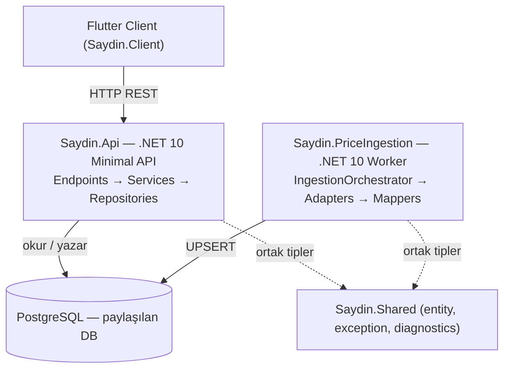
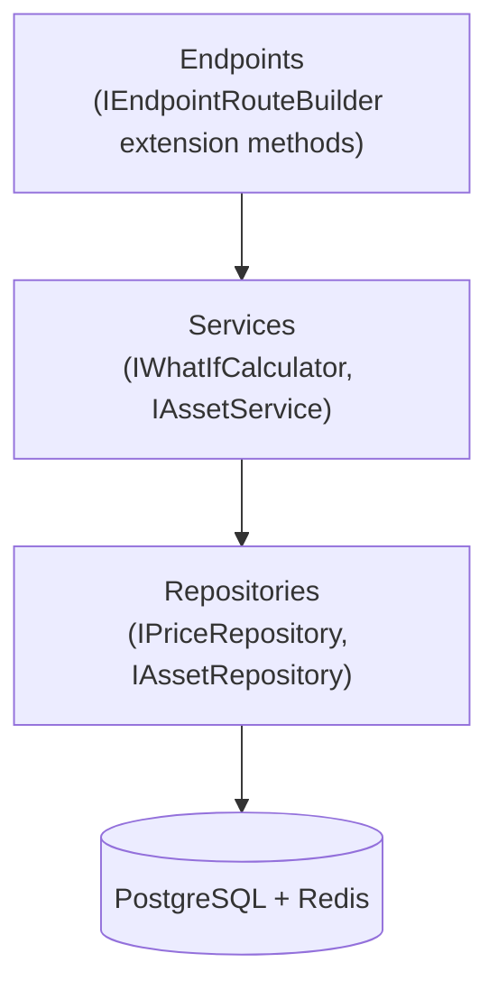
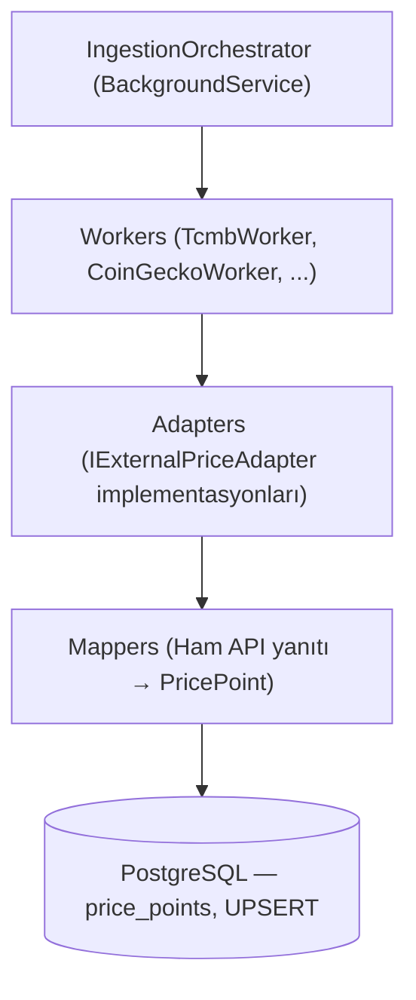
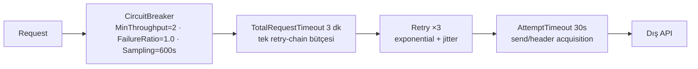
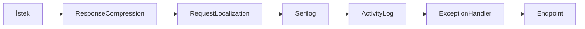

# Saydin.Services — Mimari

## Servis Haritası



## Katman Kuralları

### Saydin.Api — İç Katmanlar



- **Endpoints:** Route tanımları, request validation, response şekillendirme. İş mantığı yok.
- **Services:** "Ya alsaydım" hesaplama motoru, cache yönetimi. Dış I/O doğrudan yok.
- **Repositories:** Veri erişimi (Entity Framework Core LINQ). Sadece I/O, iş mantığı yok.

### Saydin.PriceIngestion — İç Katmanlar



## Dış Veri Kaynakları

| Adapter | API | Asset | Zamanlama |
|---|---|---|---|
| `TcmbAdapter` | TCMB XML | USD/TRY, EUR/TRY, GBP/TRY, CHF/TRY vb. | 16:30 Türkiye (piyasa kapanışı) |
| `CoinGeckoAdapter` | CoinGecko API | BTC, ETH, BNB, XRP | 06:00 UTC |
| `OpenExchangeRatesAdapter` | Open Exchange Rates | XAU/TRY (altın), XAG/TRY (gümüş) — gram bazında | 22:00 UTC |
| `TwelveDataAdapter` | Twelve Data | THYAO, GARAN | 19:00 Türkiye (BIST kapanışı) |
| `EvdsInflationAdapter` | TCMB EVDS | TÜFE endeksi (TÜİK) | Aylık |

**Not:** `OpenExchangeRatesAdapter` USD-base yanıtındaki XAU/XAG oranlarını
`(1 / metalRate) * tryRate / 31.1034768` formülüyle gram/TRY'ye çevirir.
Aynı tarih için XAU ve XAG tek HTTP isteğiyle alınır (day-level in-memory cache).

**Not (TCMB parse-once):** `TcmbAdapter` aynı tarihin XML cevabını **parse edilmiş
XDocument** olarak cache'ler (60 dk TTL, max 10k entry). Aynı tarihte N farklı sembol
için `XDocument.Parse` 1 kez çalışır; 20 yıl × 30 sembol backfill senaryosunda parse
sayısı ~150k → ~5200'e düşer (review P1R-002).

**Not (EVDS ingestion job yazımı):** `EvdsInflationWorker` `BaseAssetWorker`'dan
inherit **etmez** — TÜFE aylık skaler bir seriyi `inflation_rates` tablosuna yazar,
`price_points` UPSERT pattern'i ile uyumsuzdur. Bu nedenle adapter başarısızlığı
şu an `ingestion_jobs` tablosuna **yazılmaz**, yalnızca `InflationIngestionFailures`
sayacı ve `LogError` ile telemetri edilir. Faz 2'de `inflation_jobs` benzeri ayrı bir
job şeması veya `ingestion_jobs` tablosunun jenerikleştirilmesi değerlendirilecek
(PHASE-1-DOC-UPDATE-NOTES Section 11, review P1R-011).

## Servis Sınırları (KESIN KURAL)

```
Saydin.Api           ─── TCMB, CoinGecko vb. API'lere istek ATMAZ
Saydin.PriceIngestion ── HTTP endpoint EXPOSE ETMEZ
Saydin.Api ↔ Saydin.PriceIngestion arası iletişim: sadece PostgreSQL
```

Bu kural kasıtlı olarak uygulanır. Bir servisin diğerini doğrudan çağırması gerekiyorsa, bu mimari karar gözden geçirilmelidir (bkz. ADR-001).

## Resilience Katmanı

Her dış provider adapter'ı `Microsoft.Extensions.Http.Resilience`
(`AddResilienceHandler`, Polly v8) ile merkezi, tek-kontratlı resilience pipeline'ı kullanır:



`IHttpClientFactory` üzerinden `HttpResilienceExtensions.AddSaydinResilience` ile uygulanır.
Düşük-trafik worker'larda circuit breaker iki exhausted logical çağrıdan sonra 120 sn açılır;
600 sn örnekleme penceresi iki stall/timeout zincirini de kapsar.
`Retry-After` yalnız 429'da değerlendirilir; gecikme
`max(exponential+jitter, bounded Retry-After)` olur ve dış 3 dk bütçeyi aşamaz. HTTP
attempt timeout'u `ResponseHeadersRead` nedeniyle gövde okumayı kapsamaz. Bu yüzden worker,
aynı 3 dk sabitini adapter çağrısının tamamına uygular: header + body + parse + lease renewal.
Aşım durable, retryable `provider_deadline` sonucudur; host cancellation ayrı kalır. OXR'nin
gün-başına istek modeli 90 günlük durable window'lara bölünür. Retryable ledger pencereleri
attempt sayısına göre jitter'lı exponential backoff uygular ve altı saatte tavanlanır.

## Veritabanı Erişim Deseni

`price_points` ve `inflation_rates` authority tuple'ları append-once/immutable'dır. Aynı
provider observation'ının idempotent replay'i veri değiştirmez; farklı revision aynı
asset/source/tarih authority anahtarına gelirse DB constraint'i worker'da typed
`provider_revision_conflict` permanent sonucuna çevrilir. Otomatik `ON CONFLICT DO UPDATE`
ile sessiz authority revizyonu yapılmaz.

`float`/`double` yasak. Tüm fiyat değerleri: `decimal` (C#) / `NUMERIC(18,6)` (PostgreSQL).

## Lokalizasyon (i18n)

API, `Accept-Language` header'ına göre yanıt dilini belirler. `.resx` kaynak dosyaları ve `IStringLocalizer<ErrorMessages>` kullanılır.

**Desteklenen diller:** Türkçe (`tr`, varsayılan), İngilizce (`en`)

**Middleware zinciri:**



`RequestLocalizationMiddleware` (`UseRequestLocalization`) `Accept-Language` header'ını parse eder ve `CultureInfo.CurrentUICulture`'ı ayarlar. `ExceptionHandler`'dan önce çalışır — hata yanıtları da lokalize edilir. **Serilog ve ActivityLog `ExceptionHandler`'ın DIŞINDADIR** (önünde): ExceptionHandler exception'ı 4xx/5xx'e çevirip rethrow etmeden döndüğü için ikisi de yanıtın **nihai** status'ünü gözlemler (bkz. "Exception Handling Zinciri" → EC-5).

**Kaynak dosyaları:**

| Dosya | İçerik |
|-------|--------|
| `Resources/ErrorMessages.resx` | Türkçe hata mesajları + asset isimleri (varsayılan) |
| `Resources/ErrorMessages.en.resx` | İngilizce çeviriler |
| `Resources/ErrorMessages.cs` | `IStringLocalizer<ErrorMessages>` marker sınıfı (`Saydin.Api` namespace) |

**Lokalize edilen alanlar:**
- Exception handler `ProblemDetails.Title` alanları
- `EndpointExtensions` installation credential doğrulama mesajları
- `WhatIfCalculator` / `SavedScenarioService` validasyon mesajları
- Asset display name'ler (`Asset_{Symbol}` convention'ı ile, fallback: DB'deki `display_name`)

**Cache dil ayrımı:** `assets:info` ve `whatif` cache key'lerine dil kodu eklenir (ör. `assets:info:27:en`). Farklı dillerdeki istekler birbirinin cache'ini bozamaz.

**Yeni asset eklendiğinde:** Her iki `.resx` dosyasına `Asset_{SYMBOL}` key'i ile çeviri eklenir. Key bulunamazsa DB'deki `display_name` fallback olarak kullanılır.

## DailyLimitGuard (Günlük Kullanım Limiti)

Günlük kullanım kotası kontrolü `DailyLimitGuard` servisi tarafından merkezi olarak yönetilir. Her hesaplama servisi (WhatIfCalculator, DcaCalculator) kendi `usageKeyPrefix` değeriyle bu guard'ı çağırır:

```
usage:whatif:{principal}:{redis-day}   → WhatIfCalculator (single + compare + reverse)
usage:dca:{principal}:{redis-day}      → DcaCalculator
```

Her acquire exact Redis key'i ve 128-bit nonce'u taşıyan immutable `QuotaLease` döndürür.
Release yalnız bu lease ile yapılır; gece yarısı ve retry key'i yeniden hesaplamaz. Limit=0
no-op lease'tir. Finite kota Redis TIME + Lua ile atomiktir; ambiguous ACK aynı nonce ile
idempotent reconcile edilir. Redis kullanılamazsa **503 `quota_unavailable`** döner; finite kota
fail-open değildir.

**Compare kotası (ADR-002):** `POST /v1/what-if/compare` sembol sayısından (2-5) bağımsız
olarak günlük kotadan **1 hesaplama** düşer. Tek What-If, Reverse What-If ve Compare aynı
`usage:whatif:` sayacını **paylaşır**; DCA ayrı `usage:dca:` sayacını kullanır. Per-feature
alt-kotalar (roadmap'teki compare=5 / reverse=3 / dca=3) post-MVP'ye ertelendi
(bkz. [ADR-002](decisions/ADR-002-compare-quota.md)).

## Rate Limiting / Throttling (İki Katman — ADR-003)

| Katman | Mekanizma | Pencere | Amaç |
|---|---|---|---|
| 1 | `IDailyLimitGuard` (Redis, yukarıda) | günlük | ürün adilliği / kota |
| 2 | Redis-backed `DistributedSecurityLimiter` | saniye/dakika | burst / DoS koruması |

Katman 2 production'da zorunludur. Redis TIME tabanlı Lua exact IP, IPv4 `/24` veya IPv6
`/64` network ve authenticated installation principal bucket'larını tüm replica'larda paylaşır.
Anahtarlar private-file HMAC pseudonym taşır; ham IP/principal Redis key veya loga girmez.
Güvenilmeyen/malformed forwarded IP ya da Redis hatası 503, limit aşımı 429 + bounded
`Retry-After` üretir. Public `/health/live` ile private management readiness/metrics yolları
API admission yüzeyinden ayrıdır
(bkz. [ADR-003](decisions/ADR-003-rate-limiting.md)).

## Feature Flags (Özellik Bayrakları)

Her plan tier'ı (`free`/`premium`) `FeatureOptions` ile hangi özelliklerin aktif olduğunu belirler:

| Bayrak | Varsayılan | Etkisi |
|---|---|---|
| `Comparison` | `true` | Compare endpoint erişimi |
| `InflationAdjustment` | `true` | Enflasyon düzeltmeli hesaplama |
| `Share` | `true` | Paylaşım özelliği |
| `Dca` | `true` | DCA hesaplama erişimi |
| `PriceHistoryMonths` | `12` | Fiyat geçmişi ay sınırı |

Devre dışı (plan/tier ile kapalı) bir özellik çağrılırsa `FeatureDisabledException`
fırlatılır; `FeatureDisabledExceptionHandler` bunu **HTTP 403 Forbidden** + RFC 7807
ProblemDetails (`type=https://saydin.app/errors/feature-disabled`, `feature` ve `traceId`
extension'ları, `IStringLocalizer` ile lokalize `title`/`detail`) olarak döner.

**Konvansiyon (F4-14):** plan/tier ile **bilinçli kapatılan** özellik → **403 Forbidden**
(özellik `/v1/config` üzerinden görünür kalır; istemci upsell/"premium" akışı gösterebilsin
diye **404 KULLANILMAZ**). **422** yalnız geçerli ama domain kuralını ihlal eden istekler
içindir (ör. senaryo kayıt kotası → `ScenarioLimitExceededExceptionHandler`). **429** günlük
kota / rate-limit aşımıdır.

Feature flag'lar `/v1/config` endpoint'inden istemciye döner — UI dinamik olarak kısıtlama uygular.

## Finansal Yuvarlama Politikası

Tüm finansal hesaplamalar `decimal` + `MidpointRounding.AwayFromZero` ile yapılır; birim
adetleri **6 hane**, TL tutarları **2 hane** yuvarlanır (CLAUDE.md finansal hassasiyet
kuralı). İleri WhatIf ve DCA `try` modunda gerçekleşebilir yatırım maliyetini
`Round(UnitsAcquired × BuyPrice, 2)` olarak türetir; ham istek tutarı ile 6 haneli
birim granülasyonu karıştırılmaz. Böylece alış ve satış fiyatı eşitse P/L tam sıfırdır.
Ters hesaplama (`POST /v1/what-if/reverse`) `try` modunda, yanıttaki
`TargetValueTry` ham hedeften DEĞİL, birim granülasyonundan **ileri-türetilir**
(forward-consistency): `TargetValueTry = Round(UnitsAcquired × SellPrice, 2)`. Böylece
UI'da `UnitsAcquired × SellPrice == TargetValueTry` birebir uyuşur; ham hedeften sapma
alt-kuruş mertebesindedir ve o birim adediyle fiilen elde edilebilecek gerçek TL değeridir
(F1.3-2 / F4-3).

## DCA Alım Tarihi Üretimi (Anchor-Day Politikası)

Aylık DCA serilerinde her alım tarihi orijinal `startDate`'e göre **indeks-bazlı** üretilir
(`startDate.AddMonths(i)`), kümülatif `AddMonths(1)` DEĞİL — bu, ay-sonu kaymasını (drift)
önler: 31 Ocak başlangıcı `31 Oca → 28 Şub → 31 Mar → 30 Nis` şeklinde ilerler, kalıcı
olarak 28'e takılmaz. Kısa aylarda .NET `AddMonths` son geçerli güne **CLAMP** eder
(31 Oca → 28 Şub); **SKIP UYGULANMAZ** çünkü kullanıcı o ay da yatırım yapar — ayı atlamak
toplam yatırılan sermayeyi olduğundan az gösterir. Hafta sonu/tatil durumunda alım en yakın
işlem gününe taşınır; aynı `PriceDate`'e iki alım düşerse response satırı birleştirilir,
ancak iki nakit akışı finansal hesapta ayrı kalır. Tekil katkı tarihi için ±7 günde fiyat
bulunamazsa tarih `SkippedPurchaseDates` içinde bildirilir ve warning'li kısmi sonuç
cache'lenmez (F1.3-3 / F1.3-4).
Kaynak: `DcaCalculator.GeneratePurchaseDates`.

### DCA reel getiri — cash-flow CPI LKV terminal v1

`IncludeInflation=true` için her katkı, planlanan tarihin değil fiilen fiyat bulunan piyasa
gününün ayındaki exact TÜFE endeksinden terminal tarihten ileri olmayan en son final TÜFE
deflatörüne taşınır. Ara katkı aylarında exact CPI şarttır. Terminal hedef ayındaki katkılar,
henüz yayımlanmamış current-month CPI beklenmeden terminal deflatörle nötr taşınır.
Katkı `Cᵢ`, katkı endeksi `Iᵢ`, terminal endeksi `Iₜ`, raw terminal portföy değeri `Vₜ` ise:

- `InflationAdjustedInvestedTry = Σ(Cᵢ × Iₜ / Iᵢ)`
- `RealProfitLossTry = Vₜ - InflationAdjustedInvestedTry`
- `RealProfitLossPercent = (Vₜ / InflationAdjustedInvestedTry - 1) × 100`

Hesaplar `decimal` ile yapılır; `Cᵢ` 6 haneli birim granülasyonundan türeyen iki haneli
gerçekleşebilir yatırım maliyetidir. Deflatör oranı/toplamı ve terminal portföy için ara
yuvarlama yapılmaz; TL alanları ve yüzde yalnız response sınırında yuvarlanır.
`RealReturnMethod = cashflow_cpi_lkv_terminal_v1`; `InflationTerminalMonth` gerçekten
kullanılan final CPI ayıdır. Backward-compatible `InflationDataAsOf`, WhatIf ile aynı
semantiği taşır: exact hedef ayda `null`, LKV gecikmişse kullanılan ay. Herhangi bir ara
exact CPI veya terminal LKV eksik/pozitif değilse nominal alanlar döner, reel alanlar
`null` kalır ve incomplete yanıt cache'lenmez. XIRR/yıllıklandırma bu sözleşmenin parçası
değildir.

## Senaryo Tipi Normalizasyonu

`SavedScenarioService` senaryo kaydetme sırasında `Type` alanını `ToLowerInvariant()` ile normalize eder. İzin verilen tipler:

```
what_if | comparison | portfolio | dca
```

- `what_if` ve `dca` tipleri geçerli bir asset sembolü gerektirir (FK kontrolü)
- `comparison` ve `portfolio` tipleri asset doğrulamasını atlar

## Exception Handling Zinciri

`Program.cs`'deki kayıt sırası (spesifik handler'lar önce, `GlobalExceptionHandler` her
zaman en sonda):

```mermaid
flowchart LR
    R[İstek → Endpoint → Service<br/>Exception fırlatıldı] --> V[ValidationExceptionHandler<br/>400]
    V --> F[FeatureDisabledExceptionHandler<br/>403]
    F --> P[PriceNotFoundExceptionHandler<br/>404]
    P --> A[AssetNotFoundExceptionHandler<br/>404]
    A --> SN[ScenarioNotFoundExceptionHandler<br/>404]
    SN --> SL[ScenarioLimitExceededExceptionHandler<br/>422]
    SL --> D[DailyLimitExceededExceptionHandler<br/>429]
    D --> E[ExternalApiExceptionHandler<br/>502]
    E --> G[GlobalExceptionHandler<br/>500 + traceId]
```



Her domain exception için ayrı `IExceptionHandler` yazılır ve zincire eklenir. Tüm
handler'lar `IStringLocalizer<ErrorMessages>` inject ederek `Title`/`Detail` alanını
lokalize eder ve RFC 7807 `ProblemDetails` + `traceId` döner. HTTP kod konvansiyonu:
400 (geçersiz istek) · 403 (tier-kapalı özellik) · 404 (bulunamadı) · 422 (geçerli ama
domain-kuralı ihlali, ör. senaryo kotası) · 429 (günlük kota / rate-limit) · 502 (dış API)
· 500 (beklenmeyen, catch-all).

**Hata zarfı sözleşmesi (EC-3/EC-4/EC-9):** Tüm handler'lar `Content-Type:
application/problem+json` döner ve `Extensions`'a **kararlı, lokalden bağımsız `code`** alanı
ekler (`Saydin.Api/Exceptions/ApiErrorCodes.cs`; ör. `feature_disabled`, `daily_limit_exceeded`,
`invalid_installation_credential`) — istemci `type` URI'sine değil **`code`'a göre** dallanır.
Security limiter ve installation credential filter da aynı zarfı kullanır. `GlobalExceptionHandler` 5xx gövdesine
teknik mesaj/stack **sızdırmaz**; `ExternalApiExceptionHandler` upstream kaynak adını gövdeye
**koymaz** (yalnız log'da, EC-9). Kararlı kodlar + tip→kod eşlemesi meta repo
`docs/architecture/api-contract.md` "Hata Taksonomisi"nde yayınlanır.

**Middleware sırası (EC-5 + EC-FU):** Sıra `Serilog → ActivityLog → ExceptionHandler → endpoint`;
**Serilog ve ActivityLog'un ikisi de `UseExceptionHandler`'ın dışında (önünde)** durur. Bu KRİTİK:
ExceptionHandler endpoint istisnasını 4xx/5xx'e çevirip yanıtı yazar ve (handler `true` döndüğü
için) rethrow ETMEZ → dıştaki middleware'lerin `await next()`'i normal tamamlanır ve **nihai**
status'ü (403/404/429/502/500) görür.
- **Serilog:** request log'u doğru status'ü yansıtır; istisnayı handler çevirmeden gören yanıltıcı
  "500" artefaktı oluşmaz (gerçek 5xx exception detayı `GlobalExceptionHandler.LogError`'da
  traceId ile korunur).
- **ActivityLogMiddleware:** `finally`'si çevrilmiş status'ü okuyup `activity_logs`'a doğru kodu
  yazar (EC-FU: önceki sürümde ActivityLog ExceptionHandler'ın İÇİNDEYDİ → finally response
  çevrilmeden, `StatusCode` hâlâ 200 iken çalışıyor ve hatalı isteklere `200` yazıyordu). İç
  try/catch yalnız log-gönderim hatasını sarar; istek exception'ını **yutmaz**.

Hata-sözleşmesi regresyonu `Saydin.Api.Tests/Exceptions/ExceptionHandlerContractTests.cs`
(altyapısız, deterministik) + `Saydin.Api.IntegrationTests/ErrorContractHttpTests.cs`
(`WebApplicationFactory`, `SkippableFact` — feature-disabled sonrası `activity_logs.http_status`
== 403 dahil) ile kilitlenir.

## Cache Stratejisi (Redis)

```text
authority-final-v1:catalog:{revision.sha}:price:{symbol}:{date}                  → TTL 24 saat
authority-final-v1:catalog:{revision.sha}:nearest-price:{symbol}:{date}          → TTL 24 saat
authority-final-v1:catalog:{revision.sha}:prices:{symbol}:{from}:{to}:{interval} → TTL 1 saat
authority-final-v1:catalog:{revision.sha}:latest-date:{symbol}                   → TTL 1 saat
authority-final-v1:catalog:{revision.sha}:whatif:v4:{...}:{lang}                 → TTL 1 saat
authority-final-v1:catalog:{revision.sha}:whatif:reverse:v2:{...}:{lang}         → TTL 1 saat
authority-final-v1:catalog:{revision.sha}:dca:v3:{...}:{lang}                    → TTL 1 saat
authority-final-v1:catalog:{revision.sha}:assets:list                            → TTL 6 saat
authority-final-v1:catalog:{revision.sha}:assets:info:{lang}                     → TTL 1 saat
```

> Tam ve yetkili cache key referansı (TTL gerekçeleri, fail-open politikası dahil):
> [`cache-strategy.md`](cache-strategy.md).

Cache anahtarı normalize edilmiş parametrelerle oluşturulur.

**Finansal cache versiyonlama:** Gerçekleşebilir yatırım maliyeti forward yolu
`whatif:v4`, terminal LKV cash-flow CPI yöntemi ve kısmi katkı sözleşmesi `dca:v3`
namespace'ine taşır. Dil kodu (`tr`/`en`) cache key'in parçasıdır; farklı dillerdeki
istekler ayrı cache'lenir.

**Asset listesi cache stratejisi:** DB-owned monoton catalog revision + SHA bütün data-bearing
key'lere bağlanır; salt count imzası yoktur. Cache envelope catalog identity, requested symbol/date
ve yalnız complete-final authority taşıyan sonucu doğrular. Eski namespace veya malformed/null
envelope miss sayılıp silinir; authority/DB hatası cache degradation adı altında yutulmaz.

## Observability

- **Structured logging:** Serilog → Console (JSON) + OTLP → Collector → durable Loki
- **Tracing:** OpenTelemetry → Collector disk queue → durable Tempo
- **Metrics:** OpenTelemetry + management listener (`:9090/metrics`) Prometheus scrape
- **Health checks:** public `:8080/health/live` yalnız process liveness; private management
  `:9090/health/ready` zorunlu PostgreSQL readiness kontrolü

Detaylı referans: [architecture/observability.md](architecture/observability.md) ·
İlgili: [architecture/database-schema.md](architecture/database-schema.md) ·
[architecture/activity-logging.md](architecture/activity-logging.md)

## Faz 3 Sistemik Değişiklikler

- **`IInstallationPrincipalContext` (scoped):** `POST /v1/installations` server-issued 256-bit
  credential üretir; korumalı endpoint'ler `Authorization: Installation <token>` ister.
  Filter HMAC verifier ile principal'ı çözer ve scoped context'e yazar. Legacy client-chosen
  `X-Device-ID` authentication/ownership yüzeyi yoktur; activity kolonundaki eski ad yalnız
  server-issued bounded principal pseudonym taşır.
- **`TimeProvider`:** API servisleri/handler/repository `DateTime.UtcNow` yerine enjekte edilen
  `TimeProvider` (singleton `TimeProvider.System`) kullanır → testlerde `FakeTimeProvider` ile
  deterministik saat (gün-dönümü flaky'liği yok).
- **`ChartSampler`:** WhatIf/DCA'daki birebir tekrar eden grafik down-sampling tek jenerik
  `Saydin.Api/Helpers/ChartSampler.Downsample<TIn,TOut>` yardımcısında toplandı.
- **Domain constants:** `Saydin.Shared.Constants` altında `PriceIntervals`, `InflationSources`
  ve `QuantityUnits.DcaAccepted` ile interval/amount-type/inflation-source literal'leri merkezlendi.
- **inflation_rates composite PK `(period_date, source)` (migration 012/F2.7-5):** Aynı ay için
  `seed-approximation` ve gerçek `tuik` satırı bir arada tutulabilir (audit). Okuma yolu
  (`InflationRepository`) aynı tarihte `tuik`'i tercih eder; UPSERT conflict hedefi
  `(period_date, source)`.
- **ingestion_jobs (migration 012/INGR-002):** `asset_id` nullable + `source` kolonu. EVDS worker
  artık ingestion_jobs yazar (`asset_id=null`, `source=evds`, job_type `inflation_*`) — CLAUDE.md
  "ingestion_jobs'a başarı/hata yazılır" kuralı tüm worker'lar için sağlandı.
- **activity_logs compression (migration 008b/013):** TimescaleDB 2.16.1 compression-enabled
  hypertable'da `ALTER COLUMN TYPE`'ı engellediği için fresh init zinciri kırılıyordu; `008b`
  (009'dan önce disable) + `013` (012'den sonra re-enable) deseni ile çözüldü (mevcut migration'lar
  değiştirilmeden). Compression fiziksel katmandır → EF modeli etkilenmez.

## Proje Referans Kuralları

```
Saydin.Api      → Saydin.Shared  ✓
Saydin.Api      → Saydin.PriceIngestion  ✗ YASAK
Saydin.PriceIngestion → Saydin.Shared  ✓
Saydin.PriceIngestion → Saydin.Api  ✗ YASAK
Saydin.Shared   → herhangi biri  ✗ YASAK (shared is leaf)
```
