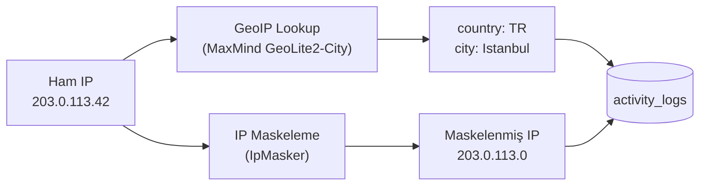
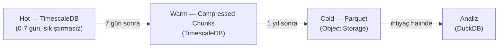
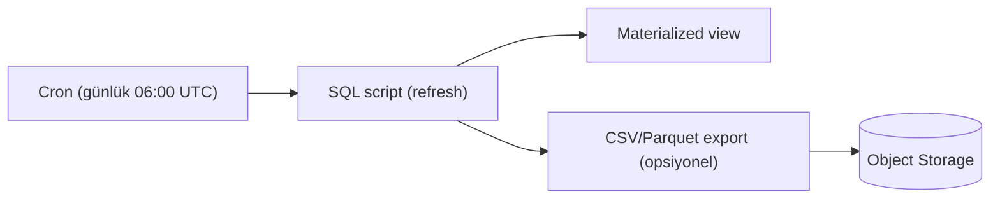

# Aktivite Loglama Sistemi — Mimari Dokümanı

> **Kaynak doğruluğu (source of truth):** Bu doküman backend'in **gerçek kodunu ve
> migration'larını** yansıtır. Şema için tek doğru kaynak `infrastructure/postgres/migrations/`
> altındaki numaralandırılmış `.sql` dosyaları (008/008b/009/010/011/013/022) ve EF
> konfigürasyonu (`Saydin.Shared/Data/Configurations/ActivityLogConfiguration.cs`);
> davranış için `Saydin.Api/{Middleware,Helpers,Services,BackgroundServices}` altındaki
> sınıflardır. Doküman bunlarla çeliştiğinde **kod/migration geçerlidir**. Client tarafı
> (Flutter Dio interceptor, `package_info_plus` vb.) bu dokümanın kapsamı dışındadır —
> backend yalnızca client'ın gönderdiği header'ları **okur**; bkz. §2.1.

Bu doküman, kullanıcı isteklerinin asenkron olarak veritabanına kaydedilmesi için
uygulanmış mimariyi açıklar.

---

## 1. Amaç

- Kullanıcıların hangi varlıkları, hangi tarih aralıklarında, ne sıklıkla sorguladığını kayıt altına almak
- Asset ve tarih bazlı raporlar çıkarabilmek (en çok sorgulanan varlık, popüler tarih aralıkları, kullanıcı davranış analizi)
- Mevcut istek akışını **engellemeden**, asenkron olarak (Channel pattern) loglama yapmak
- Hata durumunda yalnızca error/warning log basıp ana akışı etkilememek (log yazımı asla isteği bloklamaz/çökertmez)
- KVKK veri minimizasyonu: ham finansal tutar ve mutlak TL sonuç değerleri loglanmaz (bkz. §2.3, ADR-006)

---

## 2. Toplanan Veriler

### 2.1 Backend'in Okuduğu İstek Header'ları

Backend, aşağıdaki düşük hassasiyetli istemci metadata header'larını **okur** ve
`activity_logs` satırına yazar.
Bu header'ları **göndermek client'ın (Flutter) sorumluluğudur**; client tarafı
implementasyonu bu dokümanın kapsamı dışındadır.

| Header | Örnek Değer | `activity_logs` kolonu | Backend'in okuduğu yer |
|--------|-------------|------------------------|------------------------|
| `X-Device-OS` | `android` / `ios` | `device_os` | `Request.Headers["X-Device-OS"]` |
| `X-Device-OS-Version` | `18.6` / `34` | `os_version` | `Request.Headers["X-Device-OS-Version"]` |
| `X-App-Version` | `0.1.1+43` | `app_version` | `Request.Headers["X-App-Version"]` |

> **Not:** Header değerleri DB kolon kapasitelerine göre (`ActivityLogLimits`) UTF-16
> surrogate-safe biçimde kırpılır (`ActivityLogBuilder.TruncateSurrogateSafe`) — emoji
> içeren bir header bile malformed UTF-16 olarak kaydedilmez. Boş/whitespace değer `null` olur.
> `Authorization: Installation …` kimlik doğrulama için okunur ancak credential veya onun ham
> hash'i activity kaydına yazılmaz. `device_id` eski kolon adı, yalnız doğrulanmış installation
> principal için sunucunun ürettiği sabit boyutlu pseudonym'i taşır; `X-Device-ID` artık kimlik,
> sahiplik veya activity kaynağı değildir.

### 2.2 Server Tarafında Üretilen Veriler

| Veri | Kaynak | `activity_logs` kolonu | Not |
|------|--------|------------------------|-----|
| IP adresi | `HttpContext.Connection.RemoteIpAddress` | `ip_address` (`inet`) | `UseForwardedHeaders` sonrası gerçek IP; **maskelenerek** saklanır (§7) |
| Ülke / Şehir | MaxMind GeoLite2 (`IGeoIpResolver`) | `country` (`char(2)`) / `city` | IP maskelemeden **önce** çözümlenir (§6) |
| HTTP durum kodu | Pipeline sonu `Response.StatusCode` | `status_code` | Exception handler zincirinin set ettiği 4xx/5xx dahil |
| İstek süresi | `ActivityLogBuilder` içindeki `Stopwatch` | `duration_ms` (`bigint`) | Builder yaratıldığında başlar, `Build()` ile durur |
| Hata kodu | Endpoint `WithError(...)` veya yok | `error_code` | Varsa |
| Principal | `IInstallationPrincipalContext` | `user_id` | **Nullable**; doğrulanmış installation principal kimliği, anonim endpoint'lerde `NULL` |

### 2.3 İşlem Türüne Göre Veriler — `data` JSONB (KVKK uygulanmış)

Her action farklı veri taşır; hepsi **tek bir `data` JSONB kolonunda** saklanır
(mevcut `saved_scenarios.extra_data` pattern'iyle tutarlı).

> **KVKK veri minimizasyonu — F4-6 / ADR-006 (UYGULANMIŞTIR):**
> - **Ham finansal tutar yazılmaz.** `request.Amount` / `TargetAmount` / `PeriodicAmount`
>   yerine `AmountBucket.Coarse(decimal)` kaba aralık etiketi yazılır:
>   `"0" · "0-1k" · "1k-10k" · "10k-100k" · "100k-1M" · "1M+"`
>   (sınırlar `Saydin.Shared/Constants/AmountBucket.cs`'de tek source-of-truth).
> - **Exact finansal sonuç loglanmaz:** `profitLossTry`, `currentValueTry`,
>   `requiredInvestmentTry`, `totalInvestedTry`, `averageCostPerUnit`,
>   `profitLossPercent` ve `realProfitLossPercent` `data`'ya **hiç** yazılmaz.
>   Yalnız `profit/loss/flat/unavailable` outcome ve sayım alanları tutulur.
> - **Hash kullanılmaz** (düşük entropili tutar hash'i brute-force ile geri çevrilebilir).
> - **Serbest metin senaryo label'ı yazılmaz.** `scenario_save` yalnız düşük kardinaliteli
>   `hasLabel` boolean'ını tutar; label içeriği activity/analytics hattına girmez.
> - Detay: `docs/decisions/ADR-006-activity-log-financial-policy.md`.

Aşağıdaki örnekler **kodun ürettiği gerçek payload'lardır**
(`WhatIfEndpoints.cs`, `DcaEndpoints.cs`, `ScenariosEndpoints.cs`, `AssetsEndpoints.cs`,
`AppConfigEndpoints.cs`).

#### `what_if_calculate` — Tekli hesaplama

```json
{
  "assetSymbol": "USDTRY",
  "buyDate": "2020-03-01",
  "sellDate": "2024-01-15",
  "amountBucket": "1k-10k",
  "amountType": "try",
  "includeInflation": true,
  "result": {
    "outcome": "profit",
    "realOutcome": "profit",
    "actualBuyDate": null,
    "actualSellDate": "2024-01-12"
  }
}
```

#### `what_if_compare` — Karşılaştırma

```json
{
  "assetSymbols": ["USDTRY", "BTC", "XAU_TRY_GRAM"],
  "buyDate": "2020-03-01",
  "sellDate": "2024-01-15",
  "amountBucket": "1k-10k",
  "amountType": "try",
  "includeInflation": false,
  "result": {
    "winner": "BTC",
    "rankings": [
      { "rank": 1, "symbol": "BTC", "outcome": "profit" },
      { "rank": 2, "symbol": "USDTRY", "outcome": "profit" },
      { "rank": 3, "symbol": "XAU_TRY_GRAM", "outcome": "profit" }
    ]
  }
}
```

#### `what_if_dca` — DCA (Düzenli Yatırım) simülasyonu

```json
{
  "assetSymbol": "USDTRY",
  "startDate": "2020-01-01",
  "endDate": "2024-01-15",
  "amountBucket": "0-1k",
  "period": "monthly",
  "amountType": "try",
  "includeInflation": true,
  "result": {
    "totalPurchases": 48,
    "outcome": "profit",
    "realOutcome": "profit"
  }
}
```

#### `what_if_reverse` — Ters senaryo (hedef hesaplama)

```json
{
  "assetSymbol": "BTC",
  "buyDate": "2020-03-01",
  "sellDate": "2024-01-15",
  "targetAmountBucket": "100k-1M",
  "targetAmountType": "try",
  "includeInflation": false,
  "result": {
    "outcome": "profit",
    "realOutcome": "unavailable",
    "actualBuyDate": "2020-03-02",
    "actualSellDate": "2024-01-15"
  }
}
```

#### `scenario_list` — Senaryo listeleme

```json
{ "scenarioCount": 7 }
```

#### `scenario_save` — Senaryo kaydetme

```json
{
  "scenarioId": "0190b2c3-...",
  "type": "what_if",
  "assetSymbol": "USDTRY",
  "hasLabel": true
}
```

#### `scenario_delete` — Senaryo silme

```json
{ "scenarioId": "0190b2c3-..." }
```

#### `assets_list` — Varlık listeleme

```json
{ "assetCount": 25 }
```

#### `asset_price` — Tekli fiyat sorgusu

```json
{ "assetSymbol": "BTC", "date": "2021-01-01" }
```

#### `asset_price_range` — Fiyat aralığı sorgusu

```json
{
  "assetSymbol": "USDTRY",
  "from": "2024-01-01",
  "to": "2024-03-01",
  "interval": "daily",
  "pointCount": 42
}
```

#### `config_fetch` — Konfigürasyon sorgusu

```json
{ "tier": "free" }
```

> **`data` boyut sınırı:** JSONB payload `pg_column_size(data) <= 10000` byte CHECK
> (`chk_activity_data_size`, migration 011) ve `ActivityLogLimits.DataMaxBytes` (10.000)
> ile sınırlıdır. `ActivityLogBuilder` insert öncesi boyutu tahmin eder; aşılırsa payload
> `{"_truncated": true, "originalBytes": <n>}` placeholder'ı ile değiştirilir ve
> `saydin.activity_log.data.truncations.total` metriği artar (satır yine yazılır,
> CHECK ihlali ve toksik-satır retry'ı önlenir).

---

## 3. Veritabanı Tasarımı

> **Migration zinciri:** `activity_logs` tablosu **migration 008** ile yaratılır
> (`008_add_activity_logs.sql`). Sonraki migration'lar kolon/compression ayarlarını
> evrimleştirir:
> - **008** — tablo + hypertable + indexler + `chk_activity_action` + compression ayarı
> - **008b** — compression'ı **geçici** kapatır (TimescaleDB 2.16.1'de `ALTER COLUMN TYPE`'a izin vermesi için; CLAUDE.md compression penceresi)
> - **009** — `device_os`/`os_version`/`app_version` kolonlarını genişletir (`ALTER COLUMN TYPE`)
> - **010** — `country`/`city` + `idx_activity_logs_country` (idempotent, geo geç eklendi)
> - **011** — `chk_activity_data_size`, `duration_ms INT → BIGINT`, GIN index'i `idx_activity_logs_data_gin`'e rename, `chk_activity_action` resync
> - **013** — compression'ı **geri açar** (008'deki ayarla birebir aynı)
> - **022** — silme öncesi activity redaction trigger'ı + fail-closed `ON DELETE NO ACTION` FK

### 3.1 Tablo: `activity_logs` (008 + 009 + 010 + 011 + 013 sonrası efektif şema)

```sql
CREATE TABLE activity_logs (
    id              UUID            NOT NULL DEFAULT gen_random_uuid(),

    -- Kim?
    user_id         UUID            REFERENCES users(id) ON DELETE NO ACTION, -- NULLABLE
    device_id       VARCHAR(200)    NOT NULL,

    -- Ne?
    action          VARCHAR(30)     NOT NULL,  -- CHECK whitelist (aşağıda)

    -- Coğrafi konum (MaxMind GeoLite2 ile IP'den çözümlenir, IP maskelenmeden önce)
    ip_address      INET,                      -- maskelenmiş IP (KVKK)
    country         CHAR(2),                   -- ISO 3166-1 alpha-2 (ör: TR, US)
    city            VARCHAR(100),

    -- Cihaz bilgisi
    device_os       VARCHAR(30),               -- 'android', 'ios'
    os_version      VARCHAR(100),              -- '18.6', '34', "Version 18.6 (Build ...)"
    app_version     VARCHAR(50),               -- '0.1.1+43'

    -- İşlem verisi (türe göre değişen) — KVKK: bucket'lı, mutlak TL yok
    data            JSONB,

    -- Sonuç
    status_code     SMALLINT        NOT NULL,
    duration_ms     BIGINT,                    -- 011 ile INT → BIGINT (taşma koruması)
    error_code      VARCHAR(50),

    -- Zaman
    created_at      TIMESTAMPTZ     NOT NULL DEFAULT now(),

    PRIMARY KEY (id, created_at)               -- TimescaleDB partitioning
);

-- TimescaleDB hypertable (haftalık chunk)
SELECT create_hypertable('activity_logs', 'created_at',
    chunk_time_interval => INTERVAL '1 week');

-- Raporlama indexleri
CREATE INDEX idx_activity_logs_user     ON activity_logs (user_id, created_at DESC);
CREATE INDEX idx_activity_logs_action   ON activity_logs (action, created_at DESC);
CREATE INDEX idx_activity_logs_country  ON activity_logs (country, created_at DESC);
CREATE INDEX idx_activity_logs_data_gin ON activity_logs USING GIN (data jsonb_path_ops);

-- data JSONB boyut limiti (011)
ALTER TABLE activity_logs ADD CONSTRAINT chk_activity_data_size
    CHECK (data IS NULL OR pg_column_size(data) <= 10000);
```

> **`user_id` NULLABLE notu:** Stale tasarım dokümanı `user_id UUID NOT NULL REFERENCES`
> diyordu. Kolon **nullable** kalır; migration 022'den itibaren FK `ON DELETE NO ACTION`'dır.
> Scheduler-owned, locked-search-path `BEFORE DELETE` trigger önce ilgili satırların `user_id`
> alanını `NULL`, eski `device_id` bağını `server-redacted` yapar. Trigger/redaction çalışmazsa
> FK principal silmeyi reddeder. Entity de `Guid? UserId` taşır.

### 3.2 `action` CHECK whitelist (11 değer — kod + migration senkron)

`chk_activity_action` CHECK constraint hem migration'da (008 ve 011'de resync) hem de
EF konfigürasyonunda (`ActivityLogConfiguration` → `ActivityActions.All`) tanımlıdır.
İki kaynak **birebir** aynı kalmalıdır.

```sql
CHECK (action IN (
    'what_if_calculate', 'what_if_compare', 'what_if_dca', 'what_if_reverse',
    'scenario_save', 'scenario_delete', 'scenario_list',
    'assets_list', 'asset_price', 'asset_price_range', 'config_fetch'
))
```

> **İkinci savunma hattı (kod):** `ActivityLogBuilder.Build()`, action `ActivityActions.Lookup`
> (O(1) `HashSet`) içinde değilse `"unknown"` fallback'i yazar — böylece keyfi/yazım hatalı
> bir action satırı CHECK'te düşmez ve `ActivityLogWriter` bisection-retry'ı tetiklenmez.
> Aynı whitelist drop-metric tag kardinalitesini de sınırlar (~12 sabit değer).

### 3.3 Gelecekte Eklenebilecek Action'lar

Aşağıdaki action'lar henüz endpoint olarak mevcut değildir; ilgili özellik geliştirilince
hem `ActivityActions` hem migration CHECK'i güncellenir.

| Action | Beklenen Faz | Açıklama |
|--------|-------------|----------|
| `trend_view` | Faz 2.3 | Trend/popüler varlıklar sayfası görüntüleme |
| `trend_click` | Faz 2.3 | Trend listesinden bir varlığa tıklama |
| `converter_use` | Faz 2.4 | Döviz çevirici kullanımı |

> **Not:** `share` eylemi client tarafında gerçekleşir (Flutter share sheet); backend'e
> HTTP isteği gelmez. İstenirse ileride ayrı bir `POST /v1/activity` endpoint'iyle veya
> client-side analytics ile takip edilebilir.

### 3.4 IP Geolocation — Coğrafi Konum Çözümleme

IP adresinden ülke/şehir bilgisi MaxMind GeoLite2-City veritabanı ile çözümlenir.
Çözümleme IP **maskelemeden önce** yapılır (tam IP'den doğru lokasyon, sonra maskele).



| Kolon | Tip | Açıklama |
|-------|-----|----------|
| `country` | `CHAR(2)` | ISO 3166-1 alpha-2 ülke kodu |
| `city` | `VARCHAR(100)` | Şehir adı |

**Uygulama detayları (`MaxMindGeoIpResolver`):**

- `IGeoIpResolver` **singleton** olarak register edilir (`DatabaseReader` thread-safe).
- DB yolu `GeoIp:DatabasePath` config anahtarından okunur. Compose'da
  `GeoIp__DatabasePath=/app/geoip/GeoLite2-City.mmdb` ve `./infrastructure/geoip:/app/geoip:ro`
  read-only mount ile sağlanır.
- Dosya yoksa/yapılandırılmamışsa **warning** loglanır ve geo alanları `null` kalır (graceful degradation).
- Loopback ve private aralıklar GeoIP'ye sorulmaz, `null` döner: `10/8`, `172.16-31`,
  `192.168/16`, **`100.64.0.0/10` (CGNAT — Türk mobil operatörlerinde yaygın)**, IPv6
  link-local/site-local ve `fc00::/7` (ULA).
- IPv4-mapped IPv6 (`::ffff:a.b.c.d`) önce IPv4'e indirgenir.
- `.mmdb` dosyaları `.gitignore`'dadır — MaxMind hesabından indirilir.

```sql
-- Ülke bazlı kullanım dağılımı
SELECT country, COUNT(*) AS requests, COUNT(DISTINCT device_id) AS unique_devices
FROM activity_logs
WHERE country IS NOT NULL AND created_at > now() - INTERVAL '30 days'
GROUP BY country ORDER BY requests DESC;

-- Türkiye şehir bazlı dağılım
SELECT city, COUNT(*) AS requests
FROM activity_logs
WHERE country = 'TR' AND city IS NOT NULL AND created_at > now() - INTERVAL '30 days'
GROUP BY city ORDER BY requests DESC LIMIT 20;
```

### 3.5 Neden JSONB?

| Alternatif | Dezavantaj |
|---|---|
| Her action türü için ayrı tablo | 11 tablo, JOIN karmaşıklığı, migration yükü |
| Her action türü için ayrı sütunlar | Çoğu sütun NULL, şişkin tablo, yeni action = migration |
| **JSONB (seçilen)** | Esnek, GIN index (`jsonb_path_ops`) ile sorgulanabilir, yeni action türü için migration gerekmez (yalnız CHECK whitelist genişletilir) |

### 3.6 Sorgu Örnekleri

```sql
-- En çok sorgulanan varlıklar (son 30 gün)
SELECT data->>'assetSymbol' AS symbol, COUNT(*) AS query_count
FROM activity_logs
WHERE action IN ('what_if_calculate', 'what_if_compare', 'what_if_dca', 'what_if_reverse')
  AND created_at > now() - INTERVAL '30 days'
GROUP BY data->>'assetSymbol' ORDER BY query_count DESC LIMIT 10;

-- Günlük aktif cihaz sayısı (user_id çoğunlukla NULL → device_id kullan)
SELECT DATE(created_at) AS day, COUNT(DISTINCT device_id) AS dau
FROM activity_logs
WHERE created_at > now() - INTERVAL '7 days'
GROUP BY DATE(created_at) ORDER BY day;

-- En popüler alış tarihleri
SELECT data->>'buyDate' AS buy_date, COUNT(*) AS cnt
FROM activity_logs
WHERE action = 'what_if_calculate' AND created_at > now() - INTERVAL '30 days'
GROUP BY data->>'buyDate' ORDER BY cnt DESC LIMIT 10;

-- Tutar büyüklüğü dağılımı (KVKK: ham tutar değil, bucket)
SELECT data->>'amountBucket' AS bucket, COUNT(*) AS cnt
FROM activity_logs
WHERE action = 'what_if_calculate' AND created_at > now() - INTERVAL '30 days'
GROUP BY data->>'amountBucket' ORDER BY cnt DESC;

-- Platform dağılımı
SELECT device_os, COUNT(*) AS request_count
FROM activity_logs
WHERE created_at > now() - INTERVAL '30 days'
GROUP BY device_os;

-- Enflasyon özelliği kullanım oranı
SELECT
  COUNT(*) FILTER (WHERE (data->>'includeInflation')::boolean) AS with_inflation,
  COUNT(*) FILTER (WHERE NOT (data->>'includeInflation')::boolean) AS without_inflation
FROM activity_logs
WHERE action IN ('what_if_calculate', 'what_if_dca', 'what_if_reverse')
  AND created_at > now() - INTERVAL '30 days';

-- DCA periyod tercihi
SELECT data->>'period' AS period, COUNT(*) AS usage_count
FROM activity_logs
WHERE action = 'what_if_dca' AND created_at > now() - INTERVAL '30 days'
GROUP BY data->>'period';

-- Hesaplama türü dağılımı
SELECT action, COUNT(*) AS usage_count,
       ROUND(COUNT(*)::numeric / SUM(COUNT(*)) OVER () * 100, 1) AS pct
FROM activity_logs
WHERE action IN ('what_if_calculate', 'what_if_compare', 'what_if_dca', 'what_if_reverse')
  AND created_at > now() - INTERVAL '30 days'
GROUP BY action ORDER BY usage_count DESC;
```

---

## 4. Backend Mimari Tasarımı

### 4.1 Yazma Yolu — Channel Pattern (uygulanmış)

Ana istek akışını engellemeden loglama yapabilmek için
`System.Threading.Channels.Channel<ActivityLog>` (bounded, `DropWrite`) kullanılır.
Üretici endpoint **değil**, pipeline sonunda `ActivityLogMiddleware`'dir; tüketici
`ActivityLogWriter` BackgroundService'idir.

```mermaid
sequenceDiagram
    participant E as Endpoint handler
    participant M as ActivityLogMiddleware
    participant L as IActivityLogger<br/>(ChannelActivityLogger)
    participant C as Channel&lt;ActivityLog&gt;<br/>(bounded 10k, DropWrite)
    participant W as ActivityLogWriter<br/>(BackgroundService)
    participant DB as PostgreSQL

    E->>E: GetOrCreateActivityLog(action)<br/>+ WithData(...) (bucket'lı)
    Note over E,M: HttpContext.Items'a ActivityLogBuilder konur
    E-->>M: response
    M->>M: finally: builder.WithStatusCode(Response.StatusCode)
    M->>L: builder.Send(logger) → Build() + Log()
    L--)C: TryWrite(entry) (fire-and-forget)
    Note over L,C: kuyruk doluysa itemDropped callback →<br/>drop metric; TryWrite yine true
    C--)W: ReadAllAsync (batch ≤ 50)
    W->>DB: AddRangeAsync + SaveChangesAsync
    W->>W: hata → retry (3x) / bisection / toxic-row drop
```

### 4.2 Bileşenler ve Yerleşim

```text
Saydin.Shared/
  ├── Entities/ActivityLog.cs                          ← Entity (User navigation nullable)
  ├── Data/Configurations/ActivityLogConfiguration.cs  ← EF config (CHECK + index + max-length)
  └── Constants/
        ├── ActivityActions.cs       ← action whitelist (All + Lookup HashSet)
        ├── ActivityLogLimits.cs     ← kolon kapasiteleri + DataMaxBytes (tek source-of-truth)
        └── AmountBucket.cs          ← Coarse(decimal) bucket (KVKK, ADR-006)

Saydin.Api/
  ├── Services/
  │     ├── IActivityLogger.cs              ← void Log(ActivityLog) — fire-and-forget
  │     ├── ChannelActivityLogger.cs        ← Channel producer (completed/rejected write)
  │     ├── ActivityLogChannelTelemetry.cs  ← drop callback + rejected metric + bounded warning
  │     ├── IGeoIpResolver.cs               ← IP → (country, city)
  │     └── MaxMindGeoIpResolver.cs         ← MaxMind GeoLite2 (singleton)
  ├── BackgroundServices/
  │     └── ActivityLogWriter.cs            ← Channel consumer (batch + retry + bisection + drain)
  ├── Middleware/
  │     └── ActivityLogMiddleware.cs        ← IMiddleware; pipeline sonunda otomatik Send
  └── Helpers/
        ├── ActivityLogBuilder.cs           ← fluent builder (Stopwatch + GeoIP + IP mask + truncate)
        └── IpMasker.cs                     ← KVKK IP maskeleme
```

> **EF entity yerleşimi:** `ActivityLog` entity'si ve `ActivityLogConfiguration`
> `Saydin.Shared` altındadır (DbContext paylaşımı). `SaydinDbContext`'te `DbSet<ActivityLog>`
> tanımlıdır. Compression/hypertable **fiziksel**tir → EF modelinde karşılığı yoktur;
> migration 008/013 ile yönetilir (bu yüzden şema EF Core değil numaralandırılmış SQL ile,
> bkz. ADR-001 "Seçenek C").

### 4.3 Önemli Davranış Detayları (koddan)

**`ActivityLog` entity (`Saydin.Shared/Entities/ActivityLog.cs`):**
- `Id = Guid.CreateVersion7()` (zaman-sıralı UUIDv7).
- `UserId` ve `User` navigation **nullable**.
- `DurationMs` `long?` — `int` 24.8 günden uzun süreyi taşırırdı (F2.1-9); migration 011 ile DB tarafı `BIGINT`.
- `Data` `JsonElement?`.

**`ChannelActivityLogger` (producer):**
- `channel.Writer.TryWrite(entry)`. `DropWrite` capacity drop'unda bu çağrı **true** döner;
  gerçek kayıp `Channel.CreateBounded(..., itemDropped)` callback'inde ölçülür.
- `TryWrite=false` yalnız completed writer/rejected write olarak sınıflandırılır ve
  `saydin.activity_log.queue.rejected_writes.total` sayacını artırır; drop sayılmaz.
- `ActivityLogChannelTelemetry` her gerçek olayda metriği artırır, fakat drop ve rejected
  warning'lerini ayrı birer dakikalık pencereyle rate-limit eder. Metric/log action değeri
  `ActivityActions.Lookup` allowlist'i dışındaysa `unknown` olur.

**`ActivityLogMiddleware` (IMiddleware):**
- `next(context)` sonrası `finally` bloğunda `HttpContext.Items[BuilderItemKey]`'deki
  `ActivityLogBuilder`'ı bulur, `WithStatusCode(Response.StatusCode)` ile gerçek durum
  kodunu set eder ve `Send` eder. Böylece **başarılı + başarısız** (exception handler
  zincirinin set ettiği 4xx/5xx dahil) tüm istekler loglanır.
- Log gönderiminde hata olursa orijinal request exception'ını maskelemez; yalnızca
  `LogError` basar.
- `GetOrCreateActivityLog(action)` extension'ı endpoint handler'a builder'ı verir; aynı
  istek için idempotenttir (varsa mevcut builder'a `WithAction` uygular).

**`ActivityLogBuilder.Build()`:**
- `WithAction` çağrılmadıysa `InvalidOperationException` (sessiz `"unknown"` yerine bug görünür).
- `deviceId`: `Items[PrincipalActivityIdItemKey]` içindeki server-generated installation
  pseudonym'i; yoksa `"unknown"`. Ham installation credential veya client-chosen kimlik okunmaz.
- Önce `IGeoIpResolver.Resolve(rawIp)` (maskelemeden önce), sonra `IpMasker.Mask(rawIp)`.
- `data` > `DataMaxBytes` (10.000) ise `{"_truncated": true, ...}` placeholder + truncation metric.
- Header değerleri DB kapasitelerine surrogate-safe truncate edilir.

**`ActivityLogWriter` (BackgroundService consumer):**
- `BatchSize = 50`. `ReadAllAsync` ile bir kayıt gelince kuyruktaki ek kayıtları
  `TryRead` ile 50'ye kadar toplar, `SaveChangesAsync` ile tek batch yazar.
- **Retry:** transient hatada toplam 3 deneme, exponential backoff (200ms, 400ms).
- **Toksik satır:** `DbUpdateException`'da batch **bisection** ile bölünür; tek satıra
  inince o satır drop edilir (`outcome=toxic_row` metric) — bir bozuk satır tüm batch'i
  düşürmez.
- **Shutdown:** `StopAsync` `channel.Writer.TryComplete()` çağırır; kalan kayıtlar
  `DrainRemainingAsync` ile 30s timeout altında batch'ler hâlinde yazılır (drain path'inde
  retry yapılmaz). Başarısızlıklar `SaydinMetrics.ActivityLogWriteFailures` (`outcome` tag:
  `cancelled` / `retry_exhausted` / `toxic_row`) ile sayılır.

### 4.4 DI Kaydı (`Program.cs` — gerçek)

```csharp
// GeoIP (singleton — DatabaseReader thread-safe)
builder.Services.AddSingleton<IGeoIpResolver, MaxMindGeoIpResolver>();

// DropWrite doluyken TryWrite=true; gerçek drop itemDropped callback'indedir.
builder.Services.AddSingleton<ActivityLogChannelTelemetry>();
builder.Services.AddSingleton(sp => Channel.CreateBounded<ActivityLog>(
    new BoundedChannelOptions(10_000)
    {
        FullMode = BoundedChannelFullMode.DropWrite,
        SingleReader = true,
    },
    sp.GetRequiredService<ActivityLogChannelTelemetry>().RecordDropped));

builder.Services.AddSingleton<IActivityLogger, ChannelActivityLogger>();
builder.Services.AddHostedService<ActivityLogWriter>();
builder.Services.AddTransient<ActivityLogMiddleware>();  // IMiddleware → transient zorunlu

// Pipeline: ForwardedHeaders → Localization → ExceptionHandler → ActivityLogMiddleware
app.UseForwardedHeaders();
// ...
app.UseExceptionHandler();
app.UseMiddleware<ActivityLogMiddleware>();
```

### 4.5 Endpoint'lerde Kullanım (gerçek desen)

Endpoint handler **manuel `Log(...)` çağırmaz**; yalnız builder'a action + data verir,
middleware Send eder:

```csharp
private static async Task<IResult> CalculateAsync(
    HttpContext httpContext,
    WhatIfRequest request,
    IWhatIfCalculator calculator,
    CancellationToken ct)
{
    var log = httpContext.GetOrCreateActivityLog("what_if_calculate");

    var result = await calculator.CalculateAsync(request, ct);

    // Ham tutar bucket'lanır; exact TL/yüzde sonuç yalnız coarse outcome'a iner.
    log.WithData(new
    {
        request.AssetSymbol,
        buyDate = request.BuyDate.ToString("yyyy-MM-dd"),
        sellDate = request.SellDate?.ToString("yyyy-MM-dd"),
        amountBucket = AmountBucket.Coarse(request.Amount),
        request.AmountType,
        request.IncludeInflation,
        result = new
        {
            outcome = TelemetryOutcome.From(result.ProfitLossTry),
            realOutcome = TelemetryOutcome.From(result.RealProfitLossPercent),
            actualBuyDate = result.ActualBuyDate?.ToString("yyyy-MM-dd"),
            actualSellDate = result.ActualSellDate?.ToString("yyyy-MM-dd"),
        }
    });

    return Results.Ok(result);  // status code'u middleware Response'tan okur
}
```

Exception fırlatılırsa endpoint hiçbir şey yapmaz: exception handler zinciri yanıtı
üretir, `ActivityLogMiddleware` `finally`'de gerçek `status_code` (ör. 429) ile satırı yazar.

---

## 5. IP Adresi Alma Stratejisi (reverse proxy)

Backend Hetzner VPS'te Nginx/reverse-proxy arkasında çalışır; gerçek istemci IP'si için
`ForwardedHeaders` middleware'i kullanılır.

```csharp
builder.Services.Configure<ForwardedHeadersOptions>(options =>
{
    options.ForwardedHeaders = ForwardedHeaders.XForwardedFor | ForwardedHeaders.XForwardedProto;
    // KnownProxies (CSV IP) / KnownNetworks (CIDR) / ForwardLimit config'ten okunur;
    // varsayılan yalnız loopback güvenilirdir.
});

app.UseForwardedHeaders();  // sonrasında RemoteIpAddress gerçek istemci IP'sini döner
```

`ForwardedHeaders:KnownProxies`, `ForwardedHeaders:KnownNetworks`, `ForwardedHeaders:ForwardLimit`
anahtarları config'ten okunur; reverse proxy IP/subnet'leri burada whitelist'lenir.
Aynı doğrulanmış istemci IP'si, Redis tabanlı dağıtık security limiter'ın exact-IP ve
IPv4 `/24` veya IPv6 `/64` bucket'larında HMAC-pseudonymized anahtar olarak kullanılır.

---

## 6. KVKK ve Veri Kalitesi

### 6.1 IP Maskeleme (`IpMasker`)

IP adresi KVKK kapsamında kişisel veridir; **maskelenerek** saklanır. Maskeleme,
GeoIP çözümlemesi **yapıldıktan sonra** uygulanır (lokasyon kaybedilmez).

- **IPv4:** son oktet sıfırlanır → `203.0.113.42` → `203.0.113.0` (etkin **/24**).
- **IPv6:** son 80 bit (10 byte) sıfırlanır → ilk 48 bit korunur (etkin **/48**).
- **IPv4-mapped IPv6** (`::ffff:a.b.c.d`) önce IPv4'e indirgenir, sonra /24 maskelenir
  (aksi halde 16-byte yol tüm adresi sıfırlayıp bilgi kaybederdi).

```csharp
public static IPAddress? Mask(IPAddress? ip)
{
    if (ip is null) return null;
    if (ip.IsIPv4MappedToIPv6) ip = ip.MapToIPv4();

    var bytes = ip.GetAddressBytes();
    if (bytes.Length == 4)       bytes[3] = 0;             // IPv4 /24
    else if (bytes.Length == 16) Array.Fill<byte>(bytes, 0, 6, 10);  // IPv6 /48
    return new IPAddress(bytes);
}
```

### 6.2 Finansal Veri Minimizasyonu (ADR-006)

`data` JSONB içine **ham tutar yazılmaz**; `AmountBucket.Coarse` etiketi kullanılır. Exact
TL ve yüzde sonuçlar loglanmaz; yalnız coarse outcome ve sayım alanları tutulur. Gerekçe:
`docs/decisions/ADR-006-activity-log-financial-policy.md`. "Cihaz + maskeli IP + tam tutar"
profillemesi böylece engellenir; analytics değeri (popülerlik, büyüklük dağılımı ve sonuç
yönü) korunur.

### 6.3 Genel Gizlilik Tablosu

| Veri | KVKK Sınıfı | Karar | Gerekçe |
|------|-------------|-------|---------|
| IP adresi | Kişisel veri | **Maskelenir** (/24, /48) | `IpMasker` |
| Ülke / Şehir | Konum verisi | Saklanır | Maskelemeden önce GeoIP'den çözülür |
| Installation principal pseudonym'i | Pseudonymous tanımlayıcı | Saklanır | Bearer credential değil; bounded HMAC türevidir |
| OS / versiyon / app sürümü | Teknik metadata | Saklanır | Gizlilik riski yok |
| Tutar | Finansal girdi | **Bucket'lanır** (ADR-006) | Ham tutar yazılmaz |
| Mutlak TL sonuç | Finansal sonuç | **Loglanmaz** (ADR-006) | Yalnız coarse outcome tutulur |
| Kar/zarar yüzdesi | Finansal sonuç | **Loglanmaz** (ADR-006) | `profit/loss/flat/unavailable` outcome'a indirgenir |

> **Client header güvenilirliği:** `X-Device-OS` / `X-App-Version` gibi header'lar
> spoofing'e açıktır; **analitik amaçlı** kullanılır, güvenlik kararı verilmez. Manipüle
> edilse bile kullanıcı yalnız kendi verisini bozar. Raporlarda `device_os NOT IN
> ('android','ios')` gibi filtrelerle anomaliler `unknown`/`other` bucket'ına ayrılır.

---

## 7. Hangi Endpoint Hangi Action'ı Üretir?

| HTTP Endpoint | Action | Loglanan `data` (bucket'lı) |
|---|---|---|
| `POST /v1/what-if/calculate` | `what_if_calculate` | symbol, tarihler, `amountBucket`, amountType, includeInflation, outcome |
| `POST /v1/what-if/compare` | `what_if_compare` | symbol listesi, tarihler, `amountBucket`, winner + rankings (outcome) |
| `POST /v1/what-if/dca` | `what_if_dca` | symbol, startDate/endDate, `amountBucket`, period, outcome + totalPurchases |
| `POST /v1/what-if/reverse` | `what_if_reverse` | symbol, tarihler, `targetAmountBucket`, outcome |
| `POST /v1/scenarios` | `scenario_save` | scenarioId, type, assetSymbol, hasLabel |
| `DELETE /v1/scenarios/{id}` | `scenario_delete` | scenarioId |
| `GET /v1/scenarios` | `scenario_list` | scenarioCount |
| `GET /v1/assets` | `assets_list` | assetCount |
| `GET /v1/assets/{symbol}/price/{date}` | `asset_price` | assetSymbol, date |
| `GET /v1/assets/{symbol}/price-range` | `asset_price_range` | assetSymbol, from, to, interval, pointCount |
| `GET /v1/config` | `config_fetch` | tier |

> Tüm 11 action **uygulanmıştır** (endpoint handler'larda `GetOrCreateActivityLog` çağrısı
> mevcut). `asset_price` / `asset_price_range` ayrıca günlük cihaz kotasına (`IDailyLimitGuard`)
> tabidir; kota aşımında 429 + `error_code` ile satır yine loglanır.

---

## 8. Veri Saklama ve Yaşam Döngüsü

### 8.1 Compression (uygulanmış — 008/008b/013)

`activity_logs` hypertable'ında 7 günden eski chunk'lar otomatik sıkıştırılır:

```sql
ALTER TABLE activity_logs SET (
    timescaledb.compress,
    timescaledb.compress_segmentby = 'action',
    timescaledb.compress_orderby   = 'created_at DESC'
);
SELECT add_compression_policy('activity_logs', INTERVAL '7 days');
```

> **Compression penceresi (CLAUDE.md kuralı):** TimescaleDB 2.16.1'de compression
> **enabled** iken `ALTER COLUMN ... TYPE` yasaktır. Bu yüzden migration **008b**
> compression'ı 009/011 kolon-tip değişikliklerinden **önce** geçici kapatır; migration
> **013** tüm kolon değişikliklerinden **sonra** 008'deki ayarla birebir geri açar. Yeni
> `ALTER COLUMN TYPE` eklerken bu pencereyi koru.

### 8.2 Üç Katmanlı Retention (hedef — Cold katman henüz uygulanmadı)



| Katman | Süre | Depolama | Durum |
|--------|------|----------|-------|
| **Hot** | 0-7 gün | TimescaleDB (sıkıştırmasız) | Uygulandı |
| **Warm** | 7 gün+ | TimescaleDB compressed chunks | Uygulandı (008/013) |
| **Cold** | 1 yıl+ | Parquet (Object Storage) | **Planlanan** (manuel; cron'a çevrilecek) |

> **Cold export (planlanan, MVP'de manuel):** `psql COPY` → DuckDB ile Parquet (ZSTD) →
> Object Storage → `drop_chunks('activity_logs', older_than => INTERVAL '1 year')`.
> Bu adım henüz otomatize edilmemiştir.

### 8.3 Disk Tahmini

| Günlük cihaz | İstek/cihaz | Günlük satır | Aylık (hot) | Yıllık (cold/parquet) |
|---|---|---|---|---|
| 100 | 10 | 1.000 | ~50 MB | ~30 MB |
| 1.000 | 10 | 10.000 | ~500 MB | ~300 MB |
| 10.000 | 10 | 100.000 | ~5 GB | ~3 GB |

---

## 9. Raporlama Stratejisi

> **Durum:** Aşağıdaki materialized view'lar ve cron/refresh mekanizması **henüz
> uygulanmamıştır** (migration'larda `MATERIALIZED VIEW` yoktur). Bu bölüm hedef
> raporlama planını ve doğrulanmış SQL şablonlarını verir. View eklendiğinde ayrı
> migration ile gelir.

### 9.1 Rapor Kataloğu (özet)

| Kategori | Raporlar | Sıklık |
|----------|----------|--------|
| Ürün & Büyüme | DAU/WAU/MAU, feature adoption, en popüler varlıklar | Günlük/Haftalık |
| Funnel & Cohort | Hesaplama → senaryo kaydetme, retention (D1/D7/D30) | Haftalık/Aylık |
| Teknik & Kalite | hata oranı, P50/P95/P99, platform/app-versiyon dağılımı | Günlük/Haftalık |
| Coğrafi & Cihaz | ülke/şehir dağılımı, iOS vs Android | Aylık |

> **DAU tanımı notu:** Korumalı isteklerde `user_id` doğrulanmış installation principal'dır;
> anonim yüzeylerde `NULL` kalabilir. Fiziksel `device_id` kolonundaki değer client header'ı değil,
> server-generated bounded principal pseudonym'idir. Analytics sorguları deletion/redaction sonrası
> `server-redacted` değerini ayrı anonim bucket olarak ele almalıdır.

### 9.2 SQL Şablonları (doğrulanmış)

**DAU (device bazlı):**

```sql
SELECT DATE(created_at) AS day, COUNT(DISTINCT device_id) AS dau, device_os, COUNT(*) AS total
FROM activity_logs
WHERE created_at > now() - INTERVAL '90 days'
GROUP BY DATE(created_at), device_os;
```

**Retention (D1/D7/D30 — device bazlı):**

```sql
WITH first_seen AS (
    SELECT device_id, DATE(MIN(created_at)) AS first_day
    FROM activity_logs GROUP BY device_id
),
daily_active AS (
    SELECT DISTINCT device_id, DATE(created_at) AS active_day FROM activity_logs
)
SELECT
    fs.first_day AS cohort_day,
    COUNT(DISTINCT fs.device_id) AS cohort_size,
    COUNT(DISTINCT CASE WHEN da.active_day = fs.first_day + 1  THEN da.device_id END) AS d1,
    COUNT(DISTINCT CASE WHEN da.active_day = fs.first_day + 7  THEN da.device_id END) AS d7,
    COUNT(DISTINCT CASE WHEN da.active_day = fs.first_day + 30 THEN da.device_id END) AS d30
FROM first_seen fs
LEFT JOIN daily_active da ON da.device_id = fs.device_id
WHERE fs.first_day > now() - INTERVAL '60 days'
GROUP BY fs.first_day ORDER BY fs.first_day;
```

**Hesaplama → senaryo kaydetme funnel'ı:**

```sql
WITH calculations AS (
    SELECT device_id, MIN(created_at) AS first_calc_at
    FROM activity_logs WHERE action = 'what_if_calculate' GROUP BY device_id
),
saves AS (
    SELECT device_id, MIN(created_at) AS first_save_at
    FROM activity_logs WHERE action = 'scenario_save' GROUP BY device_id
)
SELECT
    CASE
        WHEN s.first_save_at IS NULL THEN 'never'
        WHEN s.first_save_at - c.first_calc_at < INTERVAL '1 hour' THEN '< 1 saat'
        WHEN s.first_save_at - c.first_calc_at < INTERVAL '1 day'  THEN '1-24 saat'
        WHEN s.first_save_at - c.first_calc_at < INTERVAL '7 days' THEN '1-7 gün'
        ELSE '7+ gün'
    END AS time_to_save,
    COUNT(*) AS device_count,
    ROUND(COUNT(*)::numeric / SUM(COUNT(*)) OVER () * 100, 1) AS pct
FROM calculations c
LEFT JOIN saves s ON s.device_id = c.device_id
GROUP BY 1;
```

**Endpoint response time + hata oranı:**

```sql
SELECT
    action,
    COUNT(*) AS total_requests,
    COUNT(*) FILTER (WHERE status_code >= 400) AS error_count,
    ROUND(COUNT(*) FILTER (WHERE status_code >= 400)::numeric / NULLIF(COUNT(*),0) * 100, 2) AS error_rate_pct,
    PERCENTILE_CONT(0.50) WITHIN GROUP (ORDER BY duration_ms) AS p50_ms,
    PERCENTILE_CONT(0.95) WITHIN GROUP (ORDER BY duration_ms) AS p95_ms,
    PERCENTILE_CONT(0.99) WITHIN GROUP (ORDER BY duration_ms) AS p99_ms
FROM activity_logs
WHERE created_at > now() - INTERVAL '7 days'
GROUP BY action;
```

**Platform / app versiyon dağılımı:**

```sql
SELECT device_os, COUNT(DISTINCT device_id) AS unique_devices, COUNT(*) AS total,
       ROUND(AVG(duration_ms)) AS avg_ms,
       COUNT(*) FILTER (WHERE status_code >= 500) AS server_errors
FROM activity_logs
WHERE created_at > now() - INTERVAL '30 days' AND device_os IN ('android', 'ios')
GROUP BY device_os;

SELECT app_version, COUNT(DISTINCT device_id) AS devices, MAX(created_at) AS last_seen
FROM activity_logs
WHERE created_at > now() - INTERVAL '7 days' AND app_version IS NOT NULL
GROUP BY app_version ORDER BY devices DESC;
```

### 9.3 Üretim Mekanizması (planlanan)



| Aşama | Araç | Tetikleyici |
|-------|------|-------------|
| **MVP** | Materialized view + psql cron refresh | Eklenince (henüz yok) |
| **Phase 2** | Metabase (açık kaynak BI) | DAU > 500 |
| **Phase 3** | dbt + Metabase | DAU > 5.000 |

---

## 10. Metrikler (uygulanmış)

`Saydin.Shared/Diagnostics/SaydinMetrics.cs`'de tanımlı, private management listener'daki
`GET :9090/metrics` ile kazınır:

| Metrik | Tip | Tag | Anlam |
|--------|-----|-----|-------|
| `saydin.activity_log.queue.drops.total` | Counter | `action` (allowlist) | Kuyruk dolu → `itemDropped` callback; gerçek capacity drop |
| `saydin.activity_log.queue.rejected_writes.total` | Counter | `action` (allowlist), `reason=writer_completed` | Completed writer `TryWrite=false`; capacity drop değildir |
| `saydin.activity_log.write.failures.total` | Counter | `outcome` (`cancelled`/`retry_exhausted`/`toxic_row`) | `ActivityLogWriter` batch yazımı kaybı |
| `saydin.activity_log.data.truncations.total` | Counter | `action` (whitelist'li) | `data` > 10.000 byte → placeholder ile değiştirildi |

> Action ve outcome tag'leri sabit, küçük kümelerle sınırlıdır (kardinalite patlaması yok);
> bilinmeyen action `"unknown"` fallback'ine düşer.

---

## 11. İlgili Kararlar (cross-reference)

- **Backend ADR:**
  - `docs/decisions/ADR-001-migration-strategy.md` — numaralandırılmış SQL "Seçenek C"
    (şema EF Core ile değil `.sql` dosyalarıyla yönetilir; compression/hypertable EF'le modellenemez).
  - `docs/decisions/ADR-006-activity-log-financial-policy.md` — `data` finansal tutar
    bucket'lama + mutlak TL sonuç loglamama politikası.
- **Principal ve retention ADR'leri:**
  - [`../decisions/ADR-010-installation-principal.md`](../decisions/ADR-010-installation-principal.md)
    — server-issued installation credential, quarantine ve scheduler-owned redaction.
  - [`../decisions/ADR-003-rate-limiting.md`](../decisions/ADR-003-rate-limiting.md)
    — dağıtık IP/network/principal limiter ve finite quota fail-closed sözleşmesi.

---

## 12. Backend Yapılacaklar / Durum

| # | Madde | Durum |
|---|-------|-------|
| 1 | `ActivityLog` entity (`Saydin.Shared/Entities/`) | ✅ |
| 2 | `ActivityLogConfiguration` EF config + CHECK + index | ✅ |
| 3 | `SaydinDbContext`'e `DbSet<ActivityLog>` | ✅ |
| 4 | Migration **008** (+ 008b/009/010/011/013/022 retention) | ✅ |
| 5 | Callback'li DropWrite + ayrı rejected-write metriği + bounded warning | ✅ |
| 6 | `ActivityLogWriter` BackgroundService (batch + retry + bisection + drain) | ✅ |
| 7 | `Program.cs` Channel + DI kaydı | ✅ |
| 8 | `ForwardedHeaders` middleware (KnownProxies/Networks config'li) | ✅ |
| 9 | `IpMasker` (/24, /48; IPv4-mapped indirgeme) | ✅ |
| 10 | `MaxMindGeoIpResolver` (singleton, graceful degradation, CGNAT/ULA private) | ✅ |
| 11 | `ActivityLogMiddleware` + `ActivityLogBuilder` ile 11 action otomatik log | ✅ |
| 12 | Cihaz header'larını oku (`X-Device-OS/-Version`, `X-App-Version`) | ✅ |
| 13 | `data` payload KVKK bucket'lama (ADR-006) | ✅ |
| 14 | `GeoLite2-City.mmdb` mount (`infrastructure/geoip/`, compose `:ro`) | ✅ (dosya `.gitignore`, MaxMind'dan indirilir) |
| 15 | Materialized view'lar + cron refresh | ⬜ Planlanan |
| 16 | Cold katman Parquet export (cron) | ⬜ Planlanan (MVP'de manuel) |
