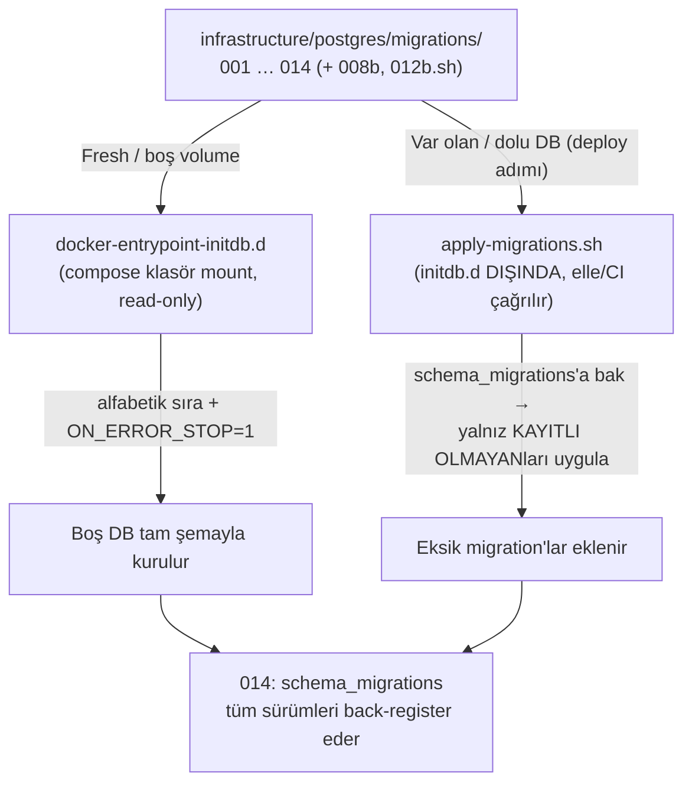

# Saydın Veritabanı Şeması

> **Doğruluk kaynağı (source of truth):** Bu dokümanın *kanonik* karşılığı
> `infrastructure/postgres/migrations/` altındaki numaralandırılmış `.sql`/`.sh`
> dosyalarıdır (`001_initial` … `014_schema_migrations`, `008b`/`012b` dahil).
> Burada anlatılan şema o migration zincirinin **uygulanmış son hâlini** özetler;
> bir uyumsuzluk olursa migration dosyaları geçerlidir. EF Core entity/configuration
> sınıfları (`src/Saydin.Shared/Entities/`, `src/Saydin.Shared/Data/Configurations/`)
> bu şemayı *yansıtır* (drift'i kapatmak için), ancak şemayı **üretmez** — şema yine
> SQL ile yönetilir (bkz. [ADR-001 — Migration Stratejisi](../decisions/ADR-001-migration-strategy.md)).

## Teknoloji Seçimi

**PostgreSQL + TimescaleDB** kullanılmaktadır (compose imajı: `timescale/timescaledb:2.16.1-pg16`).

TimescaleDB, PostgreSQL üzerine kurulu bir uzantıdır. Aynı SQL sözdizimini kullanır, ayrı
bir veritabanı sistemi gerektirmez. Zaman serisi verilerinde otomatik partisyonlama
(hypertable) ile büyük range query'lerde belirgin hızlanma sağlar. İki tablo hypertable'dır:
`price_points` (aylık chunk) ve `activity_logs` (haftalık chunk + compression).

> **Çapraz referans (meta repo):** TimescaleDB tercihinin ve günlük (intraday değil)
> granülaritenin ürün gerekçesi Saydın **meta repo**sundaki ürün ADR'lerinde
> (`docs/decisions/` — *ADR-002-timescaledb*, *ADR-003-daily-granularity*) belgelenir.
> Bu backend repo'sunda o dosyalar **bulunmaz**; backend ADR'leri için `../decisions/`
> altındaki `ADR-001..ADR-006`'ya bakın.

**ORM ve şema yönetimi:** Entity Framework Core (`Npgsql` sağlayıcısı) sorgu/ persist
katmanında kullanılır, fakat **şema migration'ları `dotnet ef migrations add` ile
üretilmez**. Şema, `infrastructure/postgres/migrations/` altındaki elle yazılmış
numaralandırılmış SQL dosyalarıyla evrilir; fresh (boş volume) init'te `docker-entrypoint`
bu klasörü `/docker-entrypoint-initdb.d` altına mount edip alfabetik sırayla
`ON_ERROR_STOP=1` ile uygular. EF Core'a tam geçiş **bilinçli olarak ertelenmiştir**
(TimescaleDB `create_hypertable`/compression policy çağrıları EF tarafından üretilemez).

Detay ve gerekçe: [ADR-001 — Migration & Schema Evolution Stratejisi](../decisions/ADR-001-migration-strategy.md)
(Seçenek C — Hybrid).

İsimlendirme kuralı **snake_case**'dir (ör. `price_date`, `display_name`); tablo/kolon
adları SQL dosyalarında açıkça snake_case yazılır, EF konfigürasyonları `ToTable`/`HasColumnName`
ile bu adlara hizalanır.

---

## Migration Stratejisi (Gerçek Akış — ADR-001 Seçenek C)



- **Fresh init:** Volume boşken `docker-entrypoint` migration klasörünü alfabetik sırada
  uygular. Bir `.sql` hata verirse `ON_ERROR_STOP=1` zinciri **durdurur** — bu yüzden
  sıralama ve idempotency kritiktir.
- **Var olan DB:** `infrastructure/postgres/apply-migrations.sh`, `schema_migrations`
  tablosuna bakar ve yalnız **kaydı olmayan** `.sql`/`.sh` dosyalarını alfabetik sırada
  `psql -v ON_ERROR_STOP=1` ile uygular, ardından `version`'ı kaydeder. Bu script
  `migrations/` klasörünün **dışındadır** ve initdb.d'ye mount edilmez → fresh init'te
  asla otomatik çalışmaz. 014 öncesi DB'lerde önce `014_schema_migrations.sql` elle uygulanır.
- **İzleme:** `schema_migrations(version PK, applied_at, checksum)` (migration 014) hangi
  sürümün uygulandığını denetlenebilir kılar. `version` = dosya adının uzantısız hâli
  (ör. `008b_disable_activity_log_compression`).
- **Mevcut dosyalar değiştirilmez** — yeni davranış yeni numaralı dosyayla eklenir
  (CLAUDE.md kuralı). Compression penceresi için `008b` (disable) / `013` (re-enable)
  sarmalama deseni korunur.

### Migration Zinciri (özet)

| Dosya | Özet |
|-------|------|
| `001_initial.sql` | Uzantılar, `asset_category` enum, `assets`, `price_points` (hypertable), `ingestion_jobs`, `users`, `saved_scenarios`, `market_holidays` + 8 seed asset |
| `002_add_assets.sql` | 5 ek TCMB döviz + 3 ek CoinGecko crypto (`ON CONFLICT DO NOTHING`) |
| `003_switch_precious_metals_to_oxr.sql` | XAU/XAG `source`: `goldapi` → `openexchangerates` |
| `004_add_inflation_rates.sql` | `inflation_rates` tablosu + yaklaşık TÜFE seed (`source='seed-approximation'`) |
| `005_add_tcmb_currencies.sql` | 13 ek TCMB döviz → toplam 20 (source_id = bare ISO kodu) |
| `006_scenario_type.sql` | `saved_scenarios`: `type`/`extra_data`/`asset_symbol`/`asset_display_name`; `asset_id` nullable |
| `007_add_dca_scenario_type.sql` | `chk_saved_scenarios_type`'a `dca` eklenir |
| `008_add_activity_logs.sql` | `activity_logs` (hypertable haftalık chunk + compression policy), geo kolonları, GIN index |
| `008b_disable_activity_log_compression.sql` | Compression'ı **geçici kapat** (009/011 `ALTER COLUMN TYPE` için TS 2.16.1 kısıtı) |
| `009_widen_activity_log_columns.sql` | `device_os`/`os_version`/`app_version` genişletme |
| `010_add_geo_columns.sql` | `country`/`city` + index (idempotent — 008 ile çakışmaz) |
| `011_phase2_schema_hardening.sql` | Partial UNIQUE index'ler, CHECK senkronu (NOT VALID+VALIDATE), explicit FK ON DELETE, `data` boyut CHECK, `duration_ms` → BIGINT, GIN index rename |
| `012_faz3_schema.sql` | `inflation_rates` composite PK `(period_date, source)`; `ingestion_jobs.asset_id` nullable + `source` kolonu |
| `012b_create_exporter_role.sh` | `saydin_exporter` least-privilege rolü (parola env'den, fresh init'te) |
| `013_enable_activity_log_compression.sql` | `activity_logs` compression'ı **geri aç** (008 ayarıyla birebir) |
| `014_schema_migrations.sql` | `schema_migrations` izleme tablosu + 001..014 back-register |

---

## Tam Şema (uygulanmış son hâl)

```sql
-- ============================================================
-- UZANTILAR  (001)
-- ============================================================
CREATE EXTENSION IF NOT EXISTS "uuid-ossp";
CREATE EXTENSION IF NOT EXISTS timescaledb;

-- ============================================================
-- ENUM'LAR  (001) — EF: HasPostgresEnum<AssetCategory>("public","asset_category")
-- ============================================================
CREATE TYPE asset_category AS ENUM (
    'currency',         -- USD/TRY, EUR/TRY ...
    'precious_metal',   -- Altın, Gümüş
    'stock',            -- BIST hisseleri (henüz aktif ingestion yok)
    'crypto'            -- BTC, ETH ...
);

-- ============================================================
-- ASSETS — Desteklenen finansal varlıklar  (001; 002/003/005 ile genişler)
-- ============================================================
CREATE TABLE assets (
    id            UUID           PRIMARY KEY DEFAULT gen_random_uuid(),
    symbol        VARCHAR(20)    NOT NULL,
    display_name  VARCHAR(100)   NOT NULL,
    category      asset_category NOT NULL,
    is_active     BOOLEAN        NOT NULL DEFAULT true,
    source        VARCHAR(50)    NOT NULL,
    -- Değerler: 'tcmb', 'coingecko', 'openexchangerates', 'twelvedata'
    -- ('goldapi' artık KULLANILMAZ — XAU/XAG migration 003 ile 'openexchangerates'e taşındı)
    source_id     VARCHAR(100),
    -- Dış API tanımlayıcısı. NOT: formatı kaynağa göre değişir:
    --   TCMB 001/002: ISO 4217 (örn. 'TP.DK.USD.A' geçmiş notasyon) — kodda CurrencyCode kullanılır
    --   TCMB 005:     bare ISO kodu (örn. 'AUD', 'CNY')
    --   CoinGecko:    coin id (örn. 'bitcoin', 'ripple')
    --   OXR:          metal kodu (örn. 'XAU', 'XAG')
    metadata      JSONB,
    -- Esnek alan: { "decimal_places": 4 }, { "display_unit": "gram", "decimal_places": 2 },
    --             TCMB 100-birimli kurlarda { "decimal_places": 4, "unit": 100 } (JPY)
    created_at    TIMESTAMPTZ    NOT NULL DEFAULT NOW(),

    CONSTRAINT uq_assets_symbol UNIQUE (symbol)
);

-- ============================================================
-- PRICE_POINTS — Günlük OHLCV  (001, TimescaleDB hypertable)
-- ============================================================
CREATE TABLE price_points (
    asset_id      UUID          NOT NULL,
    price_date    DATE          NOT NULL,
    open          NUMERIC(18,6),
    high          NUMERIC(18,6),
    low           NUMERIC(18,6),
    close         NUMERIC(18,6) NOT NULL,
    -- 'close' tüm "ya alsaydım" hesaplamalarının kanonik fiyatıdır
    volume        NUMERIC(24,4),
    -- F1.5-2: kripto işlem hacimleri NUMERIC(18,6)'ya taşıyordu → NUMERIC(24,4).
    -- Forex (TCMB) verisinde NULL.
    source_raw    JSONB,
    -- Ham API yanıtı (veri kalitesi / yeniden işleme).
    ingested_at   TIMESTAMPTZ   NOT NULL DEFAULT NOW(),

    CONSTRAINT pk_price_points PRIMARY KEY (asset_id, price_date),
    -- 011: explicit ON DELETE RESTRICT (NOT VALID + VALIDATE pattern)
    CONSTRAINT fk_price_points_asset FOREIGN KEY (asset_id)
        REFERENCES assets(id) ON DELETE RESTRICT
);

SELECT create_hypertable('price_points', 'price_date',
    chunk_time_interval => INTERVAL '1 month', if_not_exists => TRUE);

CREATE INDEX idx_price_points_asset_date
    ON price_points (asset_id, price_date DESC);

-- NOT: price_points'te source/provenance kolonu YOKTUR. XAU/XAG goldapi→oxr geçişi
-- (003) ayrı bir DELETE gerektirmez: OXR satırları aynı (asset_id, price_date) için
-- eski GoldAPI değerlerini UPSERT ile doğal olarak üzerine yazar (bkz. 012 yorumu).

-- ============================================================
-- INGESTION_JOBS — Veri çekme takibi  (001; 011/012 ile genişler)
-- ============================================================
CREATE TABLE ingestion_jobs (
    id                UUID        PRIMARY KEY DEFAULT gen_random_uuid(),
    asset_id          UUID,                 -- 012: NULLABLE (inflation/EVDS job'ı asset değildir)
    job_type          VARCHAR(50) NOT NULL,
    started_at        TIMESTAMPTZ NOT NULL DEFAULT NOW(),
    finished_at       TIMESTAMPTZ,
    status            VARCHAR(20) NOT NULL DEFAULT 'running',
    records_upserted  INT,
    error_message     TEXT,
    date_range_start  DATE,
    date_range_end    DATE,
    source            VARCHAR(30),          -- 012 (INGR-002): provenance ('tcmb','coingecko','openexchangerates','twelvedata','evds')

    -- 011: explicit ON DELETE RESTRICT
    CONSTRAINT fk_ingestion_jobs_asset FOREIGN KEY (asset_id)
        REFERENCES assets(id) ON DELETE RESTRICT,
    -- 011: job_type CHECK inflation tipleriyle genişletildi
    CONSTRAINT chk_ingestion_jobs_type CHECK (job_type IN
        ('historical_backfill', 'daily_update', 'inflation_backfill', 'inflation_daily')),
    CONSTRAINT chk_ingestion_jobs_status CHECK (status IN ('running', 'success', 'failed'))
);

CREATE INDEX idx_ingestion_jobs_asset_status
    ON ingestion_jobs (asset_id, status, started_at DESC);

-- ============================================================
-- USERS — Kullanıcı hesapları  (001; 011 ile partial unique)
-- ============================================================
CREATE TABLE users (
    id            UUID         PRIMARY KEY DEFAULT gen_random_uuid(),
    device_id     VARCHAR(200),            -- MVP: anonim cihaz tabanlı auth
    email         VARCHAR(200),            -- Phase 2: e-posta kaydı
    tier          VARCHAR(20)  NOT NULL DEFAULT 'free',
    created_at    TIMESTAMPTZ  NOT NULL DEFAULT NOW(),
    last_seen_at  TIMESTAMPTZ,

    CONSTRAINT chk_users_tier CHECK (tier IN ('free', 'premium'))
);

-- 011 (F2.5-5 / F2.7-2): partial UNIQUE — NULL device_id/email'e izin ver
-- (anonim kullanıcı + kayıtsız satır birden fazla NULL tutabilmeli).
CREATE UNIQUE INDEX uq_users_device_id ON users (device_id) WHERE device_id IS NOT NULL;
CREATE UNIQUE INDEX uq_users_email     ON users (email)     WHERE email     IS NOT NULL;

-- ============================================================
-- SAVED_SCENARIOS — Kullanıcı senaryoları  (001; 006/007/011/012 ile genişler)
-- ============================================================
CREATE TABLE saved_scenarios (
    id                  UUID          PRIMARY KEY DEFAULT gen_random_uuid(),
    user_id             UUID          NOT NULL,
    asset_id            UUID,                       -- 006: NULLABLE (comparison/portfolio'da NULL)
    buy_date            DATE          NOT NULL,
    sell_date           DATE,                       -- NULL = bugüne kadar
    quantity            NUMERIC(18,8) NOT NULL,
    quantity_unit       VARCHAR(20)   NOT NULL,     -- 'try' | 'units' | 'grams'
    label               VARCHAR(200),
    created_at          TIMESTAMPTZ   NOT NULL DEFAULT NOW(),
    -- 006 ile eklenen kolonlar:
    type                VARCHAR(20)   NOT NULL DEFAULT 'what_if',
    extra_data          JSONB,                      -- tipe özgü ek veri (DCA period, comparison sembolleri ...)
    asset_symbol        VARCHAR(100)  NOT NULL,     -- denormalize (what_if=tek, comparison=virgüllü, portfolio=PORTFOLIO)
    asset_display_name  VARCHAR(200)  NOT NULL,     -- denormalize görünen ad

    -- 011: explicit FK ON DELETE
    CONSTRAINT fk_saved_scenarios_user  FOREIGN KEY (user_id)  REFERENCES users(id)  ON DELETE CASCADE,
    CONSTRAINT fk_saved_scenarios_asset FOREIGN KEY (asset_id) REFERENCES assets(id) ON DELETE RESTRICT,
    CONSTRAINT chk_saved_scenarios_dates CHECK (sell_date IS NULL OR sell_date > buy_date),
    CONSTRAINT chk_saved_scenarios_unit  CHECK (quantity_unit IN ('try', 'units', 'grams')),
    -- 007/011: dca dahil
    CONSTRAINT chk_saved_scenarios_type  CHECK (type IN ('what_if', 'comparison', 'portfolio', 'dca'))
);

CREATE INDEX idx_saved_scenarios_user ON saved_scenarios (user_id, created_at DESC);

-- ============================================================
-- INFLATION_RATES — Aylık TÜFE endeksi  (004; 011/012 ile genişler)
-- ============================================================
CREATE TABLE inflation_rates (
    period_date  DATE           NOT NULL,   -- her ayın 1'i (2024-01-01 = Ocak 2024)
    index_value  NUMERIC(12,4)  NOT NULL,   -- TÜİK TÜFE endeksi (2003=100 bazlı)
    source       VARCHAR(20)    NOT NULL DEFAULT 'tuik',
    created_at   TIMESTAMPTZ    NOT NULL DEFAULT NOW(),
    updated_at   TIMESTAMPTZ    NOT NULL DEFAULT NOW(),

    -- 012 (F2.7-5): composite PK — aynı ay için hem 'seed-approximation' hem 'tuik' satırı
    -- bir arada (audit trail). Okuma yolu 'tuik'i tercih eder.
    CONSTRAINT pk_inflation_rates PRIMARY KEY (period_date, source),
    -- 011 (SHRD-011):
    CONSTRAINT chk_inflation_rates_source CHECK (source IN ('tuik', 'seed-approximation'))
);

CREATE INDEX idx_inflation_rates_period ON inflation_rates (period_date DESC);

-- NOT: Bu tabloda 'id' UUID PK ve 'ingested_at' YOKTUR (stale doc'ta vardı).
-- Kimlik (period_date, source) bileşik anahtarıdır; zaman damgaları created_at/updated_at'tir.

-- ============================================================
-- ACTIVITY_LOGS — Kullanıcı aktivite logları  (008; 008b/009/010/011/013)
-- TimescaleDB hypertable, haftalık chunk + 7 gün üstü compression
-- ============================================================
CREATE TABLE activity_logs (
    id              UUID         NOT NULL DEFAULT gen_random_uuid(),
    user_id         UUID         REFERENCES users(id) ON DELETE SET NULL,
    device_id       VARCHAR(200) NOT NULL,
    action          VARCHAR(30)  NOT NULL,
    -- Coğrafi konum (MaxMind GeoLite2; IP maskelenmeden önce çözümlenir):
    ip_address      INET,                    -- son oktet maskelenmiş (KVKK)
    country         CHAR(2),                 -- ISO 3166-1 alpha-2
    city            VARCHAR(100),
    -- Cihaz bilgisi (009 ile genişletildi):
    device_os       VARCHAR(30),
    os_version      VARCHAR(100),
    app_version     VARCHAR(50),
    data            JSONB,                   -- action türüne göre değişen veri
    status_code     SMALLINT     NOT NULL,
    duration_ms     BIGINT,                  -- 011: INT → BIGINT (uzun süreli işlem taşması)
    error_code      VARCHAR(50),
    created_at      TIMESTAMPTZ  NOT NULL DEFAULT now(),

    PRIMARY KEY (id, created_at),

    -- 011: action kanonik liste (ActivityActions.All ile birebir)
    CONSTRAINT chk_activity_action CHECK (action IN (
        'what_if_calculate', 'what_if_compare', 'what_if_dca', 'what_if_reverse',
        'scenario_save', 'scenario_delete', 'scenario_list',
        'assets_list', 'asset_price', 'asset_price_range', 'config_fetch')),
    -- 011 (F2.7-9): data binary boyut limiti — pg_column_size (TOAST-uncompressed)
    CONSTRAINT chk_activity_data_size CHECK (data IS NULL OR pg_column_size(data) <= 10000)
);

SELECT create_hypertable('activity_logs', 'created_at',
    chunk_time_interval => INTERVAL '1 week');

CREATE INDEX idx_activity_logs_user     ON activity_logs (user_id, created_at DESC);
CREATE INDEX idx_activity_logs_action   ON activity_logs (action, created_at DESC);
CREATE INDEX idx_activity_logs_country  ON activity_logs (country, created_at DESC);
-- 011 (SHRD-013): GIN index adı kolonu yansıtsın (eski idx_activity_logs_asset_symbol)
CREATE INDEX idx_activity_logs_data_gin ON activity_logs USING GIN (data jsonb_path_ops);

-- Compression: 008 açar → 008b geçici kapatır (009/011 ALTER COLUMN TYPE için)
-- → 013 geri açar. Etkin son ayar (013, 008 ile birebir):
ALTER TABLE activity_logs SET (
    timescaledb.compress,
    timescaledb.compress_segmentby = 'action',
    timescaledb.compress_orderby   = 'created_at DESC'
);
SELECT add_compression_policy('activity_logs', INTERVAL '7 days', if_not_exists => TRUE);

-- ============================================================
-- MARKET_HOLIDAYS — Piyasa tatil günleri  (001) — DESIGN-ONLY
-- ============================================================
CREATE TABLE market_holidays (
    asset_id      UUID  NOT NULL,
    holiday_date  DATE  NOT NULL,
    reason        VARCHAR(200),

    CONSTRAINT pk_market_holidays PRIMARY KEY (asset_id, holiday_date),
    -- 011: explicit ON DELETE CASCADE
    CONSTRAINT fk_market_holidays_asset FOREIGN KEY (asset_id)
        REFERENCES assets(id) ON DELETE CASCADE
);
-- DURUM: Tablo migration 001'de yaratıldı ve 011'de FK güncellendi, fakat
-- uygulama katmanında HENÜZ KULLANILMIYOR — EF entity'si / DbSet'i yoktur ve
-- hiçbir worker/servis bu tabloyu okuyup yazmaz (design-only / gelecek kullanım).

-- ============================================================
-- SCHEMA_MIGRATIONS — Migration izleme  (014)
-- ============================================================
CREATE TABLE IF NOT EXISTS schema_migrations (
    version    text        PRIMARY KEY,   -- dosya adının uzantısız hâli
    applied_at timestamptz NOT NULL DEFAULT now(),
    checksum   text        NULL
);
```

---

## EF Core Eşlemesi (entity ↔ tablo)

`SaydinDbContext` (`src/Saydin.Shared/Data/`) yalnız **uygulama tarafından kullanılan**
tabloları DbSet olarak modeller. `market_holidays` ve `schema_migrations` EF modelinde
**yoktur** (sırasıyla design-only ve operasyonel tablo).

| Tablo | EF Entity / DbSet | Konfigürasyon |
|-------|-------------------|---------------|
| `assets` | `Asset` / `Assets` | `AssetConfiguration` (`Category` → `asset_category`, `Metadata` → jsonb) |
| `price_points` | `PricePoint` / `PricePoints` | `PricePointConfiguration` (`Volume` precision `(24,4)`) |
| `ingestion_jobs` | `IngestionJob` / `IngestionJobs` | `IngestionJobConfiguration` (`Source` `VARCHAR(30)`, AssetId optional FK) |
| `users` | `User` / `Users` | `UserConfiguration` (partial unique `HasFilter`) |
| `saved_scenarios` | `SavedScenario` / `SavedScenarios` | `SavedScenarioConfiguration` (`ExtraData` jsonb + ValueComparer) |
| `inflation_rates` | `InflationRate` / `InflationRates` | `InflationRateConfiguration` (composite key `(PeriodDate, Source)`) |
| `activity_logs` | `ActivityLog` / `ActivityLogs` | `ActivityLogConfiguration` (composite key `(Id, CreatedAt)`, GIN index) |
| `market_holidays` | — (yok) | — |
| `schema_migrations` | — (yok) | — |

`asset_category` enum'u `modelBuilder.HasPostgresEnum<AssetCategory>("public", "asset_category")`
ile yönetilir (TypeHandler yazılmaz). CHECK constraint'ler, hem migration'da hem EF
konfigürasyonunda (`HasCheckConstraint`) tanımlıdır; kaynak değerler `Saydin.Shared/Constants/`
altındaki sabitlerden (`ActivityActions`, `ScenarioTypes`, `QuantityUnits`, `UserTiers`,
`InflationSources`, `IngestionJobTypes`/`IngestionJobStatuses`) türetilir.

> **DİKKAT — TimescaleDB modellenmez:** `create_hypertable`, compression ayarları ve
> `add_compression_policy` EF Core modelinde **karşılık bulmaz**; yalnız SQL migration'larda
> yaşar. Bu, EF Core'a tam geçişin ertelenme nedenidir (ADR-001).

---

## Asset Kataloğu (seed)

Seed asset'leri `001_initial.sql` (8 satır), `002_add_assets.sql` (5 döviz + 3 crypto) ve
`005_add_tcmb_currencies.sql` (13 döviz) ile gelir. `003` ile XAU/XAG `source` alanı
`openexchangerates`'e güncellenir.

| Kategori | Semboller (kaynak) |
|----------|--------------------|
| `currency` (tcmb) | USDTRY, EURTRY, GBPTRY, CHFTRY, JPYTRY, SARTRY, AEDTRY, AUDTRY, AZNTRY, CADTRY, CNYTRY, DKKTRY, KRWTRY, KWDTRY, KZTTRY, NOKTRY, QARTRY, RONTRY, RUBTRY, SEKTRY (toplam 20) |
| `precious_metal` (openexchangerates) | XAU_TRY_GRAM, XAG_TRY_GRAM |
| `crypto` (coingecko) | BTC, ETH, BNB, XRP, SOL |
| `stock` (twelvedata) | THYAO, GARAN (seed mevcut; aktif ingestion adapter'ı henüz yok) |

### TCMB Birim (Unit) İşleme — migration 005

TCMB bazı para birimlerini **100 birim** üzerinden kote eder (örn. JPY, KRW). XML yanıtındaki
`<Unit>` elementi bu çarpanı verir. `TcmbMapper` (`src/Saydin.PriceIngestion/Mappers/TcmbMapper.cs:77-94`)
fiyatı normalize ederek "1 birim X kaç TL" değerini saklar:

```text
Close = round(ForexBuying / Unit, 6, AwayFromZero)
```

Böylece JPY/TL gibi düşük değerli kurlar 100x büyütülmüş kaydedilmez. Asset `metadata`
alanında JPY için `{ "decimal_places": 4, "unit": 100 }` gibi bir ipucu tutulur, fakat
normalizasyon esas olarak XML'deki `<Unit>` değerinden yapılır (XML'de yoksa `1` varsayılır).
TCMB intraday OHLC yayımlamadığı için yalnız `close` doldurulur; `open`/`high`/`low` NULL kalır.

---

## Tasarım Kararları

### NUMERIC — Float Kullanılmaz
Finansal değerlerde kayan noktalı aritmetik yuvarlama hatasına yol açar. Fiyat kolonları
`NUMERIC(18,6)`, hacim `NUMERIC(24,4)`, miktar `NUMERIC(18,8)`, enflasyon endeksi
`NUMERIC(12,4)` tipindedir. C# tarafında karşılık `decimal`'dir (CLAUDE.md finansal
hassasiyet kuralı; `double`/`float` yasak).

### `volume NUMERIC(24,4)` — Precision Drift Düzeltmesi
Başlangıçta `volume` da `NUMERIC(18,6)` idi; yüksek kripto işlem hacimleri taşmaya yol
açabiliyordu. Review F1.5-2 ile DB `NUMERIC(24,4)`'e çekildi ve EF
(`PricePointConfiguration.cs:20`) `HasPrecision(24, 4)` ile hizalandı.

### `close` Kanonik Fiyat
"Ya alsaydım?" hesaplamalarında endüstri standardı kapanış fiyatıdır. `open`/`high`/`low`
grafik gösterimi için saklanır; TCMB forex verisinde NULL.

### `inflation_rates` Composite PK ve LKV Mantığı
`(period_date, source)` bileşik PK sayesinde aynı ay için hem seed (`seed-approximation`)
hem gerçek TÜİK (`tuik`) satırı bir arada tutulur (audit). Okuma yolu `tuik` satırını
tercih eder. TÜİK yayın gecikmesi (2-3 ay) nedeniyle belirli bir tarih için "last known
value" (LKV) kullanılır:

```sql
SELECT index_value FROM inflation_rates
WHERE period_date <= @target ORDER BY period_date DESC LIMIT 1;
```

Seed satırları yalnız tablo boşken eklenir; EVDS worker gerçek veriyi `ON CONFLICT DO UPDATE`
ile yazar (`InflationIngestionRepository`).

### `source_raw` / `data` JSONB
`price_points.source_raw` ham API yanıtını saklar (yeniden işleme). `activity_logs.data`
action'a göre değişen log payload'ıdır ve `pg_column_size(data) <= 10000` ile sınırlanır
(GIN index `jsonb_path_ops` ile sorgulanabilir).

### `activity_logs` Hypertable + Compression Penceresi
Log verisi hızlı büyüdüğü için haftalık chunk'lı hypertable ve 7 gün üstü chunk'lar için
compression policy kullanılır. TimescaleDB 2.16.1'de compression bayrağı **set iken**
`ALTER COLUMN ... TYPE` yasaktır; bu yüzden kolon-tip değişiklikleri (`009`, `011`)
`008b` (disable) ile `013` (re-enable) arasına sarmalanır. Yeni `ALTER COLUMN TYPE`
eklenirken bu pencere korunmalıdır (CLAUDE.md notu).

### Cihaz Tabanlı Auth ve Partial UNIQUE
`users.device_id` ve `users.email` partial UNIQUE index'lerle (`WHERE ... IS NOT NULL`)
benzersizdir; böylece birden fazla anonim/kayıtsız satır NULL tutabilir.

> **Çapraz referans (meta repo):** Cihaz tabanlı (device-id) auth modelinin ürün gerekçesi
> meta repo'daki ürün ADR'sinde (`docs/decisions/ADR-004-device-id-auth`) belgelenir; bu
> backend repo'sunda o dosya bulunmaz.

### `market_holidays` — Henüz Pasif
Tablo şemada mevcuttur (001 + 011 FK) ancak uygulama katmanında kullanılmaz: EF entity'si
yoktur ve hiçbir kod yolu onu okumaz/yazmaz. Tasarım niyeti, ingestion worker'ının tatil
günlerini "eksik veri" saymamasıdır; bu davranış henüz devreye alınmamıştır.

---

## İlgili Dokümanlar

- [`../decisions/ADR-001-migration-strategy.md`](../decisions/ADR-001-migration-strategy.md) — Migration & schema evolution (Seçenek C hybrid)
- [`../architecture.md`](../architecture.md) — Servis mimarisi, DB erişim katmanı, exception zinciri, rate limiting
- `infrastructure/postgres/migrations/` — Kanonik şema kaynağı (numaralı `.sql`/`.sh`)
- `infrastructure/postgres/apply-migrations.sh` — Var olan DB'ye yeni migration uygulayan idempotent runner
- **Meta repo** `docs/decisions/` — Ürün ADR'leri (TimescaleDB, günlük granülarite, device-id auth)
