# Saydın — Observability Mimarisi

> **Not:** Observability kurallarının (log seviyeleri, structured logging zorunluluğu,
> exception handler deseni, custom span/metrik kuralları, health check) **normatif kaynağı**
> kök `CLAUDE.md` → "Observability Kuralları" bölümüdür. Bu doküman o kuralların **detaylı
> referansıdır**: kod ve konfigürasyonun fiili durumunu (Serilog, OpenTelemetry tracing/metrics,
> Prometheus, health check, 9-handler exception zinciri) örnekleriyle açıklar.

## Genel Yaklaşım

Üç observability sütunu ("three pillars") birlikte uygulanır:

| Sütun | Araç | Nerede Görülür |
|-------|------|----------------|
| **Structured Logging** | Serilog + Console (JSON) + OTLP sink | Aspire Dashboard → Logs |
| **Distributed Tracing** | OpenTelemetry | Aspire Dashboard → Traces |
| **Metrics** | OpenTelemetry + Prometheus | Aspire Dashboard → Metrics / Prometheus UI |

Trace ve metrikler **OTLP (OpenTelemetry Protocol, gRPC)** üzerinden Aspire Dashboard'a
gönderilir; loglar hem Console'a (JSON) hem OTLP sink'e yazılır. Compose içinde servisler
OTLP'yi `http://aspire-dashboard:18889` adresine, host makinede ise `http://localhost:4317`
adresine export eder (Aspire Dashboard container'ı `18889` portunu host'ta `4317` olarak yayınlar).
Endpoint `Otlp:Endpoint` config anahtarıyla (env: `Otlp__Endpoint`) ayarlanabilir; varsayılan
`http://localhost:4317`.

Metrikler ayrıca `GET /metrics` üzerinden Prometheus tarafından doğrudan kazınır
(Prometheus exporter, OTLP'den bağımsız ikinci yol).

---

## Geliştirme Ortamı Araçları

Tümü `docker compose up -d` ile ayağa kalkar ve yalnızca loopback'e (`127.0.0.1`) bağlanır:

| Araç | URL | Amaç |
|------|-----|-------|
| **Aspire Dashboard** | http://localhost:18888 | Log, trace ve metrik tek arayüzde |
| **Prometheus** | http://localhost:9090 | Metrik sorgulama (PromQL) |
| **pgAdmin** | http://localhost:5050 | PostgreSQL yönetimi |
| **Redis Insight** | http://localhost:5540 | Redis izleme ve yönetimi |

> OTLP gRPC ucu: `localhost:4317` (Aspire Dashboard container içinde `18889`).
> Prometheus ek olarak `postgres-exporter` ve `redis_exporter` hedeflerini de kazır.

---

## Logging

### Yaklaşım: Serilog + Console (JSON) + OTLP

Serilog kullanılır çünkü:
- `.ForContext<T>()` ile zengin log enrichment
- `{@object}` ile structured (JSON) nesne loglama
- OTLP sink aracılığıyla Aspire Dashboard'a gönderim
- Trace ID ve Span ID otomatik olarak log'a eklenir (trace-log korelasyonu)

### Konfigürasyon

`Program.cs` önce bir **bootstrap logger** kurar (Console), ardından host kurulurken asıl
logger'ı `appsettings.json` (`ReadFrom.Configuration`) ve DI'dan (`ReadFrom.Services`) okuyarak
yapılandırır:

```csharp
// ─── Bootstrap Logger ─── (build başlamadan önceki erken hatalar için)
Log.Logger = new LoggerConfiguration()
    .MinimumLevel.Override("Microsoft", LogEventLevel.Warning)
    .MinimumLevel.Override("System", LogEventLevel.Warning)
    .Enrich.FromLogContext()
    .WriteTo.Console()
    .CreateBootstrapLogger();

// ─── Asıl Serilog ───
builder.Host.UseSerilog((ctx, services, cfg) =>
{
    var otlpEndpoint = ctx.Configuration["Otlp:Endpoint"] ?? "http://localhost:4317";

    cfg
        .ReadFrom.Configuration(ctx.Configuration)   // MinimumLevel + Override appsettings'ten
        .ReadFrom.Services(services)
        .Enrich.FromLogContext()
        .Enrich.WithMachineName()
        .WriteTo.Console(new Serilog.Formatting.Json.JsonFormatter())   // Yapısal JSON
        .WriteTo.OpenTelemetry(opts =>                                  // OTLP → Aspire Dashboard
        {
            opts.Endpoint = otlpEndpoint;
            opts.Protocol = OtlpProtocol.Grpc;
            opts.ResourceAttributes = new Dictionary<string, object>
            {
                ["service.name"] = "saydin-api",
                ["service.version"] = "1.0.0"
            };
        });
});
```

Minimum seviye ve override'lar `appsettings.json` → `Serilog` bölümünden gelir:

```json
"Serilog": {
  "MinimumLevel": {
    "Default": "Information",
    "Override": {
      "Microsoft.AspNetCore": "Warning",
      "System.Net.Http": "Warning"
    }
  }
}
```

HTTP istek logları `app.UseSerilogRequestLogging()` ile tek satırlık structured kayıt olarak
üretilir (exception handler'dan sonra pipeline'a girer).

### Log Seviyeleri

| Seviye | Ne Zaman |
|--------|----------|
| `Error` | Beklenmeyen exception, dış API tamamen başarısız |
| `Warning` | Beklenen ama anormal durum (fiyat bulunamadı, rate limit, limit aşımı) |
| `Information` | İş akışı adımları (ingestion başladı/bitti, hesaplama yapıldı, tier-feature kapalı) |
| `Debug` | Yalnızca Development ortamında, detay bilgi |

### Log Kuralları

```csharp
// DOĞRU ✓ — structured logging, parametreli mesaj
_logger.LogInformation("Fiyat hesaplandı: {Symbol} {BuyDate} → {ProfitPercent}%",
    symbol, buyDate, profitPercent);

// YANLIŞ ✗ — string interpolation ile log (structured değil, query yapılamaz)
_logger.LogInformation($"Fiyat hesaplandı: {symbol} {buyDate} → {profitPercent}%");
```

`Console.WriteLine` / `Debug.WriteLine` yasaktır — her zaman `ILogger<T>` veya Serilog kullanılır
(bkz. CLAUDE.md "Yasak Listesi").

---

## Distributed Tracing

### Konfigürasyon

```csharp
var otlpEndpointUri = new Uri(
    builder.Configuration["Otlp:Endpoint"] ?? "http://localhost:4317");

builder.Services.AddOpenTelemetry()
    .ConfigureResource(r => r
        .AddService("saydin-api", serviceVersion: "1.0.0")
        .AddAttributes(new Dictionary<string, object>
        {
            ["deployment.environment"] = builder.Environment.EnvironmentName.ToLowerInvariant()
        }))
    .WithTracing(tracing => tracing
        .AddSource(SaydinActivitySource.Instance.Name)   // custom iş akışı span'ları
        .AddAspNetCoreInstrumentation(opts =>
        {
            opts.RecordException = true;
            // /health ve /metrics trace'leri hariç tutulur (gürültü)
            opts.Filter = ctx => !ctx.Request.Path.StartsWithSegments("/health")
                                 && !ctx.Request.Path.StartsWithSegments("/metrics");
        })
        .AddHttpClientInstrumentation(opts => opts.RecordException = true)
        .AddOtlpExporter(opts =>
        {
            opts.Endpoint = otlpEndpointUri;
            opts.Protocol = OtlpExportProtocol.Grpc;
        }));
```

Dış API adapter'ları `AddHttpClientInstrumentation()` ile otomatik izlenir. Health check
(`/health`) ve Prometheus scrape (`/metrics`) yolları trace'e dahil edilmez.

### Merkezi ActivitySource

ActivitySource `Saydin.Shared`'de merkezi tanımlanır; **kaynak adı `"Saydin"`** olduğu için
hem `Saydin.Api` hem `Saydin.PriceIngestion` aynı source'u paylaşır (servis ayrımı
`service.name` resource attribute'u ile yapılır):

```csharp
// Saydin.Shared/Diagnostics/SaydinActivitySource.cs
public static class SaydinActivitySource
{
    public static readonly ActivitySource Instance = new("Saydin", "1.0.0");
}
```

### Custom Span'lar

İş akışı adımları için manuel span ekle:

```csharp
using var activity = SaydinActivitySource.Instance.StartActivity("WhatIfCalculation");
activity?.SetTag("asset.symbol", request.AssetSymbol);
activity?.SetTag("buy.date", request.BuyDate.ToString());
// ... hesaplama
activity?.SetTag("profit.percent", result.ProfitPercent);
```

---

## Metrics

### Konfigürasyon

```csharp
builder.Services.AddOpenTelemetry()
    .WithMetrics(metrics => metrics
        .AddMeter(SaydinMetrics.MeterName)   // iş metrikleri (meter adı: "Saydin")
        .AddAspNetCoreInstrumentation()      // HTTP request metrikleri
        .AddHttpClientInstrumentation()      // outbound HTTP metrikleri
        .AddRuntimeInstrumentation()         // GC, thread pool vb.
        .AddOtlpExporter(opts =>
        {
            opts.Endpoint = otlpEndpointUri;
            opts.Protocol = OtlpExportProtocol.Grpc;
        })
        .AddPrometheusExporter());           // /metrics endpoint'i

// Route kaydı
app.MapPrometheusScrapingEndpoint();   // GET /metrics
```

### Merkezi Meter ve Custom Metrikler

İş metrikleri `Saydin.Shared/Diagnostics/SaydinMetrics.cs`'de merkezi tanımlanır. **Meter adı
`"Saydin"`** olarak tutulur (`"Saydin.Api"` DEĞİL) — Shared kütüphane her iki servis tarafından
referans alındığı için tek isim üzerinden yayın yapılır ve servis ayrımı `service.name` resource
attribute'u ile yapılır (review F1.5-1). `Program.cs`'de bu isim `AddMeter(SaydinMetrics.MeterName)`
ile kaydedilir.

```csharp
// Saydin.Shared/Diagnostics/SaydinMetrics.cs
public static class SaydinMetrics
{
    public const string MeterName = "Saydin";
    private static readonly Meter Meter = new(MeterName, "1.0.0");
    // ... counter / histogram tanımları (aşağıdaki tablo)
}
```

Tanımlı iş metrikleri:

| Metrik | Tip | Birim | Açıklama | Tag'ler |
|--------|-----|-------|----------|---------|
| `saydin.whatif.calculations.total` | Counter&lt;long&gt; | — | Toplam ya-alsaydım hesaplama sayısı | `asset.symbol`, `user.tier` |
| `saydin.whatif.calculation.duration.ms` | Histogram&lt;double&gt; | ms | Ya-alsaydım hesaplama süresi | — |
| `saydin.price.not_found.total` | Counter&lt;long&gt; | — | Fiyat bulunamayan sorgu sayısı | — |
| `saydin.inflation.ingestion.failures.total` | Counter&lt;long&gt; | — | EVDS/TÜFE ingestion başarısızlıkları | `source`, `outcome` (`auth\|http\|other`) |
| `saydin.activity_log.write.failures.total` | Counter&lt;long&gt; | — | Activity log batch yazımı başarısızlıkları | `outcome` (`retry_exhausted\|cancelled`) |
| `saydin.activity_log.queue.drops.total` | Counter&lt;long&gt; | — | Channel kuyruğu dolduğundan düşürülen log sayısı | — |
| `saydin.activity_log.data.truncations.total` | Counter&lt;long&gt; | — | Byte limit aşıldığı için truncate edilen `data` payload sayısı | `action` |

> **Operasyon notu:** `EvdsInflationWorker` adapter başarısızlığını şu an `ingestion_jobs`
> tablosuna her durumda yazmayabilir; alarm bu nedenle `saydin.inflation.ingestion.failures.total`
> sayacına dayanır. Activity log yazma yolundaki **sessiz veri kaybı**
> (`activity_log.write.failures` / `queue.drops` / `data.truncations`) yalnızca bu sayaçlardan
> izlenebilir — bu sayaçlar olmadan drop edilen kayıtlar görünmez olurdu.

Kullanım:

```csharp
SaydinMetrics.WhatIfCalculations.Add(1,
    new KeyValuePair<string, object?>("asset.symbol", symbol),
    new KeyValuePair<string, object?>("user.tier", userTier));
```

Özel metrik eklenirken `Meter` ve `Counter`/`Histogram` kullanılır; ham sayı tutulmaz
(bkz. CLAUDE.md "Metrics").

---

## Exception Handling

### Yaklaşım: 9 Handler'lı IExceptionHandler Zinciri

.NET 10'un `IExceptionHandler` interface'i ile her domain exception türü için **ayrı** handler
yazılır. `Program.cs`'deki kayıt sırası anlamlıdır: spesifik handler'lar önce gelir,
`GlobalExceptionHandler` her zaman zincirin **sonunda** (catch-all) durur. İlk `true` dönen
handler zinciri keser.

```mermaid
flowchart LR
    R["İstek → Endpoint → Service<br/>Exception fırlatıldı"] --> V["ValidationExceptionHandler<br/>400"]
    V --> F["FeatureDisabledExceptionHandler<br/>403"]
    F --> P["PriceNotFoundExceptionHandler<br/>404"]
    P --> A["AssetNotFoundExceptionHandler<br/>404"]
    A --> SN["ScenarioNotFoundExceptionHandler<br/>404"]
    SN --> SL["ScenarioLimitExceededExceptionHandler<br/>422"]
    SL --> D["DailyLimitExceededExceptionHandler<br/>429"]
    D --> E["ExternalApiExceptionHandler<br/>502"]
    E --> G["GlobalExceptionHandler<br/>500 + traceId"]
```



HTTP kod konvansiyonu:

| Handler | Exception | Durum | `Type` (RFC 7807) | Notlar |
|---------|-----------|:-----:|-------------------|--------|
| `ValidationExceptionHandler` | `ValidationException` | 400 | `…/errors/validation` | Yalnız domain `ValidationException`; jenerik `ArgumentException` Global'a düşer (P1R-003). `field` extension'ı opsiyonel |
| `FeatureDisabledExceptionHandler` | `FeatureDisabledException` | 403 | `…/errors/feature-disabled` | Tier ile kapatılan özellik; `feature` extension'ı. 404 değil → istemci upsell gösterebilsin (F4-14) |
| `PriceNotFoundExceptionHandler` | `PriceNotFoundException` | 404 | `…/errors/price-not-found` | `nearestDates` extension'ı |
| `AssetNotFoundExceptionHandler` | `AssetNotFoundException` | 404 | `…/errors/asset-not-found` | — |
| `ScenarioNotFoundExceptionHandler` | `ScenarioNotFoundException` | 404 | `…/errors/scenario-not-found` | — |
| `ScenarioLimitExceededExceptionHandler` | `ScenarioLimitExceededException` | 422 | `…/errors/scenario-limit-exceeded` | Geçerli ama domain kotasını ihlal eden istek; `limit` extension'ı |
| `DailyLimitExceededExceptionHandler` | `DailyLimitExceededException` | 429 | `…/errors/daily-limit-exceeded` | `limit` + `resetAt` (UTC `DateTimeOffset`, `TimeProvider`'dan) extension'ları |
| `ExternalApiExceptionHandler` | `ExternalApiException` | 502 | `…/errors/external-api` | `source` extension'ı; `Warning` loglar |
| `GlobalExceptionHandler` | (catch-all) | 500 | `…/errors/internal-error` | `Error` loglar, her zaman `traceId` döner |

> IP-bazlı `RateLimiter` middleware (config-gated) reddetme yanıtı bu zincirden bağımsızdır
> ama **aynı şekli** taşır: 429 + `…/errors/rate-limited` + lokalize `title`/`detail` + `traceId`
> + `Retry-After` header (bkz. "Rate Limiting" altında).

### Ortak Kurallar

- Tüm handler'lar `IStringLocalizer<ErrorMessages>` inject ederek `ProblemDetails.Title`
  (ve çoğu yerde `Detail`) alanını `Accept-Language`'a göre lokalize eder — hardcoded
  Türkçe/İngilizce string YASAK.
- Tüm handler'lar **RFC 7807** `ProblemDetails` döner ve `Extensions["traceId"]` ekler.
  `Activity.Current` null olabileceği için `traceId = Activity.Current?.TraceId.ToString()
  ?? context.TraceIdentifier` deseni kullanılır.
- Beklenen-anormal durumlar `LogWarning`, beklenmeyen exception'lar `LogError` ile loglanır.
  Exception'ı sessizce yutan catch block YASAK.

### Implementasyon Deseni

```csharp
// Saydin.Api/Exceptions/PriceNotFoundExceptionHandler.cs
public sealed class PriceNotFoundExceptionHandler(
    ILogger<PriceNotFoundExceptionHandler> logger,
    IStringLocalizer<ErrorMessages> localizer)
    : IExceptionHandler
{
    public async ValueTask<bool> TryHandleAsync(
        HttpContext context,
        Exception exception,
        CancellationToken ct)
    {
        if (exception is not PriceNotFoundException ex)
            return false;   // bu handler işleyemez → zincir bir sonrakine geçer

        logger.LogWarning(
            "Fiyat bulunamadı: {Symbol} / {Date}",
            ex.AssetSymbol, ex.Date);

        context.Response.StatusCode = StatusCodes.Status404NotFound;

        await context.Response.WriteAsJsonAsync(new ProblemDetails
        {
            Type = "https://saydin.app/errors/price-not-found",
            Title = localizer["PriceNotFound"],                     // lokalize
            Status = StatusCodes.Status404NotFound,
            Detail = string.Format(localizer["PriceNotFoundDetail"], // lokalize, parametreli
                ex.Date.ToString("yyyy-MM-dd"), ex.AssetSymbol),
            Extensions =
            {
                ["traceId"] = Activity.Current?.TraceId.ToString(),
                ["nearestDates"] = ex.NearestAvailableDates
            }
        }, ct);

        return true;   // işlendi → zincir kesilir
    }
}

// Saydin.Api/Exceptions/GlobalExceptionHandler.cs — zincirin sonu (catch-all)
public sealed class GlobalExceptionHandler(
    ILogger<GlobalExceptionHandler> logger,
    IStringLocalizer<ErrorMessages> localizer) : IExceptionHandler
{
    public async ValueTask<bool> TryHandleAsync(
        HttpContext context,
        Exception exception,
        CancellationToken ct)
    {
        var traceId = Activity.Current?.TraceId.ToString() ?? context.TraceIdentifier;

        logger.LogError(exception,
            "İşlenmemiş exception: {ExceptionType} — TraceId: {TraceId}",
            exception.GetType().Name, traceId);

        context.Response.StatusCode = StatusCodes.Status500InternalServerError;

        await context.Response.WriteAsJsonAsync(new ProblemDetails
        {
            Type = "https://saydin.app/errors/internal-error",
            Title = localizer["ServerError"],
            Status = StatusCodes.Status500InternalServerError,
            Detail = localizer["UnexpectedError"],
            Extensions = { ["traceId"] = traceId }
        }, ct);

        return true;
    }
}
```

### Kayıt (Program.cs) — Sıra Önemli

```csharp
builder.Services.AddProblemDetails();
// Spesifik handler'lar önce, GlobalExceptionHandler en sonda:
builder.Services.AddExceptionHandler<ValidationExceptionHandler>();
builder.Services.AddExceptionHandler<FeatureDisabledExceptionHandler>();
builder.Services.AddExceptionHandler<PriceNotFoundExceptionHandler>();
builder.Services.AddExceptionHandler<AssetNotFoundExceptionHandler>();
builder.Services.AddExceptionHandler<ScenarioNotFoundExceptionHandler>();
builder.Services.AddExceptionHandler<ScenarioLimitExceededExceptionHandler>();
builder.Services.AddExceptionHandler<DailyLimitExceededExceptionHandler>();
builder.Services.AddExceptionHandler<ExternalApiExceptionHandler>();
builder.Services.AddExceptionHandler<GlobalExceptionHandler>();

app.UseExceptionHandler();
```

### TraceId İstemciye Döner

Her yanıtta `traceId` extension'ı bulunur (özellikle 5xx'te kritik). İstemci bu ID'yi
loglara/destek talebine ekler; geliştirici Aspire Dashboard → Traces'te tam çağrı zincirini
(`endpoint → service → repository → DB query`) bulur.

---

## Rate Limiting (IP-Bazlı, Config-Gated)

İki katmanlı throttling modelinin **2. katmanı** ASP.NET Core `RateLimiter` middleware'idir
(1. katman: `IDailyLimitGuard` / Redis günlük kota — bkz. `docs/architecture.md`). Varsayılan
**KAPALI** (`RateLimiting:Enabled=false`); açıkken IP-bazlı sabit pencere
(`PartitionedRateLimiter` + `FixedWindow`, `PermitLimit`/`WindowSeconds` config) uygulanır.

Observability açısından:
- `/health` ve `/metrics` throttle dışıdır (OTel trace filtresiyle tutarlı — gürültü yok).
- Reddetme yanıtı 429 + RFC 7807 `ProblemDetails` (`type=…/errors/rate-limited`), `IStringLocalizer`
  ile lokalize `title`/`detail`, `traceId` extension'ı ve `Retry-After` header taşır — exception
  zinciriyle tutarlı şekil.
- `app.UseRateLimiter()` yalnız config açıkken, `UseForwardedHeaders` (gerçek istemci IP'si) ve
  `UseRequestLocalization` (lokalize 429 mesajı) **sonrasında** pipeline'a girer.

---

## Health Checks

### Konfigürasyon

```csharp
builder.Services
    .AddHealthChecks()
    // PostgreSQL: paylaşılan NpgsqlDataSource üzerinden "SELECT 1" — ayrı bağlantı string'i değil.
    .AddAsyncCheck("postgresql", async ct =>
    {
        await using var conn = await npgsqlDataSource.OpenConnectionAsync(ct);
        await using var cmd = conn.CreateCommand();
        cmd.CommandText = "SELECT 1";
        await cmd.ExecuteScalarAsync(ct);
        return HealthCheckResult.Healthy();
    }, tags: ["db"])
    .AddRedis(
        builder.Configuration.GetConnectionString("Redis")!,
        name: "redis",
        tags: ["cache"]);

// Tek endpoint
app.MapHealthChecks("/health");
```

- PostgreSQL kontrolü hazır `AddNpgSql(...)` yerine, uygulamanın gerçekte kullandığı singleton
  `NpgsqlDataSource` (aynı connection pool) üzerinden `SELECT 1` çalıştıran bir `AddAsyncCheck`
  ile yapılır — gerçek pool sağlığını yansıtır.
- Redis kontrolü `AddRedis` ile yapılır. Redis `AbortOnConnectFail=false` ile bağlanır:
  Redis down olsa bile API ayağa kalkar (cache-aside → DB'ye düşülür), health check `Unhealthy`
  raporlar.
- `/health` endpoint'i trace filtresi ile tracing dışında tutulur (gürültü engellenir).

---

## Activity Logging (Channel Pattern)

Kullanıcı/istek aktiviteleri `activity_logs` (TimescaleDB hypertable) tablosuna **asenkron** yazılır.
İstek yolunda DB yazımını bloklamamak için bounded `Channel<ActivityLog>` (kapasite 10.000,
`FullMode = DropWrite`, `SingleReader`) kullanılır:

- `ActivityLogMiddleware` (transient `IMiddleware`) exception handler'dan **sonra**, endpoint
  mapping'den **önce** çalışır; pipeline tamamlanınca nihai `Response.StatusCode`'u kayda yazar →
  4xx/5xx istekler de doğru loglanır (review C-3).
- `ChannelActivityLogger` kayıtları kuyruğa yazar; kuyruk doluysa `TryWrite` false döner,
  `saydin.activity_log.queue.drops.total` sayacı artar (`DropWrite` mode bilinçli — `DropOldest`
  drop sayısını ölçülemez kılıyordu).
- `ActivityLogWriter` (hosted service) kuyruğu okuyup batch UPSERT yapar; kalıcı başarısızlıkta
  `saydin.activity_log.write.failures.total` (`outcome=retry_exhausted|cancelled`), byte limit
  aşımında `saydin.activity_log.data.truncations.total` sayaçları artar.

Bu üç sayaç, sessizce düşen/kısaltılan kayıtlar için **tek görünürlük kaynağıdır**.

---

## Pratik Kullanım Senaryoları

### Senaryo 1: Yavaş Hesaplama Tespiti

1. Prometheus'ta `saydin_whatif_calculation_duration_ms` histogram'ını izle.
2. P99 > 500ms uyarısı: hangi `asset.symbol`?
3. Aspire Dashboard → Traces'te `WhatIfCalculation` span'ını bul → hangi alt-adım yavaş?

### Senaryo 2: Dış API / Downstream Hata Takibi

1. `ExternalApiException` → 502 logları Aspire Dashboard → Logs'ta `Warning` olarak görünür.
2. Her log'da `traceId` var → ilgili `AddHttpClientInstrumentation` span'ını bul.
3. Prometheus'ta `http.client.request.duration` ile trend analizi.

### Senaryo 3: Üretim Hata Analizi (5xx)

1. Kullanıcı hata bildiriyor, yanıttaki `traceId: abc123` değerini paylaşıyor.
2. Aspire Dashboard → Traces → `abc123` ara.
3. Tam çağrı zinciri: endpoint → service → repository → DB query.

### Senaryo 4: Sessiz Log Kaybı / Limit Alarmı

1. `saydin.activity_log.queue.drops.total` veya `…write.failures.total` artışı → activity log
   yazma yolunda darboğaz/hata.
2. `saydin.inflation.ingestion.failures.total` (`outcome` tag'i) → EVDS TÜFE ingestion sorunu.
3. `saydin.price.not_found.total` artışı → eksik fiyat verisi / yeni asset backfill gecikmesi.

---

## İlgili Belgeler

- Kök `CLAUDE.md` → "Observability Kuralları" (normatif kurallar).
- [`../architecture.md`](../architecture.md) → exception zinciri, iki katmanlı rate limiting,
  feature flag → 403, lokalizasyon middleware zinciri.
- [`../cache-strategy.md`](../cache-strategy.md) → Redis cache key/TTL ve fail-open prensibi.
- ADR'ler: backend kararları [`../decisions/`](../decisions/) altındadır (ör. ADR-001
  migration-strategy = numaralı SQL "Seçenek C"). Ürün/altyapı kararları (TimescaleDB,
  daily-granularity, device-id-auth vb.) **Saydın meta repo'sundaki** `docs/decisions/` altında
  yaşar — bu dokümandan onlara meta-repo çapraz referansı olarak atıf yapılır.
