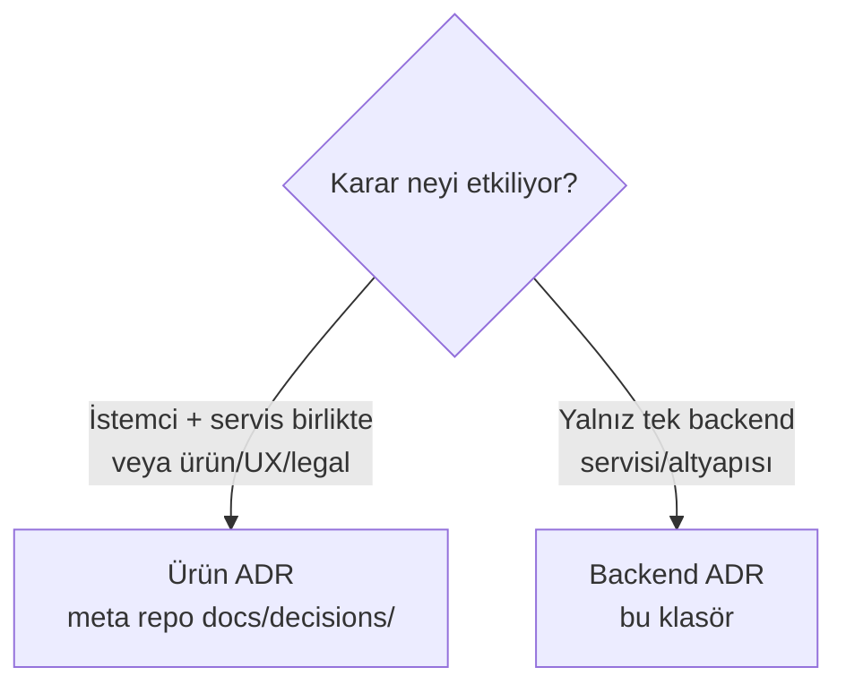

# Saydın Backend — Mimari Karar Kayıtları (ADR)

Bu klasör **yalnızca backend/servis-özgü** mimari kararları (ADR) içerir:
`saydin-services` reposuna özgü, Flutter istemcisini etkilemeyen teknik kararlar —
migration stratejisi, rate limiting, secrets yönetimi, GeoIP dağıtımı, activity-log
politikası, resilience vb.

## Numaralandırma & İki ADR Uzayı (F4-10)

Saydın iki ayrı git reposundan oluşur ve **iki bağımsız ADR numara uzayı** vardır:

| Uzay | Konum | Kapsam | Numaralandırma |
|---|---|---|---|
| **Backend ADR** | `saydin-services/docs/decisions/` (bu klasör) | Tek backend servisini/altyapısını ilgilendiren teknik kararlar | Bağımsız `ADR-001+` |
| **Ürün ADR** | `Saydın` meta repo `docs/decisions/` | İstemci + servisleri birlikte etkileyen veya ürün/UX/legal kararlar | Bağımsız `ADR-001..ADR-014` |

İki uzayın numaraları **kasıtlı olarak ayrıdır**; çakışma (ör. iki `ADR-005`) beklenir ve
sorun değildir — dosyalar farklı repolarda yaşar. Numaraları yeniden adlandırmak 14+ ADR'a
ve tüm çapraz-referanslara dokunurdu (yüksek risk, MVP'de değersiz), bu yüzden
**yapılmaz**. Belirsizlik olmaması için atıf konvansiyonu:
**"Backend ADR-00X"** (bu klasör) / **"Ürün ADR-0XX"** (meta repo).

## Hangi ADR nereye?

## Mevcut Backend ADR'lar

| # | Konu | Durum |
|---|---|---|
| [ADR-001](ADR-001-migration-strategy.md) | Migration & schema evolution (numaralı SQL + tracking, hybrid) | Kabul edildi (revize) |
| [ADR-002](ADR-002-compare-quota.md) | Compare endpoint kota semantiği (compare = 1 hesap) | Kabul edildi (MVP) |
| [ADR-003](ADR-003-rate-limiting.md) | Rate limiting / throttling (iki katman; IP throttle config-gated) | Kabul edildi |
| [ADR-004](ADR-004-geoip-distribution.md) | GeoIP (MaxMind GeoLite2) dağıtımı (commit yok, best-effort) | Kabul edildi |
| [ADR-005](ADR-005-secrets-management.md) | Secrets management (katmanlı; rotation insan onayı) | Kabul edildi |
| [ADR-006](ADR-006-activity-log-financial-policy.md) | Activity-log finansal tutar politikası (bucketing, KVKK) | Önerilen (legal onayı) |

## Yeni ADR ekleme

1. Sıradaki numarayı al (`ADR-007`).
2. ADR-001'in formatını izle: **Durum / Tarih / Karar verenler / İlgili bulgular** başlığı,
   ardından **Bağlam → Değerlendirilen Seçenekler → Karar → Sonuçlar/Risk → İlgili
   Dökümanlar** bölümleri. Diyagram gerekiyorsa Mermaid kullan (ASCII art YASAK — CLAUDE.md).
3. Karar yalnız backend'i mi yoksa istemci/ürünü de mi ilgilendiriyor? Yalnız backend →
   bu klasör; istemci+servis/ürün/legal → meta repo `docs/decisions/`.
