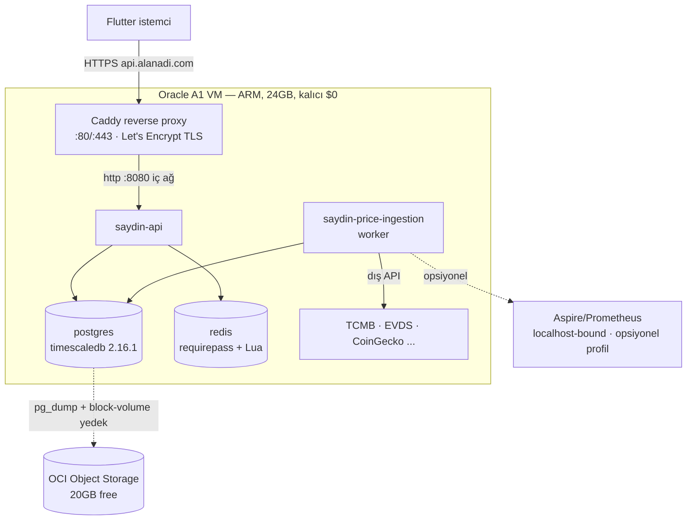

# Oracle Cloud (OCI A1) Geçiş Planı — Runbook

> **ARŞİVLENMİŞ TASARIM — KOPYALA/ÇALIŞTIR DEĞİLDİR.** Bu 2026-05-31 lift-and-shift planındaki
> inline Compose, migration, backup, secret ve rollback komutları güncel güvenlik sözleşmesinden
> önce yazılmıştır. Üretim için yalnız digest-only
> [`../../infrastructure/deployment/compose.production.yml`](../../infrastructure/deployment/compose.production.yml),
> [`../../infrastructure/deployment/validate-production-assets.sh`](../../infrastructure/deployment/validate-production-assets.sh),
> imzalı [`../../infrastructure/release/`](../../infrastructure/release/) akışı ve
> [`../runbooks/`](../runbooks/README.md) kullanılır. Domain, OCI region, bucket/KMS ve backup
> role/HBA girdileri operator tarafından sağlanmadan deployment fail-closed kalır.

> **Karar:** [ADR-007](../decisions/ADR-007-hosting-deployment.md) · **Gerekçe/karşılaştırma:**
> [`hosting-comparison.md`](hosting-comparison.md)
>
> **Amaç:** Backend'i yerel Docker + ngrok'tan **Oracle Cloud Always Free Ampere A1**
> (ARM, 4 OCPU / 24 GB, kalıcı $0) VM'ine **lift-and-shift** etmek. Mevcut `docker-compose`
> neredeyse olduğu gibi taşınır; kod ve migration değişmez.
>
> **Bu tarihsel runbook fazlara bölünmüştür.** Komutlar ve Ek A güncel değildir; yalnız karar
> geçmişi olarak okunur, kopyalanıp çalıştırılmaz.

---

## Hedef mimari



**Prod-zorunlu servisler (4):** `postgres`, `redis`, `saydin-api`, `saydin-price-ingestion`
+ `caddy` (TLS). Dev servisleri (pgadmin, redis-insight, aspire, prometheus, exporter'lar,
tests) prod compose'a **alınmaz** (opsiyonel gözlem profili Ek A.4).

---

## Ön koşullar (checklist)

- [ ] Oracle Cloud hesabı açılabilecek bir kredi kartı (PAYG yükseltmesi için; limit
      aşılmadıkça ücret çıkmaz) ve telefon doğrulaması.
- [ ] Bir **alan adı** (ör. `saydin.app` veya ücretsiz bir subdomain) — `api.alanadi.com`
      A kaydını VM IP'sine yöneltmek için.
- [ ] Mevcut repo erişimi (git) ve **prod sırları** (güçlü parolalar + dış API key'leri).
- [ ] Yerel SSH anahtar çifti (`ssh-keygen -t ed25519`).
- [ ] (Bilgi) Mevcut `.env.example` env değişken listesi — Ek A.3 prod `.env` şablonu.

---

## Faz 0 — Hazırlık & kararlar (kod/sunucu öncesi)

**Amaç:** Geçiş öncesi tüm parametreleri ve sırları netleştir.

1. **Region seçimi (kritik — kayıtta sabitlenir).** A1 kapasitesi yoğun region'larda kıt
   ("Out of host capacity"). Az-yoğun bir **home region** seç: `eu-frankfurt-1` veya
   `ap-singapore-1` (Türkiye'ye düşük gecikme için Frankfurt önerilir). ⚠️ Home region
   sonradan değiştirilemez.
2. **Alan adı & DNS planı.** `api.<alanadi>` subdomain'ini API için ayır. (DNS A kaydı
   Faz 4'te, VM IP'si belli olunca girilecek.)
3. **Sır üretimi.** Güçlü, benzersiz değerler üret ve güvenli sakla (secret backend):
   - PostgreSQL admin ile her managed purpose (`migrator`, `api`, `ingestion`,
     `calendar_importer`, `exporter`, `audit`) için ayrı password file; Redis password file.
     Raw DB parolası/connection URL environment veya Compose interpolation'a konmaz.
   - Dış API key'leri: `EVDS_API_KEY` (ücretsiz, evds3.tcmb.gov.tr), `COINGECKO_API_KEY`
     (gerekirse), `OPENEXCHANGERATES_APP_ID`, `TWELVEDATA_API_KEY`. TCMB key gerektirmez.
   - (Opsiyonel) `GEOIP_ACCOUNT_ID` / `GEOIP_LICENSE_KEY` (MaxMind; yoksa GeoIP best-effort kapalı).
4. **Worker politikası.** Hangi ingestion worker'ları açılacak? Öneri başlangıç:
   `WORKER_TCMB_ENABLED=true`, `WORKER_EVDS_ENABLED=true` (key'leri hazır/ücretsiz); diğerleri
   key sağlandıkça. Free dış API limitlerini gözet.

**Kabul kriteri:** Region, alan adı, tüm sırlar ve worker listesi belirlendi.

---

## Faz 1 — OCI provisioning (VM oluşturma)

**Amaç:** Çalışan, erişilebilir bir A1 VM elde et.

1. Oracle Cloud'a kaydol (Faz 0'daki home region ile). Hesap aktifleşince **Pay-As-You-Go'ya
   yükselt** — bu, Always Free kaynakların **boşta reclaim** edilmesini engeller; kullanım
   Always Free limitlerinde kaldıkça **ücret $0**'dır. (Yükseltmezsen 7 günde p95 CPU/ağ/bellek
   < %20 ise instance durdurulabilir.)
2. **Compute → Instances → Create instance:**
   - Shape: **VM.Standard.A1.Flex**, **4 OCPU / 24 GB** (always-free tavanı).
   - Image: **Canonical Ubuntu 22.04 (aarch64)**.
   - SSH: Faz 0 public anahtarını yapıştır.
   - Boot volume: 50–100 GB (200 GB always-free havuzundan; geri kalanı block volume/yedek).
   - "Out of host capacity" hatası gelirse: birkaç dakika sonra tekrar dene veya AD
     (availability domain) değiştir; ısrar ederse Hetzner yedek planına geç (Ek B).
3. **Reserved public IP** ata (ephemeral yerine) — instance yeniden başlatmada IP sabit kalır.
4. SSH erişimini doğrula: `ssh ubuntu@<PUBLIC_IP>`.

**Kabul kriteri:** `ssh ubuntu@<IP>` ile bağlanılıyor; `nproc`=4, `free -g`≈24, `uname -m`=`aarch64`.

---

## Faz 2 — Sunucu sertleştirme & Docker kurulumu

**Amaç:** Güvenli, Docker'lı, dayanıklı bir host.

1. **Sistem güncelle + temel araçlar:**
   ```bash
   sudo apt-get update && sudo apt-get -y upgrade
   sudo apt-get -y install ca-certificates curl git ufw fail2ban unattended-upgrades
   sudo dpkg-reconfigure -plow unattended-upgrades   # otomatik güvenlik yamaları
   ```
2. **Docker Engine + Compose v2 (ARM64):**
   ```bash
   curl -fsSL https://get.docker.com | sudo sh
   sudo usermod -aG docker ubuntu && newgrp docker
   docker version && docker compose version
   ```
3. **Firewall — İKİ KATMAN (Oracle'ın bilinen tuzağı):**
   - **(a) OCI Security List / NSG** (web konsol): VCN → Security List → Ingress ekle:
     `0.0.0.0/0` TCP **80** ve **443**. SSH (22) yalnız kendi IP'ne kısıtla.
     **Postgres (5432) / Redis (6379) ASLA açılmaz.**
   - **(b) Instance içi iptables/ufw:** Oracle Ubuntu imajları kısıtlı `iptables` ile gelir;
     sadece cloud firewall yetmez. UFW ile yönet:
     ```bash
     sudo ufw default deny incoming && sudo ufw default allow outgoing
     sudo ufw allow from <SENİN_IP> to any port 22 proto tcp
     sudo ufw allow 80/tcp && sudo ufw allow 443/tcp
     sudo ufw --force enable
     # Not: Oracle imajında /etc/iptables/rules.v4 içindeki REJECT kuralları UFW'den önce
     # gelebilir; gerekirse `sudo netfilter-persistent flush` sonrası UFW kurallarını uygula.
     ```
4. **Swap** (24 GB RAM bol ama OOM güvenliği için 2–4 GB swap önerilir):
   ```bash
   sudo fallocate -l 4G /swapfile && sudo chmod 600 /swapfile
   sudo mkswap /swapfile && sudo swapon /swapfile
   echo '/swapfile none swap sw 0 0' | sudo tee -a /etc/fstab
   ```

**Kabul kriteri:** `docker run --rm hello-world` çalışıyor; `sudo ufw status` 22/80/443
açık gösteriyor; 5432/6379 dışarıdan kapalı.

---

## Faz 3 — Uygulama dağıtımı (build + fresh-init migration)

**Amaç:** 4 çekirdek servisi ayağa kaldır; DB şemasını fresh-init ile kur.

1. **Repoyu çek:**
   ```bash
   cd ~ && git clone <REPO_URL> saydin-services && cd saydin-services
   git checkout main   # prod = main
   ```
2. **ARM64 base-imaj düzeltmesi (zorunlu).** Mevcut `Dockerfile`'lardaki base imaj
   **digest pinleri amd64'tür**; A1'de pull başarısız olur. Prod için **multi-arch tag**
   kullanan `.arm64` varyantları oluştur (Ek A.2). Bunlar build'i native arm64 host'ta
   yaptığı için tag otomatik arm64'e çözülür. (Committed amd64-digest Dockerfile'lar
   CI/dev için dokunulmadan kalır.)
3. **TimescaleDB imajının arm64 desteğini doğrula:**
   ```bash
   docker manifest inspect timescale/timescaledb:2.16.1-pg16 | grep -A2 arm64 || echo "ARM64 YOK"
   ```
   - **arm64 varsa** → devam.
   - **yoksa** → Ek C'deki fallback (timescaledb-ha imajı ya da postgres:16 + timescaledb apt).
4. **Prod `.env` oluştur** (Ek A.3 şablonu, Faz 0 sırlarıyla):
   ```bash
   cp .env.example .env && nano .env
   # ASPNETCORE_ENVIRONMENT=Production · güçlü parolalar · WORKER_*_ENABLED · API key'leri
   chmod 600 .env
   ```
5. **Prod compose ile başlat** (Ek A.1):
   ```bash
   docker compose -f docker-compose.prod.yml build
   docker compose -f docker-compose.prod.yml up -d postgres redis
   # postgres healthy olunca initdb.d 001→014 migration zincirini otomatik çalıştırır (boş volume)
   docker compose -f docker-compose.prod.yml logs postgres | grep -E "initdb|ERROR" | tail -30
   docker compose -f docker-compose.prod.yml up -d saydin-api saydin-price-ingestion
   ```
6. **Migration zincirini doğrula** (fresh-init 001→014 abort'suz tamamlanmalı — yerelde
   doğrulandı):
   ```bash
   docker exec saydin-postgres psql -U saydin -d saydin -c "SELECT version FROM schema_migrations ORDER BY version;"
   docker exec saydin-postgres psql -U saydin -d saydin -c "SELECT hypertable_name FROM timescaledb_information.hypertables;"
   # beklenen: price_points, activity_logs
   ```

**Kabul kriteri:** `docker compose ps` 4 servis **healthy**; `schema_migrations` 001–014
dolu; iki hypertable mevcut; `curl -fsS localhost:8080/health/live` (VM içinden) başarılıdır.

---

## Faz 4 — Reverse proxy + TLS + domain (ngrok'un yerini alır)

**Amaç:** Kalıcı HTTPS üzerinden public erişim.

1. **DNS:** Alan adı sağlayıcında `api.<alanadi>` için **A kaydı → VM reserved public IP**.
   Yayılmayı bekle: `dig +short api.<alanadi>` IP'yi döndürmeli.
2. **Caddyfile** oluştur (Ek A.5) — alan adını yaz. Caddy, Let's Encrypt sertifikasını
   **otomatik** alır/yeniler (80/443 açık olmalı, Faz 2).
3. **ForwardedHeaders (önemli — IP spoofing + GeoIP doğruluğu):** API artık Caddy arkasında.
   İstemci gerçek IP'si `X-Forwarded-For`'dan gelir; rate-limit ve GeoIP bunu kullanır.
   Review **F1.2-3** gereği `KnownProxies`/`KnownNetworks` **boş bırakılmamalı**. Prod
   appsettings/env'de Caddy konteyner ağını güvenilir işaretle (ör. Docker subnet'i
   `ForwardedHeaders__KnownNetworks` olarak; detay [ADR-003](../decisions/ADR-003-rate-limiting.md)
   ve `architecture.md`).
4. **Caddy'i başlat:**
   ```bash
   docker compose -f docker-compose.prod.yml up -d caddy
   docker compose -f docker-compose.prod.yml logs caddy | grep -iE "certificate|error"
   ```
5. **Public doğrulama (dışarıdan):**
   ```bash
   curl -fsS https://api.<alanadi>/health/live   # liveness + geçerli TLS
   ```

**Kabul kriteri:** `https://api.<alanadi>/health/live` geçerli Let's Encrypt sertifikasıyla
başarılıdır; HTTP→HTTPS yönlendirmesi çalışır. Dependency readiness public proxy'den değil,
private management listener'daki `:9090/health/ready` yolundan izlenir.

---

## Faz 5 — Worker'lar & ingestion doğrulaması

**Amaç:** Fiyat/enflasyon verisinin gerçekten akmaya başlaması.

1. Faz 0/3'te `.env`'de `WORKER_TCMB_ENABLED=true`, `WORKER_EVDS_ENABLED=true` (+ key'ler)
   set edildi. Worker imajını yeniden başlat:
   ```bash
   docker compose -f docker-compose.prod.yml up -d saydin-price-ingestion
   docker compose -f docker-compose.prod.yml logs -f saydin-price-ingestion | grep -iE "backfill|ingest|TÜFE|hata|error"
   ```
2. **İlk backfill'i izle** (EVDS aylık TÜFE, TCMB günlük kur). EVDS backfill'i
   `MAX(period_date WHERE source='tuik')+1` ayından başlar (INGR-012 fix sonrası kaynak-bazlı).
3. **Veri doğrula:**
   ```bash
   docker exec saydin-postgres psql -U saydin -d saydin -c "SELECT source, count(*) FROM inflation_rates GROUP BY source;"
   docker exec saydin-postgres psql -U saydin -d saydin -c "SELECT status, count(*) FROM ingestion_jobs GROUP BY status;"
   ```

**Kabul kriteri:** `ingestion_jobs`'ta `succeeded` satırları var; `inflation_rates`'te
`tuik` kaynağı görünüyor; worker logları hata içermiyor; healthcheck healthy.

---

## Faz 6 — Yedekleme (iki katman)

**Amaç:** Veri kaybına karşı dayanıklılık (tek-makine riskini azalt).

1. **Birincil — OCI Block Volume otomatik yedek policy** (en basit, güvenilir):
   - Console → Block Storage → Boot/Block Volume → **Backup Policy** ata (ör. günlük,
     7 gün saklama). Always Free **5 yedek** içerir. Disk-seviyesi snapshot → Postgres data
     dizini dahil tüm durum.
2. **İkincil — mantıksal `pg_dump`** (taşınabilirlik + TimescaleDB-doğru restore):
   - Cron ile gecelik dump → OCI Object Storage (20 GB free). Script: Ek A.6.
   - ⚠️ **TimescaleDB restore notu:** logical dump'ı geri yüklerken **mutlaka**
     `SELECT timescaledb_pre_restore();` … restore … `SELECT timescaledb_post_restore();`
     sırası uygulanır (aksi halde hypertable/compression metadata bozulur). Ek A.6'da restore
     prosedürü.
3. **Restore tatbikatı** (en az bir kez): yedeği boş bir test container'a geri yükleyip
   `schema_migrations` + hypertable'ların geldiğini doğrula.

**Kabul kriteri:** Block-volume policy aktif; `pg_dump` cron'u çalışıyor ve Object Storage'a
yazıyor; en az bir başarılı restore tatbikatı yapıldı.

---

## Faz 7 — Cutover (ngrok'tan geçiş)

**Amaç:** İstemciyi yeni kalıcı domain'e taşı, ngrok'u emekliye ayır.

1. Flutter istemci `baseUrl`'ünü `https://api.<alanadi>`'ye çevir (config/env). Önce bir
   **test build**'i ile doğrula.
2. **Paralel çalıştır:** Geçiş süresince ngrok'u bir süre açık tut (geri dönüş için).
3. Tüm kritik akışları yeni domain'e karşı dene (what-if, compare, dca, saved scenarios,
   asset list, daily-limit 429, feature-disabled 403).
4. Stabil ise **ngrok'u kapat**; yerel makineyi prod yol haritasından çıkar.

**Kabul kriteri:** İstemci tüm akışları yeni HTTPS domain üzerinden sorunsuz çalıştırıyor;
ngrok bağımlılığı kaldırıldı.

---

## Faz 8 — Doğrulama & kabul (uçtan uca)

**Amaç:** "Production hazır" kanıtı.

- [ ] `https://api.<alanadi>/health/live` → 2xx, geçerli TLS, HSTS başlığı.
- [ ] What-if / compare / dca / reverse / saved-scenarios uçtan uca 200.
- [ ] Hata sözleşmesi: feature-disabled → 403 + `application/problem+json` + `traceId`;
      daily-limit → 429; validation → 400 (error-contract EC çalışması korunmuş).
- [ ] `docker compose ps` → 5 servis (4 çekirdek + caddy) **healthy**, `restart: unless-stopped`.
- [ ] Worker ingestion akıyor; `ingestion_jobs.succeeded` artıyor.
- [ ] Yedek: block-volume policy + `pg_dump` cron + bir restore tatbikatı ✅.
- [ ] Reboot testi: `sudo reboot` sonrası tüm servisler kendiliğinden ayağa kalkıyor.
- [ ] (Opsiyonel) UptimeRobot/Healthchecks.io ile dış uptime izleme (ücretsiz).

---

## Faz 9 — Süregelen operasyon (ops)

| Konu | Eylem | Sıklık |
|---|---|---|
| Güvenlik yamaları | `unattended-upgrades` otomatik; kernel için periyodik `reboot` | Otomatik / aylık |
| TLS yenileme | Caddy otomatik yeniler | Otomatik |
| Yedek izleme | `pg_dump` cron çıktısı + block-volume snapshot kontrolü | Haftalık |
| İmaj güncelleme | `git pull` + `docker compose -f docker-compose.prod.yml up -d --build` | Sürüm başına |
| Disk/RAM izleme | `docker stats`, `df -h`; gerekirse log retention | Aylık |
| A1 reclaim | PAYG aktif olduğundan reclaim yok; yine de CPU>%0 doğrula | — |
| Migration | Yeni `.sql` ekle → `infrastructure/postgres/apply-migrations.sh` ([ADR-001](../decisions/ADR-001-migration-strategy.md)) | Şema değişiminde |

### Rollback / kurtarma planı
- **Deploy bozulursa:** `git checkout <önceki-tag>` + `up -d --build`; imajlar
  versiyonlanmış olduğundan hızlı geri dönüş.
- **VM kaybı:** Block-volume yedekten yeni instance + volume restore; veya temiz VM'e
  repo + `pg_dump` restore (Ek A.6, TimescaleDB pre/post-restore ile).
- **Oracle kapasite/reclaim krizi:** Hetzner CAX11'e taşı (Ek B) — aynı compose + `.env`,
  aynı ARM imajları; yalnız DNS A kaydını yeni IP'ye çevir.

---

# Ek A — Kopyala-çalıştır config'ler

> Bu dosyalar `infrastructure/deployment/` altında tutulabilir. (İstersen bunları gerçek
> dosyalar olarak oluşturayım — bkz. doküman sonu.)

## A.1 `docker-compose.prod.yml` (çekirdek 4 servis + Caddy)

```yaml
# Prod: yalnız prod-zorunlu servisler + TLS reverse proxy. Dev servisleri (pgadmin,
# redis-insight, aspire, prometheus, exporter'lar) DAHİL DEĞİL (opsiyonel: A.4).
services:
  postgres:
    image: timescale/timescaledb:2.16.1-pg16   # arm64 desteğini Faz 3.3'te doğrula
    container_name: saydin-postgres
    environment:
      POSTGRES_DB: ${POSTGRES_DB:-saydin}
      POSTGRES_USER: saydin_admin
      POSTGRES_PASSWORD_FILE: /run/saydin-secrets/private/password
    # Host'a PORT AÇILMAZ — yalnız iç ağ. (Dev compose'daki 127.0.0.1:5432 yok.)
    volumes:
      - postgres_data:/var/lib/postgresql/data
      - postgres_secret:/run/saydin-secrets:ro
    healthcheck:
      test: ["CMD-SHELL", "pg_isready -U \"$${POSTGRES_USER:-saydin}\" -d \"$${POSTGRES_DB:-saydin}\""]
      interval: 10s
      timeout: 5s
      retries: 5
    restart: unless-stopped

  redis:
    image: redis:7.4.1-alpine
    container_name: saydin-redis
    command: ["redis-server", "--requirepass", "${REDIS_PASSWORD:?REDIS_PASSWORD must be set}", "--appendonly", "yes"]
    environment:
      REDIS_PASSWORD: ${REDIS_PASSWORD:?REDIS_PASSWORD must be set}
    volumes:
      - redis_data:/data
    healthcheck:
      test: ["CMD-SHELL", "redis-cli -a \"$$REDIS_PASSWORD\" --no-auth-warning ping | grep -q PONG"]
      interval: 10s
      timeout: 5s
      retries: 5
    restart: unless-stopped

  saydin-api:
    build:
      context: .
      dockerfile: src/Saydin.Api/Dockerfile.arm64   # A.2 — multi-arch base
    container_name: saydin-api
    environment:
      ASPNETCORE_ENVIRONMENT: Production
      PGHOST: postgres
      PGPORT: 5432
      PGDATABASE: ${POSTGRES_DB:-saydin}
      PGUSER: ${SAYDIN_API_LOGIN:?managed role metadata required}
      PGSSLMODE: Disable
      SAYDIN_API_DATABASE_PASSWORD_FILE: /run/saydin-secrets/private/password
      SAYDIN_DATABASE_SYSTEM_HASH: ${SAYDIN_DATABASE_SYSTEM_HASH:?database identity required}
      SAYDIN_DATABASE_ROLE_PREFIX: ${SAYDIN_DATABASE_ROLE_PREFIX:?role prefix required}
      SAYDIN_DATABASE_LOGIN_VERSION: 1
      ConnectionStrings__Redis: "redis:6379,password=${REDIS_PASSWORD:?REDIS_PASSWORD must be set}"
      GeoIp__DatabasePath: "/app/geoip/GeoLite2-City.mmdb"
      # Caddy arkasında gerçek istemci IP'si için (F1.2-3) — Docker subnet'ini güvenilir işaretle:
      ForwardedHeaders__KnownNetworks__0: "172.16.0.0/12"
      # Otlp__Endpoint: opsiyonel gözlem (A.4) açılırsa set edilir; aksi halde export kapalı.
    volumes:
      - ./infrastructure/geoip:/app/geoip:ro
      - api_secret:/run/saydin-secrets:ro
    depends_on:
      postgres: { condition: service_healthy }
      redis: { condition: service_healthy }
    healthcheck:
      test: ["CMD-SHELL", "curl -fsS http://localhost:8080/health/live || exit 1"]
      interval: 30s
      timeout: 5s
      start_period: 20s
      retries: 3
    restart: unless-stopped

  saydin-price-ingestion:
    build:
      context: .
      dockerfile: src/Saydin.PriceIngestion/Dockerfile.arm64
    container_name: saydin-price-ingestion
    environment:
      DOTNET_ENVIRONMENT: Production
      PGHOST: postgres
      PGPORT: 5432
      PGDATABASE: ${POSTGRES_DB:-saydin}
      PGUSER: ${SAYDIN_INGESTION_LOGIN:?managed role metadata required}
      PGSSLMODE: Disable
      SAYDIN_INGESTION_DATABASE_PASSWORD_FILE: /run/saydin-secrets/private/password
      SAYDIN_DATABASE_SYSTEM_HASH: ${SAYDIN_DATABASE_SYSTEM_HASH:?database identity required}
      SAYDIN_DATABASE_ROLE_PREFIX: ${SAYDIN_DATABASE_ROLE_PREFIX:?role prefix required}
      SAYDIN_DATABASE_LOGIN_VERSION: 1
      ExternalApis__CoinGecko__ApiKey: ${COINGECKO_API_KEY:-}
      ExternalApis__OpenExchangeRates__AppId: ${OPENEXCHANGERATES_APP_ID:-}
      ExternalApis__TwelveData__ApiKey: ${TWELVEDATA_API_KEY:-}
      ExternalApis__Evds__ApiKey: ${EVDS_API_KEY:-}
      IngestionWorkers__Tcmb__Enabled: ${WORKER_TCMB_ENABLED:-false}
      IngestionWorkers__CoinGecko__Enabled: ${WORKER_COINGECKO_ENABLED:-false}
      IngestionWorkers__OpenExchangeRates__Enabled: ${WORKER_OXR_ENABLED:-false}
      IngestionWorkers__TwelveData__Enabled: ${WORKER_TWELVEDATA_ENABLED:-false}
      IngestionWorkers__EvdsInflation__Enabled: ${WORKER_EVDS_ENABLED:-false}
    depends_on:
      postgres: { condition: service_healthy }
    volumes:
      - ingestion_secret:/run/saydin-secrets:ro
    healthcheck:
      test: ["CMD-SHELL", "test -f /tmp/saydin-ingestion-healthy && find /tmp/saydin-ingestion-healthy -mmin -2 -print -quit | grep -q . || exit 1"]
      interval: 30s
      timeout: 5s
      start_period: 30s
      retries: 3
    restart: unless-stopped

  caddy:
    image: caddy:2-alpine
    container_name: saydin-caddy
    ports:
      - "80:80"
      - "443:443"
    volumes:
      - ./infrastructure/deployment/Caddyfile:/etc/caddy/Caddyfile:ro
      - caddy_data:/data
      - caddy_config:/config
    depends_on:
      - saydin-api
    restart: unless-stopped

volumes:
  postgres_data:
  redis_data:
  caddy_data:
  caddy_config:
```

## A.2 ARM64 Dockerfile varyantları (yalnız `FROM` satırları değişir)

`src/Saydin.Api/Dockerfile.arm64` — mevcut [`Dockerfile`](../../src/Saydin.Api/Dockerfile)
ile aynı, **yalnız** üç base imaj digest yerine multi-arch tag kullanır:

```dockerfile
FROM mcr.microsoft.com/dotnet/sdk:10.0 AS build
# ... (mevcut Dockerfile gövdesinin aynısı) ...
FROM mcr.microsoft.com/dotnet/aspnet:10.0 AS runtime
# ... (mevcut Dockerfile gövdesinin aynısı: apt libgssapi-krb5-2 curl, appuser, COPY, HEALTHCHECK) ...
```

`src/Saydin.PriceIngestion/Dockerfile.arm64` — aynı mantık, runtime tag'i:
```dockerfile
FROM mcr.microsoft.com/dotnet/sdk:10.0 AS build
# ...
FROM mcr.microsoft.com/dotnet/runtime:10.0 AS runtime
# ...
```
> `mcr.microsoft.com/dotnet/*:10.0` imajları multi-arch'tır; arm64 host'ta otomatik arm64'e
> çözülür. Committed amd64-digest Dockerfile'lar CI/dev için değişmeden kalır.

## A.3 Prod `.env` şablonu

```bash
# --- PostgreSQL ---
POSTGRES_DB=saydin
# DB secret'ları bu dosyaya yazılmaz. Admin ve her managed purpose için ayrı
# owner-only file secret, deployment secret backend'i tarafından mount edilir.
# Nonsecret SAYDIN_DATABASE_SYSTEM_HASH/ROLE_PREFIX ve exact login adları
# bootstrap/identity adımından alınır.

# --- Redis ---
REDIS_PASSWORD=<GÜÇLÜ-RASTGELE>

# --- .NET ---
ASPNETCORE_ENVIRONMENT=Production

# --- Dış API key'leri ---
COINGECKO_API_KEY=
OPENEXCHANGERATES_APP_ID=
TWELVEDATA_API_KEY=
EVDS_API_KEY=<evds3.tcmb.gov.tr key>

# --- GeoIP (opsiyonel) ---
GEOIP_ACCOUNT_ID=
GEOIP_LICENSE_KEY=

# --- Worker aktivasyonu ---
WORKER_TCMB_ENABLED=true
WORKER_COINGECKO_ENABLED=false
WORKER_OXR_ENABLED=false
WORKER_TWELVEDATA_ENABLED=false
WORKER_EVDS_ENABLED=true
```

## A.4 (Opsiyonel) Gözlem profili

Aspire dashboard + Prometheus + exporter'ları **yalnız localhost'a bind** ederek ekleyebilir,
SSH tüneli (`ssh -L 18888:localhost:18888 ubuntu@<IP>`) ile erişebilirsin. Ayrı bir
`docker-compose.observability.yml` ile `-f docker-compose.prod.yml -f docker-compose.observability.yml`
şeklinde aç; API/worker'a `Otlp__Endpoint: http://aspire-dashboard:18889` ekle.
`aspire-dashboard` için **`ASPIRE_FRONTEND_AUTHMODE=BrowserToken`** (Unsecured DEĞİL).

## A.5 `Caddyfile`

```caddyfile
api.<alanadi> {
    encode gzip
    reverse_proxy saydin-api:8080
    header {
        Strict-Transport-Security "max-age=31536000; includeSubDomains"
        -Server
    }
}
```

## A.6 `backup.sh` (pg_dump → Object Storage)

```bash
#!/usr/bin/env bash
set -euo pipefail
TS="$(date -u +%Y%m%d-%H%M%S)"
OUT="/home/ubuntu/backups/saydin-${TS}.dump"
mkdir -p /home/ubuntu/backups
# -Fc: custom format (TimescaleDB restore için önerilir); --no-owner taşınabilirlik
docker exec saydin-postgres pg_dump -U saydin -d saydin -Fc --no-owner -f /tmp/dump.bin
docker cp saydin-postgres:/tmp/dump.bin "$OUT"
docker exec saydin-postgres rm -f /tmp/dump.bin
# OCI Object Storage'a yükle (oci-cli kurulu + yapılandırılmış):
oci os object put --bucket-name saydin-backups --file "$OUT" --name "saydin-${TS}.dump" --force
# 14 günden eski yerel dump'ları temizle
find /home/ubuntu/backups -name 'saydin-*.dump' -mtime +14 -delete
```
Cron: `0 3 * * * /home/ubuntu/saydin-services/infrastructure/deployment/backup.sh >> /home/ubuntu/backup.log 2>&1`

**TimescaleDB restore (boş DB'ye):**
```bash
# 1) Şemasız boş DB; TimescaleDB extension'ı önce kur, sonra restore moduna al
docker exec -i saydin-postgres psql -U saydin -d saydin -c "CREATE EXTENSION IF NOT EXISTS timescaledb;"
docker exec -i saydin-postgres psql -U saydin -d saydin -c "SELECT timescaledb_pre_restore();"
docker cp saydin-2026....dump saydin-postgres:/tmp/restore.bin
docker exec saydin-postgres pg_restore -U saydin -d saydin --no-owner /tmp/restore.bin
docker exec -i saydin-postgres psql -U saydin -d saydin -c "SELECT timescaledb_post_restore();"
```

---

# Ek B — Hetzner CAX11 yedek planı (Oracle kapasite vermezse)

1. Hetzner Cloud hesabı → **CAX11 (ARM64, 2 vCPU / 4 GB / 40 GB)**, Ubuntu 22.04, ≈ €3.79/ay.
2. Faz 2–8 **aynen** uygulanır (aynı ARM imajları, aynı `docker-compose.prod.yml`, aynı `.env`).
3. Hetzner Cloud Firewall'da yalnız 22/80/443 aç. Snapshot/yedek Hetzner panelinden.
4. DNS A kaydını Hetzner IP'sine çevir. Oracle'ın kapasite/reclaim kaprisleri yoktur.

> Tek fark: 4 GB RAM (24 yerine). 4 servis + Caddy bu RAM'e rahat sığar; gözlem profilini
> (A.4) açmıyorsan sorun olmaz. Swap (Faz 2.4) burada daha önemli.

---

# Ek C — TimescaleDB imajı arm64 fallback

`timescale/timescaledb:2.16.1-pg16` arm64 manifest içermiyorsa:

- **Seçenek 1:** `timescale/timescaledb-ha:pg16-ts2.16` (HA imajı genelde multi-arch; daha
  büyük ama TimescaleDB dahil). Compose'da yalnız `image:` satırını değiştir; env/volume aynı.
- **Seçenek 2:** `postgres:16-bookworm` (arm64) üzerine TimescaleDB apt deposundan kur
  (custom `Dockerfile.postgres-arm64`): `apt-get install timescaledb-2-postgresql-16` +
  `timescaledb-tune`. Migration zinciri değişmez.
- Her iki durumda da fresh-init migration zincirini (Faz 3.6) yeniden doğrula.

---

## Özet kontrol listesi (master)

- [ ] **Faz 0** Region/domain/sırlar/worker kararları
- [ ] **Faz 1** A1 VM oluştu + PAYG + reserved IP + SSH
- [ ] **Faz 2** Docker + iki-katman firewall + swap + unattended-upgrades
- [ ] **Faz 3** ARM Dockerfile + `.env` + prod compose + fresh-init 001→014 + 2 hypertable
- [ ] **Faz 4** DNS + Caddy + Let's Encrypt + ForwardedHeaders + public `/health/live`
- [ ] **Faz 5** Worker'lar açık + ingestion akıyor + veri doğrulandı
- [ ] **Faz 6** Block-volume policy + `pg_dump` cron + restore tatbikatı
- [ ] **Faz 7** İstemci yeni domain'e geçti + ngrok emekli
- [ ] **Faz 8** Uçtan uca kabul + reboot testi
- [ ] **Faz 9** Ops rutini + rollback planı dokümante
